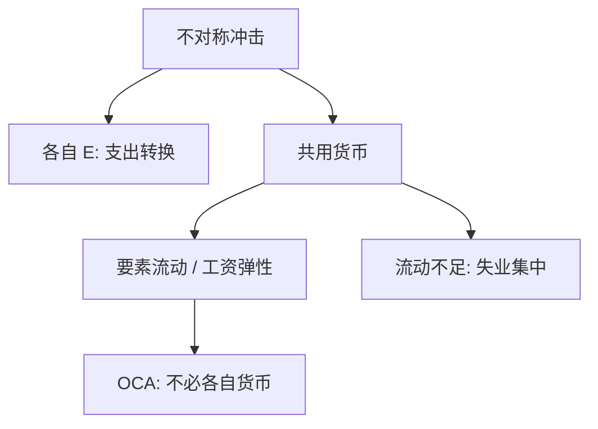

# 货币同盟

最优货币区问的不是「要不要固定汇率」，而是：在哪一组冲击与要素流动下，交出独立货币的代价小于节省的兑换与承诺成本。

<footer>—— Mundell, A Theory of Optimum Currency Areas, American Economic Review, 1961</footer>

[上一课](/econ/exchange-regimes)把安排分成硬钉、中间与浮动。硬钉住已经让 $M$ 内生。本课缺口是把硬钉住推到极限：若干经济体共用一种货币、没有各自的 $E$ 与 $M$。Mundell（1961）的最优货币区（OCA）给出何时这种极限比各自浮动更划算。不重画制度邮票，不把欧元史写成年表。

## 问题

浮动让 $E$ 吸收不对称冲击；钉住把冲击留给物价、产出或要素流动。货币同盟是不可逆的硬钉住加共同央行：成员国不能再贬本国货币，也不能单独扩 $M$。Mundell 问：若冲击在区域间不对称，而劳动力（或更一般的要素）在区内可流动，谁还需要各自的 $E$？流动把失业从受冲击区抽走，汇率工具变得多余。

缺口不是再讲三角的哪两个顶点，而是：同盟的边界应由冲击对称性与要素流动来画，不由国界印章来画。下一课不可能三角会把「交出独立货币」收成三选二的一角；本课先把这一角的福利条件写清。

1961 年的标准是要素流动。后来的清单加上贸易一体化、财政转移、金融一体化与名义刚性——那是补充，不是把 Mundell 改写成「政治愿意即可」。

## 方法

比较两种调整技术。不对称需求下降落在 A 区：若 A 有独立货币，贬值可转换支出；若 A 与 B 共用货币，调整靠 A 的工资物价下降，或劳动力迁到 B，或财政转移。OCA 说：要素流动充分时，第二种技术够用，节省兑换成本与各自货币的承诺噪音。流动不充分且冲击不对称时，各自浮动（或至少保留 $E$）更便宜。

McKinnon 强调开放度：可贸易比重高时，各自浮动的 $q$ 波动更伤。Kenen 强调产品多样化：多样化本身平滑产业冲击。本课以 Mundell 的流动标准为最小定义，其余作边界上的加项。

### 同盟不是「永远钉住」的修辞

货币局仍可退出。同盟取消了本国货币，退出是另一场制度变迁。Obstfeld–Rogoff 的中间幻象在此反过来：同盟把承诺做硬，代价是失去 $E$ 与本国最后贷款人——除非共同机构把它们接过去。原罪国家加入储备货币同盟，可以减轻币种错配，同时放弃独立铸币税。

## 机制

机制是把名义调整从汇率挪到数量与要素价格。共同货币删掉区内 $E$ 的超调，也删掉用贬值做净值税或转换的选项。工资若粘，数量（失业）承担冲击，直到相对物价慢慢动。要素流动把数量调整从失业改成迁移。财政若能跨区保险，需求冲击被转移吸收——1961 年正文并没有把财政联盟写全，后文的欧元辩论才补。

长期中性：同盟的 $\pi$ 由共同名义锚决定。成员国不能靠本国 $H$ 征独立通胀税。三角下一课会说：资本流动加共同货币，独立货币已经交出去。本课只钉 OCA 的成本收益，不把三选二提前写成定理。

内生 OCA：加入同盟后贸易与金融一体化加深，对称性可以后验提高。这是 Frankel–Rose 一类补充，不能事前把任何一组国家说成已经满足 1961 年标准。

## 边界

不要把 OCA 写成「大国就该有独立货币」。标准是冲击与流动，不是面积。也不要把共同货币区内的支付系统写成限价簿。下一课 [不可能三角](/econ/impossible-trinity)把独立货币、钉住、资本开放收成三选二；同盟是已经选了「钉住（极端）+ 资本可开、货币上交」。

后课默认：货币同盟是硬钉住加交出 $M$；是否最优看不对称冲击与要素流动。中间制度的幻象与同盟的硬承诺是同一菜单上的两端。

马歇尔–勒纳与 J 曲线仍适用于对区外的 $E$；区内没有各自的 $E$ 可贬。

共同央行的最后贷款人是对同盟整体，不是对某一个成员国的财政。银行若持有本国主权债，同盟内部仍可有原罪式的环。那是后课银行与主权的接缝，本课先把 OCA 的调整技术钉死。

不要用「已经加入所以一定是 OCA」倒推 1961 年标准。政治承诺可以先于要素流动；Mundell 问的是代价，不是入场券。

## 小结

- Mundell 1961：要素流动充分、冲击可被数量吸收时，共用货币划算。
- 同盟是不可逆硬钉住：失去各自的 $E$ 与 $M$，换承诺与兑换成本。
- 开放度、多样化、财政保险是后补条件，不是 1961 年的最小定义。
- 区内没有各自的 $E$ 可贬；对区外仍有马歇尔–勒纳与 J 曲线。
- 下一课不可能三角把「交出独立货币」收成三选二的一角。
- 出处：Mundell, *AER* 1961；制度菜单见上一课 Obstfeld–Rogoff 与 IMF 口径。
