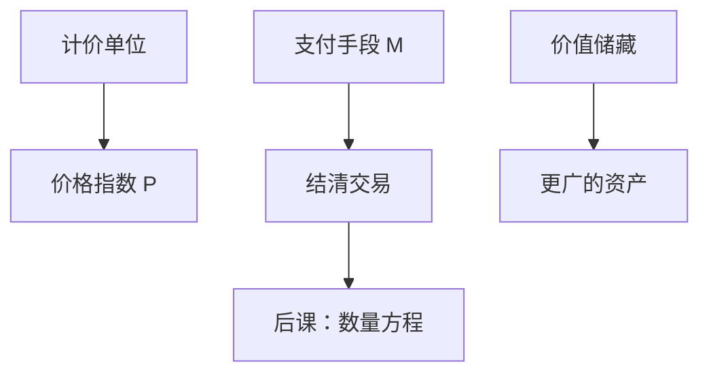

# 货币层次与支付

货币首先是被广泛接受的支付手段；把凡能保值的东西都叫货币，层次就无法接到数量方程。

<footer>—— Hicks, A Suggestion for Simplifying the Theory of Money, Economica 1935；对照 Friedman 对货币作为暂时购买力栖所的整理</footer>

[上一课](/econ/adjustment-cost-invest)（投资调整成本）。在此之上，长期人均产出拆成 $K$、$h$ 与剩余 $A$。那些是实物账户。本课换对象：交易如何清算。增长核算不告诉我们哪一种债权算「钱」。后课的 $MV=Py$、铸币税和银行负债，都默认本课已经把**支付手段**与邻近资产分开，不再从物物交换的寓言重讲。

## 问题

核算里的 $Y$ 用某种记账单位计价，但记账单位不必等于流通中的支付工具。若把货币定义成一切财富，数量方程没有独立的 $M$。若只认铸币与纸币，又会漏掉可开支票的存款——而存款正是后课中介的负债。缺口是：按**流动性与支付功能**分层，而不是先写央行反应函数。

Hicks（1935）把货币需求从边际效用的货物清单里提出来，改成对流动性的需求：持有货币是为了在买卖不同步时不必卖掉其他资产。Friedman 后来把货币写成暂时的购买力栖所。本课钉功能与口径；流通速度与中性是下一课。

三项功能常并列：交换媒介、计价单位、价值储藏。后两项许多资产也能做。使 $M$ 可测的，是它在交易中被**按面值接受**，而不必先找到配对的需求双重巧合。

## 方法

记 $M0$（或基础货币）为通货加准备金；$M1$ 再加活期与可转让存款；$M2$ 再加储蓄与若干定期。层次是统计约定，边界随监管与支付技术移动。本课要的不是某一年的精确表，而是：进入 $M$ 的东西，必须能直接结清对货物与要素的支付，或可几乎无成本地转成这种手段。

支付与中介尚未分开：公众持有的存款已经是银行负债，[中介功能](/econ/why-intermediaries)会回来写转换；本课只认它此刻是 $M$ 的一部分。准备金与内生存款乘数是后课银行课序，这里不提前做货币乘数故事。

### 内部货币与外部货币

外部货币是私人部门对政府（含央行）的净债权：通货与准备金。内部货币是私人之间的存款：对一家银行是负债、对持有人是资产，加总时对冲。数量方程里用哪一个 $M$，会改变「谁在征收通胀税」。下一课先用一个加总 $M$；铸币税再拆开基础货币。

支付系统分两层：央行货币结算银行间净额，存款货币结算公众。本课不写 RTGS 工程。层次边界随货币市场基金与支付账户漂移；定义必须随制度改，否则速度表现为假突变。

## 机制

没有被广泛接受的支付手段，交易必须配对或每次重新议价用哪种商品清算。货币降低的是这笔匹配成本，不是把 $A$ 提高一截的同一机制——增长课的 $A$ 是生产效率，本课的 $M$ 是交易技术。一旦某种负债被当成货币，对它的超额供给会先表现在名义支出上，这是后课数量方程的入口。

可转让存款能进 $M1$，是因为结算系统让它与通货几乎一对一兑换。若挤兑使兑换中断，同一负债就不再按面值充当支付手段——那是银行课，不是本课把 $M$ 写成恒定乘数。

层次漂移：货币市场基金、支付账户使准货币更像 $M1$，货币需求函数移位。Friedman 强调定义要随制度，否则下一课的速度会表现为「突变」而其实是口径。名义锚从这里开始：没有被接受的媒介，SNA 的名义 $Y$ 仍可记账，但「价格水平」缺一个货币面。

贷款创造存款，再找准备金。乘数故事把顺序写反，留给[准备金课](/econ/reserve-endogenous-money)。本课只承认：公众持有的媒介大量是银行存款，不是铸币。

## 边界

不要把国债、股票、房产算进交易用 $M$，即使它们能保值。也不要把加密代币在未成为普遍清算工具时写成新的 $M0$。量化栏的报价与成交是微观价格发现，本栏的货币是宏观支付存量。本课不讨论最优通胀；Friedman 的最优货币量要有机会成本，留给数量与铸币税。开放经济的美元化：外国媒介取代本国 $M$，铸币税外流，三角课再提。

后课默认：写下 $M$ 时，指的是支付口径的存量，并声明层次。下一课把 $M$ 接到 $P$ 与 $y$。

## 小结

- 增长账是实物；货币课从支付手段开始。
- 层次按流动性划分；$M$ 不是一切财富。
- 内部货币是银行负债，外部货币才直接通向铸币税。
- 接受是均衡；挤兑使同一负债退出 $M$。
- 速度、中性、通胀税都建立在本课的 $M$ 上。
- 出处：Hicks, Economica 1935；Friedman 的货币需求与购买力栖所传统。
