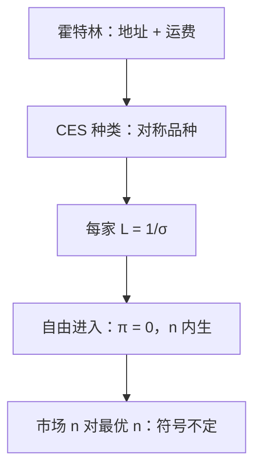

# 垄断竞争 Dixit–Stiglitz

对种类的 CES 偏好让每一种产品面对向下的剩余需求；自由进入把品种数目内生，加价由替代弹性钉住。

<footer>—— Dixit and Stiglitz, Monopolistic Competition and Optimum Product Diversity, American Economic Review, 1977</footer>

定位：[上一课](/econ/hotelling)。线性城市用位置与运费 $t$ 拆开同质产品，选址权衡份额与价格战。本课不重讲 $[0,1]$ 上的最小/最大差异，也不把 CES 写成另一条街道。缺口是 Chamberlin 的那句「许多家、每家一条向下需求、进入把利润赶到零」怎样写成一般均衡可加总的偏好：种类本身进入效用，品种数目 $n$ 内生。

## 问题

霍特林的差异是横截面上的地址，消费者只买最近的一家（或两家之间切开）。Dixit–Stiglitz 的差异是对称品种：效用

$$
U=\Bigl(\sum_{i=1}^{n}q_i^{\rho}\Bigr)^{1/\rho},\qquad 0<\rho<1,
$$

每种产品被所有人按 CES 同时消费一点，替代弹性 $\sigma=1/(1-\rho)$。每家面对的需求弹性就是 $\sigma$（$n$ 大时），勒纳 $L=1/\sigma$，与位置无关。缺口不是再写一次伯川德悖论的解除，而是：**种类爱（love of variety）如何决定均衡 $n$，以及它与社会最优 $n$ 是否重合。**

自由进入：$n$ 家各付固定成本 $F$，再以常数 MC 生产。零利润把 $n$ 钉住。这与[长期进入](/econ/long-run-entry)同型，但产品不再同质，每家保留 $P>\mathrm{MC}$，经济利润仍为零——固定成本吃掉加价租金。上一课垄断勒纳允许正利润；这里进入把利润赶到零，势力留下。

### 不是霍特林选址，也不是外生的 n 家垄断

不要把 $i$ 读成公里数。品种是对称的，没有「中点」。也不要把 $n$ 当参数：那是 Chamberlin 的短画，DS 的贡献是把 $n$ 从偏好与 $F$ 里解出来。贸易、新增长后课会把同一套 CES 当技术模块；本课只钉封闭的产品市场。

$\sigma\to\infty$ 回到同质、加价消失，像 $t\to 0$。$\sigma\to 1^+$ 种类几乎不可替代，每家接近垄断。弹性在偏好里是常数，这是可加总的代价，不是从街道几何推出来的。

## 方法

代表性消费者对既定 $n$ 导出每种产品的等弹性需求。厂商 $\mathrm{MR}=\mathrm{MC}$ 给出 $P=(\sigma/(\sigma-1))\,\mathrm{MC}$。进入使 $(P-\mathrm{MC})q=F$。联立得均衡产量（常与最优规模比较）与 $n$。资源约束把劳动分到固定成本与可变产出上。

最优多样性：社会规划者内部化新品种对他人的剩余，市场只内部化利润。DS 原文指出市场 $n$ 相对最优可多可少，取决于偏好形式——不要写成「市场品种一定太少」。本课钉机制，不把比较静态做成定理表。

不要把 CES 价格指数写成 CPI 宏观课的全部内容；这里指数只是加总工具。也不要写限价簿上的品种报价。

## 机制

向下需求的机制是不完全替代：多产自己的品种必须降价，但抢不走全部支出。进入的机制是：正利润吸引新品种（不是复制同一商品），稀释每家的支出份额，直到 $F$ 被加价刚好覆盖。种类爱的机制是 CES 的凹性：给定总支出，品种越多效用越高，即使每种 $q_i$ 更小。

与霍特林的分工：地址模型适合「买一个、在乎距离」；CES 适合「每种都来一点、在乎目录长度」。垂直质量下一课再加；本课品种在质量上对称。

价格指数 $P=(\sum p_i^{1-\sigma})^{1/(1-\sigma)}$ 把品种加总成一单位效用的成本。$n$ 增加时，既定支出买到的实际消费上升——这是种类爱的对偶。厂商把 $P$ 当参数（$n$ 大），自己的 $p_i$ 对 $P$ 可忽略；$n$ 小时寡头外部性出现，加价公式要改。本课钉大 $n$ 的 Chamberlin 极限。

Dixit–Stiglitz 1977 的最优多样性讨论常被口耳简化成「市场品种不足」。原文对 CES 与可变弹性给出不同符号。引用时落到偏好，不要当口号。

## 边界

寡头（$n$ 小）时每家影响价格指数，弹性不再是常数 $\sigma$，需要寡头版。异质企业、帕累托生产率是贸易补层，不在本课。区位与 CES 可以嵌套（Helpman–Krugman），本课不嵌。

后课默认：对称垄断竞争读 CES、加价 $1/\sigma$、自由进入内生 $n$；不要用本课去重讲霍特林端点。

## 小结

- CES 种类给出等弹性剩余需求；勒纳由 $\sigma$ 钉住。
- 自由进入让利润为零、品种数内生；加价仍在。
- 市场多样性对最优没有一般排序。
- 下一课把对称品种换成质量高低的一致排序。
- 出处：Dixit and Stiglitz, *AER*, 1977；Chamberlin 的垄断竞争作为对照。
