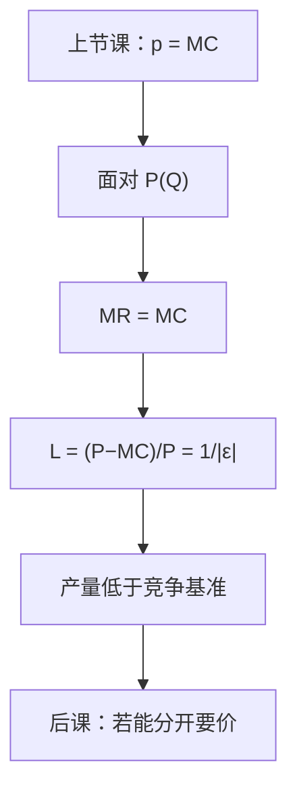

# 垄断与勒纳指数

垄断势力等于价格超出边际成本的比例，而这一比例就是需求弹性的倒数。

<footer>—— 据 Lerner, The Concept of Monopoly and the Measurement of Monopoly Power, Review of Economic Studies, 1934 整理</footer>

上一课[完全竞争的短期与长期](/econ/perfect-competition)在价格接受与自由进入下把 $p$ 钉在 $\min\mathrm{AC}$。本课不重讲行业供给加总。缺口是：若只有一家卖者、进入被挡住，厂商面对的是整条市场需求 $P(Q)$，不再是参数 $p$。$p=\mathrm{MC}$ 必须改写成带边际收入的一阶条件，并给出可观测的势力测度。

## 问题

价格接受者的一阶条件是 $p=\mathrm{MC}(q)$。垄断者多卖一单位，不仅那一单位按新价格卖，还把已经在卖的数量一起压价。边际收入 $\mathrm{MR}(q)=P(q)+q P'(q)$，最优是 $\mathrm{MR}=\mathrm{MC}$。缺口不是再画 AC，而是把偏离竞争基准的程度写成

$$
L=\frac{P-\mathrm{MC}}{P}=\frac{1}{|\varepsilon(q)|},
$$

其中 $\varepsilon$ 是需求价格弹性。这就是勒纳指数。弹性无穷（水平需求）时 $L=0$，回到上一课的接受价格。弹性越接近 $1^+$，$L$ 越大； $|\varepsilon|\le 1$ 时 MR 非正，有正 MC 的垄断者不会停在那里。

产量低于竞争产量（竞争产量由 $P=\mathrm{MC}$ 读出），形成哈伯格三角形那块无谓损失。本课只钉这一局部比较；一般均衡的福利定理是后课程对象，不要在这里用效用可能性边界重写一遍。

### 勒纳测度的是加价，不是利润率

$L$ 用的是 MC，不是 AC。正的勒纳可以和零经济利润共存——例如被进入威胁压在 AC 上但仍有 $P>\mathrm{MC}$ 的容量约束情形，后课会碰到。反过来，短期沉没造成的会计亏损也不否定 $L>0$。不要把勒纳读成「赚钱多少」；上一课刚把零利润定义为进入条件，本课的势力是价格–边际成本缝。

Cournot 1838 已经对单一矿主写出 $\mathrm{MR}=\mathrm{MC}$。Lerner 的贡献是把加价与弹性连成可比较的指数。引用时不要把 1934 年的指数写成古诺寡占的 $n$ 家公式——那是后课 $L_i=s_i/|\varepsilon|$。

## 方法

给定 $P(q)$ 与[成本](/econ/cost-minimization)侧的 $c(q)$（要素价格冻住），解 $\mathrm{MR}(q)=\mathrm{MC}(q)$，再读 $P(q)$。线性需求加常数 MC 时，垄断产量是竞争产量的一半——这是教具，不是一般定理。弹性随点变，故 $L$ 随均衡点变，不是技术常数。

统一标价是本课的菜单。若能对每个消费者要不同的价，MR 的逻辑要改，产量甚至可以回到有效；那是下一课价格歧视。本课禁止套利、禁止区别对待，只留一个 $P$。

IRS 可以解释为什么只活得下一家，但勒纳公式对凸成本同样成立。结构来自市场边界与进入壁垒，不来自把平均成本画成下降就自动叫垄断。无谓损失是需求与 MC 之间的产量缺口，租金矩形是转移，二者不要加总成一个「坏处」。

进入壁垒在此当作结构给定：执照、专利、沉没的进入成本大到没人进。壁垒从哪来不展开；没有壁垒就回到上一课的长期零利润。

## 机制

加价的机制是需求斜率进入 MR：把价格微量降低以多卖一单位，必须用 $q P'(q)$ 计量已售部分的损失。弹性把斜率换成无量纲数字，于是不同市场的加价可以比较。无谓损失的机制是：在 $P>\mathrm{MC}$ 的区间里，仍有人的边际评价高于边际成本，交易没做成。转移给垄断者的矩形是分配，三角形才是本课的效率缺口。

与短长期：垄断者也有既定规模与沉没。短期停产仍看 AVC；长期若不能阻止进入，$L$ 会被进入削薄。本课把 $n=1$ 钉死，是为了先把 $\mathrm{MR}=\mathrm{MC}$ 写清楚。

不要把勒纳指数写成限价簿买卖价差。价差是微观结构的执行成本；这里是产品市场的 $P-\mathrm{MC}$。

## 边界

多产品垄断、耐用品、动态限价，都会改 MR 的写法，本课不展开。自然垄断（次可加成本）提出的是「一家生产更省」与「加价扭曲」的冲突，规制是另一课序。也不用本课否定完全竞争基准：勒纳的零点正是上一课的 $P=\mathrm{MC}$。

寡头把 MR 变成对对手行动的猜测，古诺课再写。勒纳用的是经济 MC，不是会计平均成本。也不把 $L$ 写成买卖价差：微观结构的价差是库存与信息不对称，不是面对向下需求的加价。

后课默认：单一价格垄断满足 $\mathrm{MR}=\mathrm{MC}$，势力用勒纳指数读弹性。

## 小结

- 面对向下需求时，一阶条件从 $P=\mathrm{MC}$ 换成 $\mathrm{MR}=\mathrm{MC}$。
- 勒纳指数等于需求弹性的倒数，测度加价不是会计利润率。
- 单一价格下产量低于竞争基准；无谓损失来自 $P>\mathrm{MC}$ 的未成交。
- 下一课放开统一标价，看三级价格歧视如何改产量与剩余。
- 出处：Lerner, *RES*, 1934；Cournot, *Recherches*, 1838；Mas-Colell, Whinston and Green 第 12 章。
