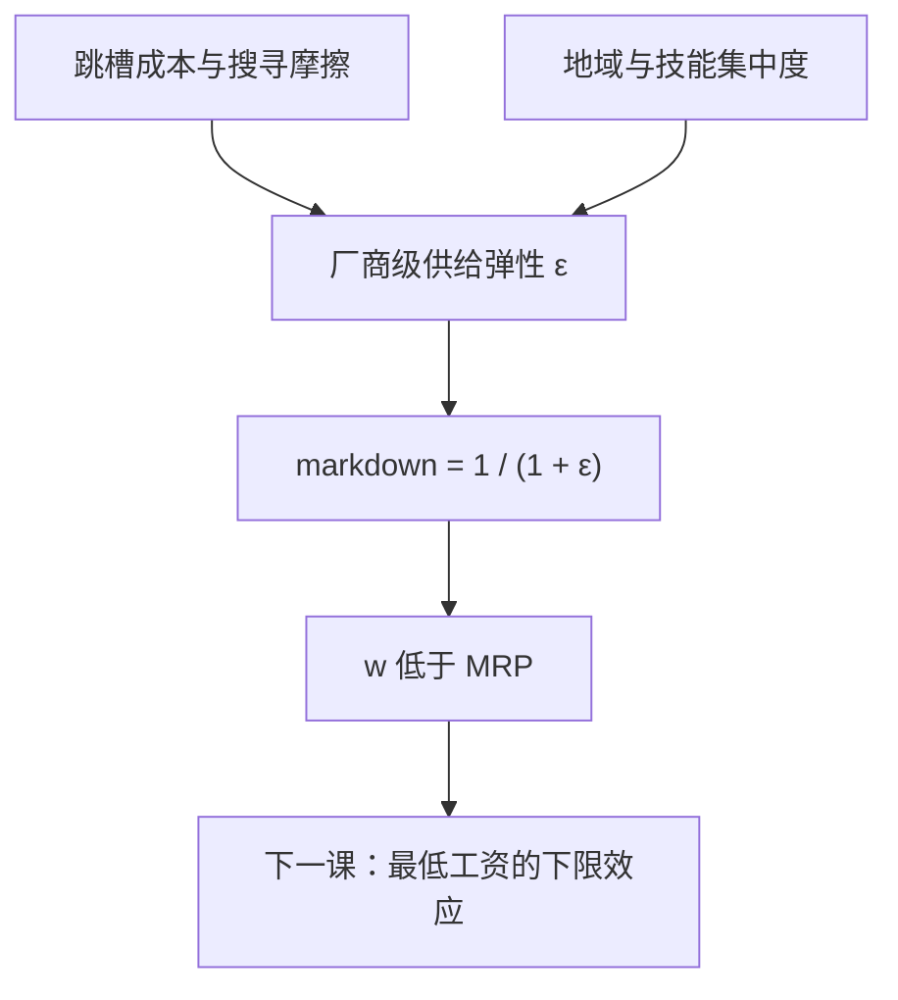

# 买方垄断与工资压低

买方垄断不是教科书的古董：只要工人换雇主有成本，每家厂商面对的都是一条向上的劳动供给曲线，工资系统性地低于边际产品。

<footer>—— Manning, Monopsony in Motion, 2003；词源见 Robinson, The Economics of Imperfect Competition, 1933</footer>

[上一课](/econ/reservation-wage-search)把搜寻写成一道路门槛：保留工资决定接受率，接受率决定入职率。本课把同一套摩擦翻到厂商侧：既然换工作要重付搜寻成本，留住的工人就不是从无弹性的总量里抽来的，而是从一条对**本厂**工资敏感的供给曲线里来的。[劳动需求课](/econ/labor-demand-mrp)的基准是 $w$ 等于边际产品价值 MRP；本课的缺口是这个等式何时失效，以及失效的缺口——markdown——怎么用数据量出来。

## 问题

Robinson 1933 的静态版本：公司镇上一家买家，面对递增的供给 $w(L)$，多雇一人的边际成本高于工资，最优雇佣停在 $\mathrm{MCL}=\mathrm{MRP}$，工资落在 $w \lt \mathrm{MRP}$。缺口不是背诵这个图形，而是问：在有许多雇主的城市里，压价从哪来。Manning 的答案是摩擦：只要跳槽有成本（搜寻、地点、专用技能、家庭），厂商提薪只留人、降薪只慢走人，每家厂商都面对一条自己专属的、向上倾斜的供给曲线——买方垄断是程度问题，不是有无问题。写成一阶条件：若厂商级供给弹性为 $\varepsilon$，则

$$
w \;=\; \mathrm{MRP}\cdot\frac{\varepsilon}{1+\varepsilon},
\qquad
\mathrm{markdown} \;=\; \frac{\mathrm{MRP}-w}{\mathrm{MRP}} \;=\; \frac{1}{1+\varepsilon}.
$$

供给越平（$\varepsilon$ 越大），越接近竞争；越陡，压得越深。

量级心算：$\varepsilon=1.5$ 时工资约为边际产品的六成；$\varepsilon=4$ 也有两成的压价。也就是说，哪怕工人稍有换厂余地，markdown 也不是小数——这把「垄断与否」的争辩换成「弹性多大」的测量。

## 方法

markdown 不可直接观测（MRP 看不见），要借弹性反推，两条实证路线。第一条是地域集中：Azar–Marinescu–Steinbaum 在县 $\times$ 行业层面算雇主集中度，发现集中度更高的本地市场工资系统性更低——把厂商级供给弹性与「附近有几家可去的厂」挂上钩。第二条是纵向流水数据：Manning 的动态买方垄断用雇主–雇员匹配面板估分离与招聘对工资的准弹性——若降薪使离职明显加快、提薪几乎不带来新人，那就是一条陡的本厂供给曲线，弹性反推回 markdown。两条路互相校验：集中度是弹性的截面代理，流水是弹性的直接读数。

错在哪：拿 W=MRP 的竞争基准直接算「工资被压了多少」，MRP 本身要用生产函数估，误差会顺着 $\varepsilon$ 的倒数放大；拿行业平均工资当 $w$，又把技能构成的变化混进压价里。

## 机制

摩擦给买方势力的微观与上一课是同一枚硬币：搜寻让工人不能瞬时改换雇主，于是遭遇（match）自带一点双边垄断，议价份额偏向先贴出岗位的一方。对照[效率工资](/econ/efficiency-wage)可以看清「不出清」的两个方向：效率工资把工资钉在出清**之上**，用失业当纪律；买方垄断把工资压在 MRP **之下**，用摩擦收租。一个是厂商自愿抬高，一个是厂商策略性压低，两种机制可以在同一市场并存，不要写成互相取消。

markdown 的存在改写政策几何：法定下限若把工资从压价区间抬向 MRP，就业不必下降甚至可以上升——这正是下一课最低工资文献的机制接口。错在哪：在压价区间里套竞争模型的就业预测，方向都可能反；反过来，把「最低工资无害」直接当买方垄断的证据，又忽略了价格、工时、进入这些调整边际。本课先只钉机制：$w$ 与 MRP 之间有缺口，缺口由弹性决定，弹性可测。

## 边界

本课不给反垄断执法的操作清单：集中度阈值是行政筛子，门槛之内弹性仍可能很大，写成「高集中即压价」会误伤规模经济。流水数据的识别也有坑：提薪本身内生（留人加薪发生在离职风险高的岗位），面板系数要往弹性上读，得先处理这类选择。专用性投资引出的另一种压价走[套牢](/econ/hold-up-gh)的合同与所有权通道，不在本课。跨区域的工资套利、移民与最低工资的交互，留待政策课。

后课默认：厂商面对向上供给、$w$ 低于 MRP 是基准情形而非特例；一切工资下限政策的讨论从这条几何出发。

## 小结

- 摩擦使每家厂商面对向上的劳动供给：$w = \mathrm{MRP}\cdot\varepsilon/(1+\varepsilon)$。
- markdown 用两条路测：地域集中度对照（Azar 等）与纵向流水的分离弹性（Manning）。
- 买方垄断压价与效率工资抬价是两个方向的「不出清」，可并存。
- 压价区间里的政策几何与竞争模型不同，为下一课铺垫。
- 出处：Robinson 1933；Manning 2003；Azar–Marinescu–Steinbaum 的劳动市场集中度测算。
