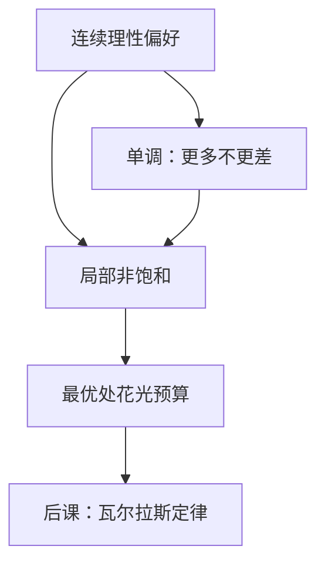

# 单调与局部非饱和

局部非饱和排除幸福点：任意消费束的附近，总还有更好的束。单调则把「附近更好」写成「更多更好」。

<footer>—— 据 Mas-Colell, Whinston and Green, Microeconomic Theory 第 2–3 章；Varian, Microeconomic Analysis 整理</footer>

上一课[连续性](/econ/continuity-preference)给了闭优集：紧菜单上最大元非空，连续表示有了拓扑前提。本课不重讲上、下优集，也不再举词典序。缺口是：连续理性仍允许「多多更差」。没有一条「附近总有更好」，最优可以落在预算内部，后课的瓦尔拉斯定律会漏一项。本课只加单调与局部非饱和。

## 问题

连续偏好可以有幸福点：某个 $\bar x$ 在一个开邻域里最好。预算若把这个点包在内部，钱花不完，$p\cdot x\lt w$。对偶里支出与财富对不上，超额需求加总也不再落在超平面上。缺口不是再要一次连续性，而是排除饱和。

局部非饱和：对每个 $x$ 与每个邻域，存在 $y$ 使 $y\succ x$。弱单调：$x\ge y$ 蕴含 $x\succsim y$。严格单调：$x\gg y$ 蕴含 $x\succ y$。单调（再加一点正则）蕴含局部非饱和；反过来，局部非饱和不强迫所有商品都是「多多益善」——有害品可以存在，只要附近总能挪到更好的点。后课预算最大化真正用的是弱的那条。

### 花光预算不是节俭，是附近还有更好

局部非饱和下，内部点不可能最优：稍花一点剩下的钱就能严格改善。因此最优必在边界，$p\cdot x=w$。这就是后课要引用的瓦尔拉斯定律。它不是道德，是公理推出来的会计。

「饱和」是幸福点；「非饱和」是任意点附近仍有改善。中文教材亦称局部非餍足。本课用标题里的非饱和，对象与 MWG 同一条。

## 方法

把 $X=\mathbb{R}_+^n$。连续、理性、局部非饱和的偏好，在 $p\gg 0$、$w\gt 0$ 的预算上：若最大元存在，则落在 $p\cdot x=w$ 上。无界预算仍可能没有最大元——单调者会沿某方向走到无穷——后课用价格严格为正和紧化处理。本课不定义马歇尔需求，只把「最优 ⇒ 花光」钉死。

单调给出更强的几何：更好的一侧是「更多」的那一侧，免费赠品不会被扔掉。弱单调允许某些坐标完全无感；严格单调要求所有坐标同时增加才严格变好，排除中性品。局部非饱和比二者都弱、也更适合当工作假说：它允许中性品、允许有害品，只要没有开集幸福点。Varian 写需求、MWG 写瓦尔拉斯定律，用的都是这条弱条件，而不是把「多多益善」写成公理清单。

严格单调还会排除边界上的「某种商品零价格仍不想要」的某些角点，但角点本身是[内点与角点](/econ/interior-corner)的缺口。本课不写 Kuhn–Tucker。

## 机制

有了局部非饱和，钱是约束而不是装饰。间接效用对财富严格递增（在内部财富处）；支出函数达到给定效用时账单被用尽。后课罗伊恒等式里的 $\partial v/\partial w$ 才不会是零。一般均衡里，每人 $p\cdot x_i(p)=p\cdot\omega_i$，加总成瓦尔拉斯法则。没有非饱和，最优可以剩钱，这条加总会计会少一项，存在性证明里超额需求也不再正交于价格。

单调把免费物送进最优集：若 $p_j=0$ 且偏好对该商品严格递增，需求可以无界。这是后课存在性证明为什么要 $p\gg 0$ 或把价格收到单纯形内部。本课只指出：连续性不够，还要「方向」——更好的方向至少不是「全部更少」。

凸性仍未进场。局部非饱和的偏好可以讨厌平均：无差异集可以凹向原点。需求集值、均衡存在更脆，是下一课的缺口。

## 边界

局部非饱和是工作假说，不是普遍事实。毒品、容量约束、生理上限都会造出局部幸福点；那时钱可以剩，瓦尔拉斯定律改成不等式。主干仍用非饱和，因为对偶与一般均衡都靠它把预算变成等式。

也不要把单调读成「所有商品都好」。垃圾、噪音可以是负商品，模型把它们写成正商品的减少，或直接允许某坐标违反单调。局部非饱和只要在某个方向上还能改善。实验里的餍足、禀赋效应是对照，不把本课改成心理学。

免费处置与单调也不是同一句话。生产一侧的自由处置说可行集向「更少」闭；消费一侧的单调说排序向「更多」升。本课只管消费者。零价格时二者会在存在性证明里碰头，那是均衡课的缺口。

后课默认：消费者局部非饱和，最优花光预算。马歇尔需求、间接效用都在这条等式上写。

## 小结

- 连续理性仍允许幸福点；局部非饱和排除开集里的最大元。
- 单调是更强的「多多不更差」；它蕴含局部非饱和，但非饱和更常用。
- 非饱和 ⇒ 最优在预算边界，后课称瓦尔拉斯定律。
- 凸性、角点一阶条件尚未出场。
- 出处：Mas-Colell, Whinston and Green 第 2–3 章；Varian, *Microeconomic Analysis*。
