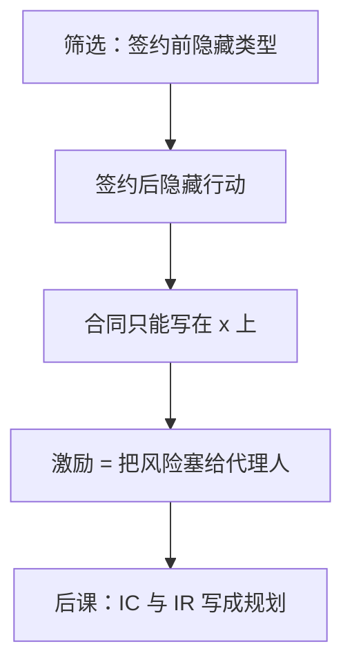

# 道德风险与隐藏行动

保险一旦买下，被保险人减少预防的激励；可观察的是结果，不是行动，合同只能写在结果上。

<footer>—— 据 Arrow, Uncertainty and the Welfare Economics of Medical Care, AER, 1963；Pauly, AER, 1968；Holmström, Bell Journal, 1979 整理</footer>

[上一课](/econ/rs-unraveling)（Rothschild–Stiglitz 崩溃）。的类型在签约前已经存在，菜单筛的是隐藏信息。缺口是时序：签约时双方对称，之后一方选不可观察、不可验证的行动，结果是行动加噪声。买方看不见努力，只能看见产出或损失，合同必须写在结果上。这会扭曲努力，即使没有逆向选择。本课钉隐藏行动，下一课把委托–代理的 IC–IR 写全。

## 问题

行动 $a$ 进入结果分布 $F(x\mid a)$，进入行动者的成本 $c(a)$。若 $a$ 可写入合同，第一最佳是风险分担加有效努力：风险中性的委托人承担全部风险，代理人拿固定工资，努力用强制规定。隐藏行动后，固定工资使代理人选最省力的 $a$。要诱出努力，支付必须随 $x$ 变，从而把风险塞给厌恶风险的代理人。

这与柠檬不同：质量不是事先的类型，而是事后的选择。保险里，保了全险，预防的私人收益下降，事故概率上升——Pauly 把 Arrow 的福利命题收成激励。事故多了，不是因为「坏人买保险」（那是逆向选择），而是因为「买了之后少预防」。

### 可观察不等于可验证

法庭要能执行，变量须可验证。委托人自己看见 $a$ 但法庭看不见，仍不能把 $a$ 写进合同。信息经济学的约束是合同集合，不是认知。噪声 $x$ 可验证，所以激励只能通过 $x$ 走。

Holmström 的充分统计：若 $x$ 是 $a$ 的充分统计，其他无关信号不应进入支付，以免无谓风险。似然比 $f_a/f$ 决定哪一个结果该奖、该罚。单调似然比让支付对 $x$ 单调，但不是定理的一般结论。

风险中性且无财富约束时，把随机剩余卖给代理人，IC 自动满足，隐藏行动不造成效率损失。
厌恶风险或有限责任让这一步做不成，才有后课的规划。

## 方法

对象：一个代理人，行动在实区间或 $\{低,高\}$，结果有限。合同 $w(x)$。代理人选 $a$ 最大化 $\mathbb{E}[u(w(x))\mid a]-c(a)$。委托人预见到这个选择，设计 $w$ 最大化自己的期望利润。两行动时，诱出高努力的关键是让高努力的期望效用不低于低努力——这是下一课的激励相容，本课先认清约束来源：分布对 $a$ 的敏感度。

若代理人风险中性且财富不约束，可把剩余全部卖给他（特许经营），隐藏行动不造成效率损失。风险厌恶或有限责任让这一步做不成，才有风险分担与激励的权衡。

## 机制

激励来自似然比：某个 $x$ 在高努力下相对更常出现，就应在该 $x$ 上奖。噪声大，似然比平，激励贵，最优可能放弃高努力。这与柠檬的「价格切断类型」不同，这里没有类型分布被切断，而是行动的一阶条件被保险压平。签约时若信息对称，IR 可以抽干事前租金；扭曲全来自事后的隐藏行动，不是来自签约前的信息优势。

全保险是极限：支付不随 $x$ 变，努力的边际私人收益为零。免赔额、共保是把似然比信息局部地写回合同，用一部分风险换一部分预防。下一课把「选 $w(\cdot)$ 使代理人愿意选 $a_H$」写成带乘子的规划，似然比会显式出现在工资公式里。

## 边界

隐藏类型加隐藏行动同时存在时，合同既筛又激励，远更难。多代理人要相对绩效（Holmström 团队），共同冲击可过滤。行动若部分可观察，应写入一切有信息的可验证变量。也不要把道德风险写成「人变坏」；它是合同集合受限下的最优反应。

团队生产里共同产出不可分到个人，相对绩效才能滤公共噪声；那是 Holmström 1982，本课只钉单代理人。

后课默认：隐藏行动 = 结果合同 + 风险–激励权衡；第一最佳在风险中性且无财富约束时可恢复。

### 免赔、共保与有限责任

全保险把支付与损失脱钩，预防的私人收益消失。免赔额把似然比集中在是否出险；共保让支付随损失连续分担。两者都是 $w(x)$ 的参数化，不是新的解概念。有限责任把 $w$ 的下界钉住时，即使风险中性也买不回第一最佳，特许经营做不成。似然比高的结果应奖、低的应罚；噪声大则激励贵，最优可能放弃高努力。

Holmström 的充分统计：若 $x$ 已是 $a$ 的充分统计，再加无关噪声只增加无谓风险。相对绩效用别人的产出过滤共同冲击。团队生产里共同产出不可分到个人，那是 1982 年的另文，本课只钉单代理人。

可观察不等于可验证。委托人看见 $a$ 但法庭看不见，仍不能把 $a$ 写进合同。

## 小结

- 隐藏行动发生在签约后；合同只能以可验证结果为条件。
- 激励要求支付随结果变，与风险分担冲突。
- 逆向选择是隐藏类型；两者不要混。
- 风险中性加可转让剩余，可回到第一最佳。
- 出处：Arrow, *AER* 1963；Pauly, *AER* 1968；Holmström, *Bell* 1979。
