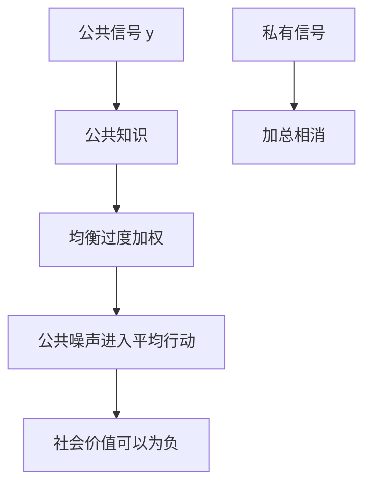

# Morris–Shin 公共信息

在协调博弈里，公共信号被用作公共知识；精度一般的公告，也可以被过度加权到损害配置。

<footer>—— Morris and Shin, Social Value of Public Information, American Economic Review, 2002</footer>

[上一课](/econ/beauty-contest-higher-order)已经把价格写成高阶期望的加权和，公共噪声更持久。本课缺口是**福利**：多披露一点公共信息，是否一定更好。Morris 与 Shin（2002）给出否定的参数区。不重推高阶展开，不写央行沟通实证。

## 问题

标准贝叶斯决策：更多公共信息降低对 $\theta$ 的均方误差，私人与社会都受益。美人竞赛改变目标：每人要同时贴近 $\theta$ 与贴近别人的平均行动。公共信号 $y$ 是公共知识，它移动整个平均行动，因而在「贴近别人」那一项里特别值钱。均衡里 $y$ 的权重超过它作为 $\theta$ 之信号的精度所配得的权重——上一课已有。

福利缺口是：过度加权把公共噪声写进集体行动。若协调项在社会目标里权重低于私人目标（私人过度在意相对表现），则提高 $y$ 的精度可能放大噪声、降低福利。私有信号没有这个问题：它不构成公共知识，加总时误差相消。

Morris and Shin, *AER* 92(5), 2002。原文动机含金融市场与货币政策透明。本课只保留协调博弈的逻辑，不审某一家央行的新闻稿。

## 方法

二次损失：距离 $\theta$ 的项，加上距离平均行动的项。均衡行动线性于 $(y,x_i)$。社会若只在乎对 $\theta$ 的配置（或给协调项较小权重），最优权重接近贝叶斯；均衡权重偏向 $y$。比较静态：$\mathrm{Var}(y\mid\theta)$ 下降时，均衡把更多噪声以更强系数写进平均行动，净福利可以下降——当且仅当协调动机足够强、公共信号还不够准到把噪声本身压没。

与 GS 对照：GS 的公共对象是价格，泄漏降低采集。这里的公共对象是外生公告 $y$，泄漏（其实是公共知识）提高协调价值、扭曲权重。获取课的互补，在此有了福利符号：私人过度投资于 $y$。

不要把「少披露」写成微观结构里的知情交易隐藏。那是战略交易者对 Kyle 风格 $\lambda$ 的反应；本课没有做市商。政策含义若要落到「公告与订单流谁先到」，已经越过 [到限价簿](/econ/to-limit-order-book) 的切点。

## 机制

机制是公共知识。$y$ 被看见，且人人知道人人看见，高阶期望坍缩到 $y$ 上。私有 $x_i$ 即使精度更高，也不能同样移动别人的二阶信念。于是理性的人「明知 $y$ 噪，仍跟 $y$」——因为别人跟。福利损失是集体跟错，不是个人算错贝叶斯。

信息披露后课会问企业愿不愿意把 $y$ 造出来。本课 $y$ 外生，只钉社会价值的符号可以翻。中介课则把 $y$ 变成评级：公共信号的生产本身是产业。

Angeletos–Pavan 把「社会是否也需要协调」参数化：若社会目标与私人一样需要协调，公共信息的价值转正。符号取决于两种损失的相对权重，不是一句「透明总好」或「透明总坏」。

## 边界

不要把本课写成反对一切披露。精度足够高时，噪声项被压住，价值转正；社会本身需要协调时，价值更不会负。刀刃在参数。也不要把过度加权检验写成事件研究的 PEAD——上一课程的注意力漂移是处理失败；这里是处理成功之后的战略权重。

下一课把战略换成有市场力的知情交易者：Kyle 在均衡框架里的位置。公共公告与私有信息的博弈，从权重问题变成「信息如何进入价格冲击」。

后课默认：协调下公共信息可被过度加权；其社会价值不必为正。私有信息加总更干净。这不改写 EMH 的信息分层，只限制「多披露必帕累托改进」。

## 小结

- 公共知识使 $y$ 的均衡权重超过贝叶斯权重。
- 协调动机足够强时，提高公共精度可以降低福利。
- 符号依赖社会是否同样需要协调，不是反披露教条。
- 出处：Morris and Shin, *AER* 2002。
