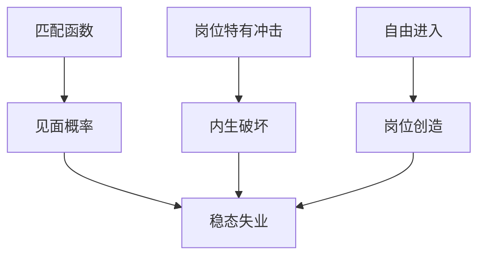

# Mortensen–Pissarides 搜寻

失业与空岗可以并存：匹配需要时间，工资在配对之后分剩余；创造与破坏是两条流，不是一条劳动需求曲线上的点。

<footer>—— Mortensen and Pissarides, Job Creation and Job Destruction in the Theory of Unemployment, Review of Economic Studies, 1994</footer>

附录对照，不插入主干。[上一课](/econ/mundell-1963-paper)对照的是开放经济里稳定化工具随汇率制度换位。本篇对照 **Mortensen–Pissarides 1994 原文的问题设定**：把失业写成搜寻摩擦下的流量均衡，而不是劳动市场出清失败的同义反复。主干[DMP 搜寻匹配](/econ/search-matching-dmp)已取匹配函数与 Beveridge；这里对照 *RES* 如何把岗位创造与岗位破坏写进同一篇，以及它为何不是 1963 年资本流动的续篇。

## 问题

瓦尔拉斯劳动市场里，工资出清，失业只剩摩擦或自愿。宏观要同时看到失业与空岗、以及岗位的生灭。Pissarides 的匹配函数把双方的寻找收成见面概率；Mortensen 的搜寻与工资议价把剩余切开。1994 年原文的缺口是：在已有匹配框架里加入**内生破坏**——生产率 idiosyncratic 冲击使现有岗位的剩余价值变负，岗位被毁，工人回到失业，同时企业按自由进入创造新岗。失业是创造流与破坏流的差，不是静态剩余。

会议式的宏观计量把失业当菲利普斯的另一轴。Lucas 原文已经警告简化式。MP 给的是另一套结构：摩擦参数与议价权，而不是一条可平移的劳动需求。

Mortensen and Pissarides, *Review of Economic Studies* 61(3), 1994, 397–415。不要发明 arXiv。DMP 是 Diamond–Mortensen–Pissarides 传统的统称；本篇对照的是 1994 年创造–破坏这一刀。

## 方法

匹配函数 $m(u,v)$，失业 $u$、空岗 $v$，紧度 $\theta=v/u$。空岗的见面率与失业的见面率由 $m$ 的一阶齐次给出。岗位有 idiosyncratic 生产率，跌破内生阈值则破坏。工资由纳什议价分匹配剩余。自由进入：空岗的期望价值等于招工成本。稳态：$u$ 使流出（匹配）等于流入（破坏加外生分离，视设定）。

主干课已写 Beveridge 曲线；附录不重画，只对照 1994 年把破坏从外生分离升级为阈值决策，使周期里破坏可以升、创造可以降。

## 机制

机制是配对的时间与剩余分享。企业付招工成本，换一个随机生产率的岗位；工人付失业时间，换一个随机工资。工资不能事先把所有状态写完，议价在见面后发生，于是空岗与失业可以同时为正——两边都在等更好的见面，而不是拒绝「市场工资」。破坏是当继续匹配的剩余低于拆开的期权。Hosios 条件（议价份额对齐匹配弹性）才有效率；否则创造过度或不足。原文把效率当参照，不把任意议价权当最优。

与 Mundell 1963 的对照只在附录链上：都是宏观结构，一个是开放宏观的制度分叉，一个是劳动流量。不要把搜寻插进不可能三角主干。

### 对照主干 DMP 课，不插入开放宏观之间

主干[DMP 搜寻匹配](/econ/search-matching-dmp)已取匹配函数、紧度与失业的流量定义。本附录对照 *RES* 1994：idiosyncratic 冲击、内生破坏、创造与破坏的共同决定。把这篇接在 Mundell 原文之后只因为宏观附录链如此排，**不插入**开放课序，也不把岗位匹配写成限价簿撮合。

Shimer 后来指出：标准校准下失业波动太小。那是定量刺，不是 1994 年定理作废。附录不审波动表。

## 边界

不要把 1994 写成已经包含内生搜寻强度的全部变体，或已经解决工资刚性。效率工资、交错合同是并列摩擦。也不要把匹配函数写成生产函数的劳动项去替代索洛残差课。

读完回主干搜寻课。宏观附录链下一篇转到股权溢价原文。

自由进入把空岗价值钉在招工成本上。没有这条，创造流没有锚。

工资若完全灵活且议价份额碰巧满足 Hosios，搜寻仍留下摩擦失业，只是创造量有效。工资粘性、效率工资是再加一层，不是 1994 年已经写进破坏阈值的东西。

读完回主干[DMP 搜寻匹配](/econ/search-matching-dmp)。不要把这篇接在 Mundell 之后当作开放宏观的下一课。股权溢价原文是附录链上的下一篇，不是劳动市场的推论。

## 小结

- 附录对照 Mortensen–Pissarides 1994：失业是匹配摩擦下创造流与破坏流的稳态。
- 内生破坏由岗位特有生产率的阈值给出；工资在配对后议价。
- 空岗与失业并存是搜寻的定义现象，不是劳动需求没画对。
- Hosios 条件才有效率；任意议价权不是最优。
- 读完回主干 DMP 课；不插入开放宏观主干。
- 出处：Mortensen and Pissarides, *RES* 1994。
