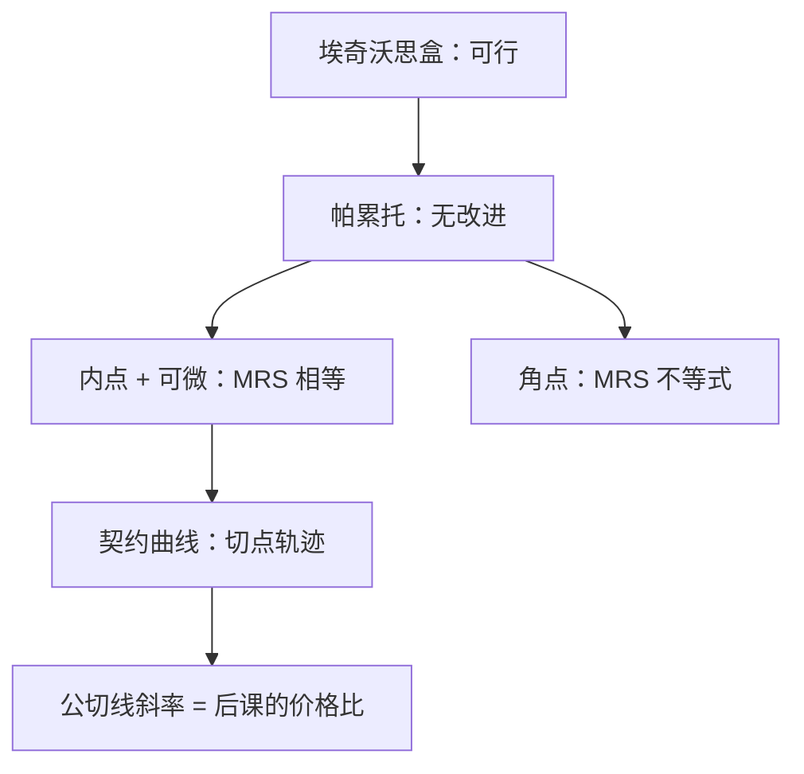

# 契约曲线与 MRS

盒中无差异曲线相切的轨迹，就是契约曲线；切点上两人的边际替代率相等，那是内点有效的几何，还不是价格。

<footer>—— 据 Varian, Intermediate Microeconomics；Mas-Colell, Whinston and Green 第 15–16 章整理</footer>

定位：[上一课](/econ/edgeworth-pareto)。埃奇沃思盒已经把可行配置画成矩形，并把帕累托集叫做合同曲线，也写下了内点 $\mathrm{MRS}^A=\mathrm{MRS}^B$。本课不从「什么是交易」起笔，也不重讲透镜与公平。缺口是几何与可微刻画怎样一一对应：切点、角点、支撑价格的斜率，以及契约曲线为什么通常是一条曲线而不是一个点。

## 问题

上一课用「不存在帕累托改进」定义有效。可微、严格凸、内点时，这句话等价于无差异曲线相切，即

$$
\mathrm{MRS}_{12}^A(x^A)=\mathrm{MRS}_{12}^B(x^B)=\frac{\partial u^A/\partial x_1^A}{\partial u^A/\partial x_2^A}.
$$

缺口是把等价说清楚，并标出它**还不是**瓦尔拉斯均衡：相切只对齐两人的边际评价，没有要求这条公切线通过禀赋点，也没有要求两人在同一预算上最优。公切线的斜率将是后课的价格比；本课只把斜率从几何里读出来。

契约曲线是满足切条件（及可行性）的点的轨迹。给定偏好，它在盒里通常从一边伸到另一边；给定禀赋，互利交易只落在透镜与轨迹的交集。集合大，正是需要拍卖人的原因。

### 相切是内点条件，不是有效的定义

定义始终是「没有可行的改进」。非凸时相切可以不是局部最优；角点时不相切也可以有效。把 MRS 相等当成定义，会在轴上和凹偏好处说错话。上一课已埋伏角点；本课用图把轴上的不等式画出来。

MRS 是商品 2 计的商品 1 的边际评价。盒里 $A$ 的无差异从左下、 $B$ 从右上。相切意味着过该点能画出一条同时支撑两条无差异曲线的直线——后课把它叫做预算。

## 方法

对内点有效配置，用拉格朗日（可行性 $x^A+x^B=\omega$）或直接从「改进方向」推切条件：若 $\mathrm{MRS}^A\gt \mathrm{MRS}^B$，$A$ 愿用比 $B$ 所要的更少的商品 2 换一单位商品 1，交换改进双方。严格凸保证切点是切不是交。把 $x^A$ 沿可行性消去，切条件给出 $x_1^A$ 与 $x_2^A$ 的关系，即契约曲线方程。

准线性、柯布–道格拉斯等教具上曲线可写成显式；本课不把显式当一般定理。提供曲线（offer curve）是价格变动时需求的轨迹，与契约曲线相交于均衡——那是下一课，本课禁止提前解 $z(p)=0$。

有生产时，总量沿 PPF 变，有效还要求 $\mathrm{MRS}=\mathrm{MRT}$。本课边长仍固定，只补交换几何；生产一般均衡后课再接。

## 机制

为什么轨迹一般是一维：两种商品、两人、可行性吃掉两个变量，切条件再吃一个，剩下一个自由度——这就是「曲线」。$I$ 人 $L$ 商品时，帕累托集是 $L(I-1)$ 维里的 $L-1$ 个切条件之后的流形，矩形画不出，定义不改。

公切线已经几乎是价格：它给一个共同的交换比率。缺的是：这个比率要让两人**愿意**停在切点，而不是沿着切线滑到别处。那需要预算通过各自的禀赋（或转移后的财富），即瓦尔拉斯。本课只保证「有效 $\Rightarrow$ 存在一条支撑两条无差异的直线」在凸、内点时成立。

从禀赋出发的交易路径不必沿契约曲线走。透镜里的点都可以是某次双边议价的停靠；只有到达曲线上，改进才消失。Edgeworth 的 recontracting 想象联盟不断重订合同，极限落在核里，两人时核就是透镜与曲线的交。本课几何停在曲线本身；核是后课用联盟阻塞再瘦一次。

不要把契约曲线上的点写成限价簿的成交价。曲线上没有队列、没有价差；每一点是配置，斜率还没有被市场挑中。

## 边界

不可分商品让切条件失效，核与匹配用另一套语言。外部性使「盒的边长」不能概括他人的效应，帕累托条件要改。后课[瓦尔拉斯均衡](/econ/walrasian-equilibrium)用价格在契约曲线上挑点；本课不挑。

后课默认：说到内点有效，即盒里 MRS 对齐、配置在契约曲线上；均衡还要预算与出清。

## 小结

- 内点有效 $\Leftrightarrow$ 无差异相切 $\Leftrightarrow$ MRS 相等；定义仍是无改进。
- 契约曲线是切点轨迹，一般不是单点；透镜只截一段。
- 公切线的斜率预示价格比，但本课还没有拍卖人。
- 下一课用价格当公共信号，在曲线上挑出清的一点。
- 出处：Varian, *Intermediate Microeconomics*；Mas-Colell, Whinston and Green 第 15–16 章；Edgeworth, 1881。
