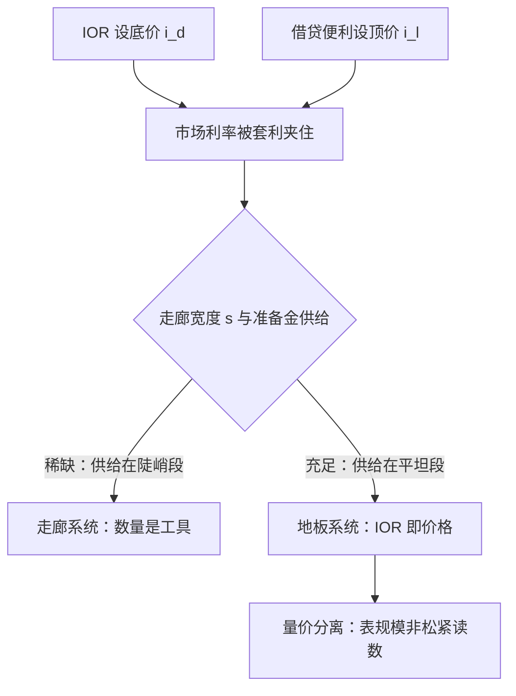

# 利率走廊的理论

价格由承诺决定，数量由支付决定；把二者混为一谈，就会把准备金的洪水误读成政策的洪水。

<footer>—— 据 Bindseil 对货币政策实施的整理；Woodford, Interest and Prices, 2003</footer>

[上一课](/econ/mt-digital-currency-theory)讨论央行负债发给谁之后，回到最古典的环节：无论目标定在哪、规则写成什么样，央行最终都要把市场利率钉在宣布的位置 $i^{*}$ 上。基线课的[准备金利息与走廊](/econ/ior-corridor-floor)已给出走廊与地板的操作框架，并留下「资产负债表规模不是松紧的充分统计」这条经验；本课深化它的理论：套利论证为什么夹得住利率、走廊宽度的取舍、以及量价分离的模型位置。

## 问题

央行对市场交易没有强制力，凭什么市场利率听它的？答案是一个两边的套利论证。准备金利息 $i_{d}$ 给持有准备金设定无风险底价：没有银行愿意以低于 $i_{d}$ 的利率把资金借给市场，因为存回央行无风险且更优。借贷便利 $i_{l}$ 给流动性设定顶价：没有银行为头寸支付高于 $i_{l}$ 的利率。于是市场利率被夹在 $[i_{d},\, i_{l}]$ 内，走廊宽度

$$s = i_{l} - i_{d}$$

就是这套机制的公差。只要支付摩擦与准备金分布的离散度小于 $s$，不需要任何一笔强制交易，市场利率就被套利钉住。

## 方法

走廊宽度把体系分成两种运行状态。**稀缺准备金**（走廊系统）：央行把供给放在需求曲线的陡峭段，量的边际误差直接变成价的误差——数量是工具，央行必须每天精确预测支付摩擦引起的准备金需求。**充足准备金**（地板系统）：供给远超需求，需求曲线在平坦段，市场利率贴着 $i_{d}$；数量失去边际含义，价格即政策，央行从「算准量」的工程师变成「宣布价」的机构。地板的代价是常备的超额准备金存量，收益是把准备金预测误差这个整类风险从政策里删除。

量价分离有更深的一层。Woodford 2003 的近现金极限论证：当央行负债充分计息、利率规则满足确定性条件时，价格水平由利率规则决定，与货币数量脱钩——这正是[Woodford 利息与价格](/econ/woodford-interest)附录的骨架，也是[数量方程与货币中性](/econ/quantity-theory)在操作层面的修正：$M$ 内生于支付需求（[准备金、乘数与内生货币](/econ/reserve-endogenous-money)），不再是政策立场的光学读数。

## 机制

走廊宽度的选择是一组权衡。宽走廊容忍日间支付摩擦（[支付系统与 RTGS](/econ/rtgs-payments)）与准备金在银行间分布的异质性，但让利率的日间波动带着政策噪声；窄走廊逼近零宽时控制精度最高，却把所有摩擦推向借贷便利，最后贷款人从后备变成日常（[最后贷款人](/econ/lender-of-last-resort)）。地板系统是窄走廊的极限稳定态：利率钉在 IOR，回购与货币基金市场的价格绕着它组织（[回购市场与货币市场基金](/econ/repo-mmf)）。

「地板漏水」是这个理论的第一号边界：当准备金分布高度异质——部分机构（如政府支持企业）无权赚 IOR，银行可以借入低价资金再存回央行套利——有效利率会贴在 IOR 之下，地板不再水平。修复靠的是把付息面扩到对手方，或靠常备回购便利托底，这恰与[CBDC](/econ/cbdc)把付息面扩到公众的「争夺走廊」逻辑同源：付息面扩到哪一层，价格钉在哪一层。

判读一个体系走在廊还是在地板，看的不是准备金总量，而是「量的边际是否还有价格含义」。2008 年后美联储准备金扩张数倍而有效联邦基金利率钉在 IOR 附近，是量价分离最直接的自然实验。

## 边界

本课的套利论证假定银行同质、支付摩擦外生；分布异质时地板会漏，如上所述。走廊理论也不涉及汇率干预与资本流动下的利率独立——那属于开放经济政策。要划清的另一条边界：地板系统下扩表不再是宽松信号，但缩表也不是对称的紧缩信号；[央行资产负债表](/econ/central-bank-balance-sheet)的退出机制另有一套工程逻辑。至此目标、规则、预期、非常规工具、负债侧创新与实施机制全部就位，下一课收束整门课程。

## 小结

- 央行钉住利率靠双边套利：IOR 设底价，借贷便利设顶价，走廊宽度是公差。
- 稀缺系统里数量是工具，地板系统里 IOR 即价格、数量失去信号含义。
- 量价分离的模型位置是 Woodford 的近现金极限：利率规则决定价格，$M$ 内生。
- 地板漏水与 CBDC 争夺走廊同源：付息面扩到哪层，价格钉在哪层。
- 出处：Bindseil 对货币政策实施的整理；Woodford, *Interest and Prices*, 2003；央行操作框架公开讨论。
