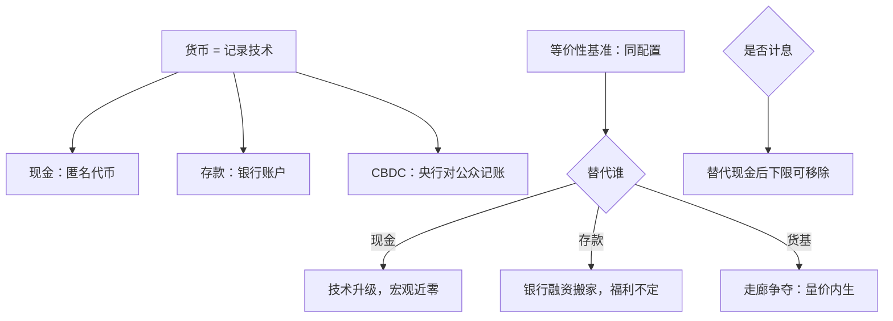

# 数字货币的理论

货币是一套记账与结算的安排；数字化的真问题不是要不要，而是由谁记账、记录带不带身份、以及计息到多负。

<footer>—— 据 Brunnermeier–Niepelt 2019；BIS 对 CBDC 的综述整理</footer>

[上一课](/econ/mt-qe-theory)把负债侧的第一种扩张——买资产——还原为对摩擦的针对性松绑。负债侧还有更激进的一步：央行绕开银行，直接对公众发行负债，这就是 CBDC。基线课的[CBDC](/econ/cbdc)已给出类型学、挤兑与走廊争夺的要点；本课深化它的理论骨架：公共货币与私人货币的等价性基准、替代对象决定效应、以及计息货币对利率下限的重写。

## 问题

理论起点是把货币看成记录技术。现金是匿名的代币式记录——谁持有谁拥有；存款是商业银行的账户记录——转账改的是账。CBDC 是央行账户（或央行代币）对公众开放，于是[货币层次与支付](/econ/money-as-medium)里由存款与现金分掌的记录职能，第一次出现了央行的直接版本。Brunnermeier–Niepelt 2019 给出等价性基准：在完全市场与同等执行技术下，公共发行与私人发行支持相同配置。与 QE 的无关性定理同构，这是纪律而非否定：**CBDC 的一切实质效应，必须由某个具体摩擦承担**——支付市场的垄断、执行技术差异、或挤兑。

## 方法

第一个要钉住的变量是替代对象，效应随它完全改变。

替代现金：只是记录技术升级，宏观含义近零。替代存款：银行融资被抽走，贷款端如何反应取决于银行能否用其他负债补位；Keister–Sanches 的结论是双向的——存款利率因竞争上升，贷款可能收缩，福利不定。替代货币基金：公众获得对手方地位的央行负债，准备金市场的量价关系被改写，这正是基线课「争夺走廊」的来源。

第二个变量是计息。现金的名义回报被制度固定为零且不可销毁，这是利率下限的技术根源（Eggertsson–Woodford 2003 已点明）：存款利率被拉到显著为负时，公众换持现金，宽松失效。可计息的 CBDC 若最终替代现金，这个逃逸通道被关闭，有效下限原则上可以移除——负利率从修辞变成工具。

## 机制

计息与下限的机制值得单独展开。上一课的[Friedman 规则](/econ/mt-optimal-inflation)与下限保险的张力，在可计息货币体系里被重新谈判：既然有效下限来自现金这个不可计息的替代品，那么消灭现金与取消下限是同一个决定的两面。下限消失后，衰退期的宽松不再受零约束，第一课里「为下限买保险而维持正通胀」的理由被削弱——最优通胀问题在数字货币世界里要重新作答。

账户式记录携带身份，代币式记录携带匿名，这是设计参数而非附加功能：身份记录改善税收执行与反洗钱，也把支付行为变成可监测数据；匿名代币保留隐私，也保留通胀税的逃逸口。货币理论在这里与公共财政接壤：通胀税的可行性依赖于不可匿名化的货币基础。

等价性定理与 Wallace 1981 在方法论上是同一枚硬币：先写无摩擦时公共与私人货币无差别，再逐个引入摩擦解释观察到的差异。跳过基准直接论证「CBDC 必然改变什么」，与跳过基准论证「QE 必然有效」是同一种错误。

## 边界

网络效应与转换成本让「原则上」与「实际上」之间隔着强路径依赖：支付习惯、商户接受、跨境使用都不随政策一步切换。离境与货币替代——他国公众持有本币 CBDC 带来的输送效应——属于国际货币体系的深化，本课不展开；挤兑动态在基线课已给出结构，这里只补一句机制来源：计息 CBDC 相当于给[存款人](/econ/diamond-dybvig)一个常备的外部期权，挤兑的触发阈值因此系统性左移。下一课回到最古典的环节：无论负债发给谁，央行怎样把市场利率钉在它宣布的位置。

## 小结

- 等价性基准先行：摩擦决定效应，CBDC 不是自带宏观力量的新资产。
- 替代对象是第一个变量：替代现金近零，替代存款福利不定，替代货基改写走廊。
- 下限的技术根源是零息现金；可计息 CBDC 使取消下限与消灭现金成为同一决定。
- 隐私是设计参数：身份记录换税收执行，匿名代币保留通胀税逃逸口。
- 出处：Brunnermeier–Niepelt 2019；Keister–Sanches 2023；Eggertsson–Woodford 2003；BIS CBDC 综述。
