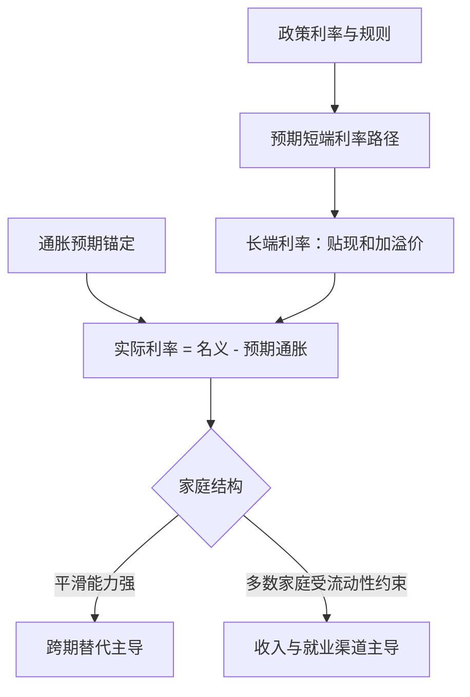
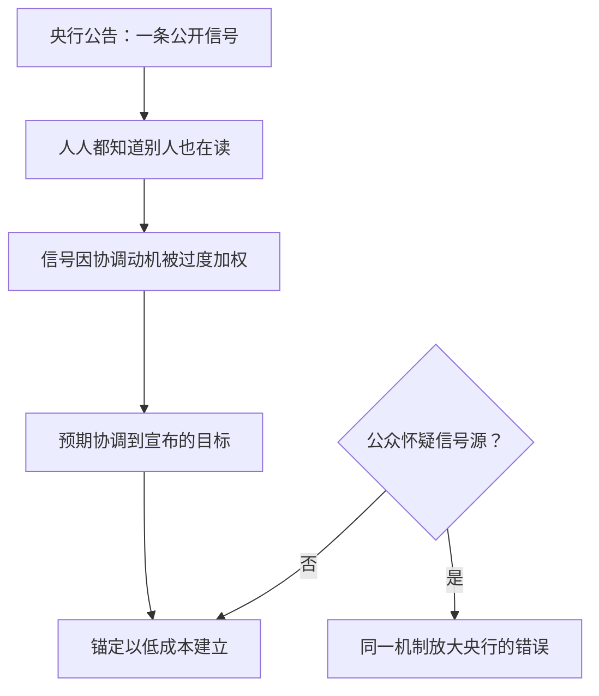

# 预期的管理与传导

央行公告同时做两件事：告诉公众通胀会是什么，以及替公众决定该把预期协调到哪一点；第二件事常常比第一件更有效力。

<footer>—— 据 Morris–Shin 2002；Woodford, Interest and Prices, 2003 整理</footer>

[上一课](/econ/mt-policy-rules)把承诺写成反应函数，并要求 $\phi_\pi \gt 1$ 来保住均衡唯一。但反应函数作用的对象不是物价本身，而是公众的预期：规则约束的是央行自己的行为，传导要穿过家庭与企业的预期形成。基线课的[预期管理与沟通](/econ/expectations-management)与[通胀预期锚定](/econ/inflation-anchoring)讲了沟通实践与锚定的经验事实；本课深化两件事——预期的形成模型，与传导管道的逐段分解。

## 问题

同样降息一百个基点，有时需求明显起振，有时悄无声息。差别藏在[新凯恩斯](/econ/new-keynesian)消费欧拉方程里：当期消费取决于未来消费路径与**整条**预期实际利率路径，不是当期一期的利率。于是传导的强弱取决于三个状态量：预期通胀 $E_t\pi_{t+1}$ 是否锚住、未来政策利率路径的预期、以及家庭结构决定的消费平滑能力。[前瞻指引之谜](/econ/fg-puzzle)已经记录了标准模型的病灶：完美平滑的代表性家庭把遥远的承诺利率也放大成当期需求，效应「异常大」。

「前瞻指引」翻译成大白话：央行提前告诉你「未来一段时间利率会保持很低」。它作用的对象是你对未来利率路径的猜测，而不是今天的利率本身——长端利率正是这条预期路径的贴现和。

## 方法

把管道拆成三段，每段单独核账。

**利率的期限段**：政策利率只管最短端，长端利率是预期短端路径的贴现和加期限溢价。传导的第一步是移动整条预期路径——指引、再投资承诺、资产购买都在做这件事，程度取决于可信性。

数字实例：市场预计未来五年短期利率平均为 2%，再加 0.5% 的期限溢价，五年期利率约为 2.5%。央行只要让公众相信「未来五年平均短端利率将低 0.3%」，长端就能立刻降 0.3%——今天的政策利率一动不动也行。

**预期的锚定段**：锚住时，名义利率的每一单位变动几乎一对一转化为实际利率变动；脱锚时，宽松会被通胀预期上升吃掉一部分。锚定因此不是修辞，是实际利率弹性的乘数。

**家庭结构段**：在异质agent模型里（[HANK](/econ/hank)），消费对利率的直接弹性集中在持有流动资产的家庭，多数家庭靠劳动收入渠道感受政策；前瞻指引的跨期替代效应大减，收入与就业效应接管传导。标准模型对指引的过度放大，在分布维度上得到修正。

## 机制

预期形成的模型决定锚定该怎么读。理性预期是基准，但它不解释漂移：[适应性预期与学习](/econ/adaptive-learning)给出锚定的动态版本——公众用递归最小二乘学习政策规则，通胀停在该处久了，认为它会停在原处的信心才累积起来；锚是学出来的，不是宣布出来的。

直觉类比：锚定像个人信誉——不是宣布一次就有的，而是每次说到做到攒出来的。通胀停在目标附近越久，公众越相信它会继续停在那里；一旦反复失约，锚就悄悄松动，重攒信誉要付通胀波动的成本。

公共信息的作用是另一层机制。[Morris–Shin 公共信息](/econ/morris-shin-public-info)指出：当行动者有协调动机时，一条公开信号即使不完全，也会被过度加权——大家都推测别人在读它。央行公告因此是协调装置：通胀目标制之所以便宜地改变了预期，正是因为目标数字给了所有人同一个聚焦点。同一机制的暗面是，若公众怀疑央行自身的判断，过度协调会放大央行的错误；沟通的精确度不是越高越好，取决于公众对信号源质量的信念。锚定的实证度量交给[调查预期数据](/econ/survey-expectations)：专业预测者离散度的收窄与长期预测对目标的收敛，是锚定与否的直接读数。

锚定的算术：预期通胀锚住时，名义利率降一百基点，实际利率约降一百基点；预期脱锚时，宽松的一部分被预期通胀上升抵消。2021 至 2023 年关于通胀是否脱锚的争论，争的就是这个泄漏项的大小。

## 边界

本课不重推导欧拉方程与菲利普斯曲线的微观基础，也不展开开放经济的汇率渠道——[利率平价与汇率](/econ/uip-and-cip)已另有安排。要钉住的边界是：预期管理不能替代承诺的可信性，指引只有在与规则一致时才被定价；诊断性预期（[过度外推与诊断性信念](/econ/diagnostic-expectations)）提醒短期预期会系统性外推近期状态，这使锚定度量必须区分短期波动与长期锚。下一课把传导推到极限状态：当短端利率触到下限，管道还剩什么。

## 小结

- 传导由三段组成：预期利率路径、锚定的实际利率折算、家庭结构的分布效应。
- 标准代表性家庭模型放大前瞻指引，HANK 类模型把它修正到合理量级。
- 锚定是学习出来的均衡，不是公告的瞬时效果；公共信号因协调而被过度加权。
- 沟通的精确度有最优水平：公众怀疑信号源时，过度协调放大央行错误。
- 出处：Woodford, *Interest and Prices*, 2003；Morris–Shin 2002；Eggertsson–Woodford 2003；Kaplan–Moll–Violante 2018。
