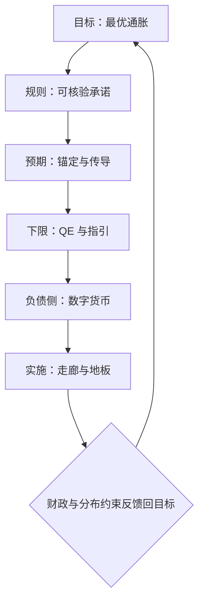
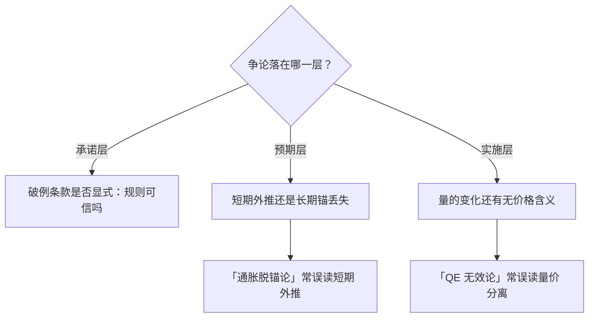

# 货币理论收束

货币理论的全部问题可以压缩成一句：央行承诺什么、凭什么信、用什么做到。

<footer>—— 据 Woodford, Interest and Prices, 2003 与本课程各课整理</footer>

[上一课](/econ/mt-corridor-theory)把实施机制钉住之后，本课程到此收束。七课连起来读，其实是一条单线：目标（[最优通货膨胀](/econ/mt-optimal-inflation)）给政策一个想守住的东西；规则（[货币政策规则](/econ/mt-policy-rules)）把守住它的方式写成可核验的承诺；预期（[预期的管理与传导](/econ/mt-expectations-transmission)）说明承诺为什么便宜——穿过预期比穿过物价便宜；下限与非常规（[QE 的理论](/econ/mt-qe-theory)）处理承诺被零利率卡住时的救济；数字货币（[数字货币的理论](/econ/mt-digital-currency-theory)）重画负债侧的可行集；走廊（[利率走廊的理论](/econ/mt-corridor-theory)）把宣布的价格变成市场里的价格。

## 问题

把七课压缩成一个框架，问的是它们共有的约束。答案是名义锚的**可信性**与实施的**可行性**必须同时成立：承诺不被相信，规则退化为话术；相信了却做不出来，承诺退化为违约。巴罗–戈登式的通胀偏误在第一课以财政形式回归，在 QE 课以财政主导形式回归——同一条边界在三处露面，说明它不是某一课的细节，而是这门学科的背景辐射。

「名义锚」翻译成大白话：给名义变量（通胀、价格水平）钉的一个公认定值，像船锚把整条船拴住——通胀预期拴在 2% 上，工资与定价就不会集体漂移。

## 方法

读后续文献与政策辩论时，可以用三张清单定位任何一篇货币政策文字。**承诺层**：目标是什么、写在损失函数还是反应函数上、有没有永恒视角、破例条件是否显式。**预期层**：锚定的度量是什么、传导走哪一段管道（利率路径、实际利率折算还是收入渠道）、模型对前瞻指引的放大是否已被修正。**实施层**：价格靠什么钉住（稀缺量、IOR 还是双边便利）、付息面覆盖到哪一层、量是否还被当作信号。三张清单各自完整，交叉处就是大多数争论的位置：例如「QE 无效论」常把实施层的量价分离误读为传导失灵；「通胀脱锚论」常把预期层的短期外推误读为锚定丢失。

## 机制

框架的生成能力可以从两个未竟问题上看。其一，自然利率的长期下行压缩了下限保险的空间：第一课的正通胀理由在 $r^{*}$ 贴近零时变贵，而数字货币若移除下限，保险费可以退回——技术变化反过来改写最优通胀的答案。其二，供给冲击让「目标制」承担此前没有的权重：相对价格大调整时期，坚持中期锚与容忍短期偏离之间的界限，正是规则课「显式破例条款」与预期课「锚定度量」的联合应用题。私人稳定币对支付与走廊的渗入，则是数字货币课替代对象分析的直接延伸：当私人代币承接记录职能，央行付息面未覆盖的那一层，就是价格钉不牢的那一层。

直觉类比：可信性像「你说到做到的记录」，可行性像「你兜里有没有工具」。只有前者，承诺是话术；只有后者，工具在手却没人信你会用——两样齐了，预期才会替你免费干活。

Sargent–Wallace 1981 在本课程出现了两次：第一课的铸币税边界与 QE 课的财政主导。一个结论在课程两处作为约束出现，通常意味着它属于学科的骨架而非某章的细节——货币理论最终要向财政理论交卷。

## 边界

本课程的边界同样要交代。开放经济的传导——汇率渠道、资本流动与货币同盟的政策分工——只在衔接处提及，没有展开；金融中介的完整理论（挤兑、监管资本、最后贷款人的救助决策）属于货币银行方向的后续课程；宏观计量的识别问题——政策冲击怎么测——属于实证方法的课程序列。收束不等于问题已解决：这门课给的是定位任何新问题的坐标系，不是答案的清单。

常见误区：把收束课当成复习。它给的是坐标系——遇到任何新政策辩论，先用三张清单判断分歧落在承诺、预期还是实施层，才看得出哪些争论其实是鸡同鸭讲。

## 小结

- 七课一条线：目标、规则、预期、下限救济、负债创新、实施机制依次咬合。
- 名义锚要可信性与可行性同时成立，缺一则承诺退化。
- 三张清单（承诺、预期、实施）用于定位任何货币政策争论的真实分歧。
- 财政与分布约束是课程两次露面的骨架性边界，货币理论向财政理论交卷。
- 技术与利率环境变化会改写最优通胀与下限保险的答案，框架可复用，参数不固化。
- 出处：Woodford, *Interest and Prices*, 2003；Friedman 1969；Taylor 1993；Eggertsson–Woodford 2003；Sargent–Wallace 1981。
