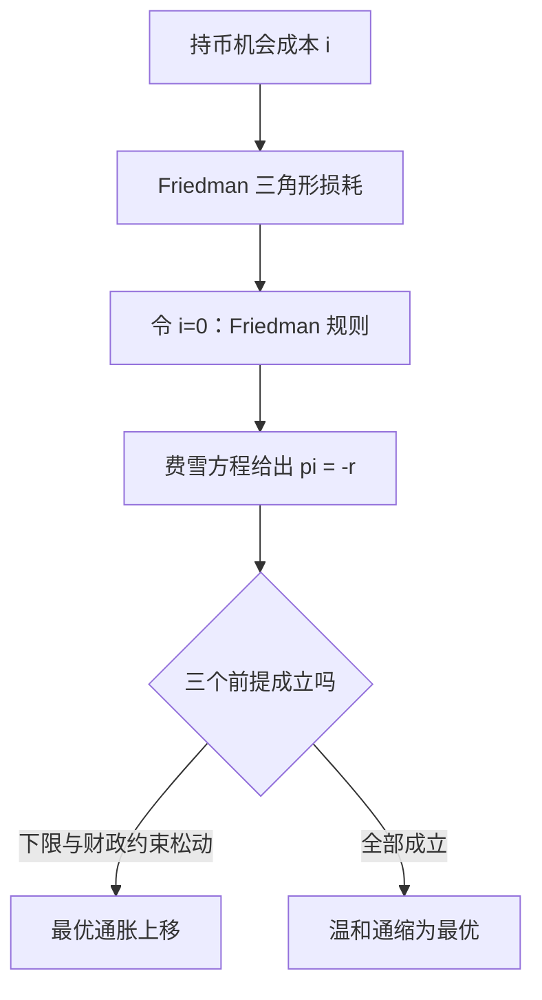

# 最优通货膨胀

让持币的机会成本归零，最优通胀就该是负的；没有央行采用这个答案，因为下限和财政都不允许它。

<footer>—— 据 Friedman, The Optimum Quantity of Money, 1969 整理</footer>

[上一课](/econ/apt-map)把资产定价深化的课程收束：核的弯在哪、可观测对应物是什么、过不过 Hansen–Jagannathan 与发表后存活率两道闸门。定价回答的是收益从哪来；换到宏观政策，先要问的是目标——通胀目标为什么是 $2\%$ 而不是 $0\%$，甚至不是负的？宏观课把目标当成给定，本课程的第一课专门问它：最优通货膨胀由什么决定。后面的政策规则、预期、QE 理论、数字货币与利率走廊，都默认你已经想清楚目标，再谈怎么实现。

## 问题

通胀的收益一面出奇地窄。居民与企业持有货币是为了支付，[货币层次与支付](/econ/money-as-medium)里已给出：现金与准备金的回报近似为零，而其他资产按名义利率 $i$ 计息，持币的机会成本就是 $i$。$i$ 越高，人们越省着用货币：更快地把工资换成生息资产、更频繁地跑银行、把现金缓冲削得更薄。Friedman 1969 把这笔损耗画成三角形：货币需求向下倾斜，单位价格是 $i$，福利损失是价格线与需求曲线之间的面积。要把三角形消灭，只能令 $i=0$。

成本一面则宽得多。可预期的通胀带来鞋底成本与[菜单成本](/econ/menu-cost)，但温和水平下都不大；真正大的是相对价格分散——调价不同步，通胀越高，同一时刻各价格之间的错位越大；再加上税制不随通胀指数化的扭曲，与未预期通胀在债权债务之间的再分配。

## 方法

把两面放进费雪方程 $i = r + \pi^{e}$（[费雪方程](/econ/fisher-equation)）。令 $i=0$，得到 **Friedman 规则**：通胀应等于真实利率的负值，$\pi^{e} = -r$。若 $r$ 在每年 $1\%$ 到 $2\%$，最优通胀是每年 $-1\%$ 到 $-2\%$ 的温和通缩：价格缓慢下降，持币与持债一样好，货币的支付服务免费。

这个答案是基准，不是处方。推导只用了持币机会成本一件事，隐含三个前提：铸币税没有独立价值（[通胀税与铸币税](/econ/seigniorage)的财政动机不存在）、名义利率下限不构成约束、价格分散与税制扭曲在温和通缩下不爆炸。哪一个前提松动，答案就往正通胀方向移动多少。

## 机制

现实央行全部把目标定在正的小值，偏离 Friedman 规则的机制有三个，值得逐一核对。

第一是**下限**。$\pi = -r$ 意味着名义利率长期贴着零，央行失去用利率应对衰退的常规空间。Eggertsson–Woodford 2003 在下限模型里证明：只要衰退可能发生，Friedman 规则不再最优——预留正的通胀与利率空间，等于买了一份对付下限的保险。这与[零下限与非常规政策](/econ/zlb-unconventional)互为表里：那一课讲下限绑住工具后怎么办，本课讲为什么一开始就不该把工具绑死。

第二是**财政**。Sargent–Wallace 1981 的算术指出：若财政赤字独立于货币当局，今天的货币紧缩只是把通胀推迟并放大——最优通胀不是央行能单独决定的变量，它取决于财政与货币谁迁就谁。

第三是**测量与缓冲**。物价指数有向上偏差，$2\%$ 的目标对应的真实生活成本通胀接近零；正目标同时给相对价格调整留出空间，避免名义刚性全部由就业吸收。

Friedman 规则在 $r=2\%$ 时要求 $\pi \approx -2\%$，没有任何主要央行采用。Eggertsson–Woodford 2003 给出最干净的反对理由：该规则把经济永久钉在利率下限上，冲击来临时没有工具可用——保险价值为负。

## 边界

本课只谈确定环境下的稳态最优，不引入产出一通胀的短期交替——那是[新凯恩斯菲利普斯曲线](/econ/nk-phillips)与[最优货币政策](/econ/optimal-nk-policy)的对象。也不讨论 2.0 还是 2.5 个百分点这类精度：在异质家庭与金融摩擦下，最优目标对分布假设敏感，没有单一数字。Friedman 规则的价值在于给出方向：持币成本是政策变量，把它压低有真实收益，压过头的代价由下限与财政来计价。

## 小结

- 持币的机会成本是名义利率；Friedman 1969 据此推出最优通胀为负，$\pi^{e}=-r$。
- 温和通胀的真实成本是相对价格分散与税制扭曲，不是鞋底成本。
- 下限约束、财政铸币税与测量缓冲，是现实目标停在正小值的三个机制。
- 目标的选择决定后课一切工具的空间：目标定得越低，下限绑得越早。
- 出处：Friedman, *The Optimum Quantity of Money*, 1969；Eggertsson–Woodford 2003；Sargent–Wallace 1981；Woodford, *Interest and Prices*, 2003。
