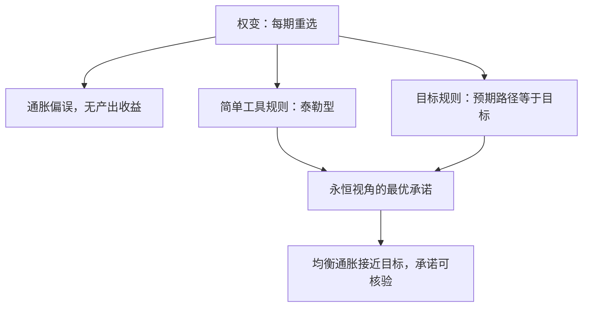

# 货币政策规则

规则优于权变，不是因为规则更聪明，而是因为承诺可以被第三方核验；不可核验的承诺只是意图。

<footer>—— 据 Kydland–Prescott 1977；Taylor, Carnegie–Rochester 1993 整理</footer>

[上一课](/econ/mt-optimal-inflation)把目标定在正的小值，并指出目标越低、下限绑得越早。缺口随之而来：从目标到实际利率之间需要一张映射，而央行每一期都有重新选择的诱惑——权变的均衡是通胀偏高而无产出收益，这是[时间不一致与承诺](/econ/time-inconsistency)与[Kydland–Prescott 规则优于权变](/econ/kydland-prescott)已经铺好的结论。本课不再论证「要承诺」，而是深化「承诺长什么样」：工具规则与目标规则的分工、泰勒原理的确定性角色、以及最优承诺的起点问题。

## 问题

「按规则办事」仍是一个谱系。基线课的[泰勒规则](/econ/taylor-rule)给出最著名的一条：

$$i_t = r^{*} + \pi_t + \phi_\pi(\pi_t - \pi^{*}) + \phi_y\,\tilde{y}_t,$$

系数 $\phi_\pi = 1.5$、$\phi_y = 0.5$ 拟合的是 1987 至 1992 年的美国数据。缺口在于：这是历史拟合，不是福利最优；且同一承诺可以写在不同的变量上——直接给利率公式，还是只给通胀目标的达成条件。选哪一种，决定了规则在模型更替时的存活能力。

数字实例：目标通胀 2%，实际通胀 4%，产出缺口为 0。按 $\phi_\pi=1.5$，名义利率应为 $r^{*}+4\%+1.5\times(4\%-2\%)=r^{*}+7\%$——通胀每多 1 个点，利率要加 1.5 个点，实际利率才能真正收紧。

## 方法

工具规则直接规定工具 $i_t$ 对可观测变量的反应，央行与公众都能逐期核验。目标规则只规定目标变量的条件，典型形式是：通胀的预期路径必须等于目标，加上损失函数最小化的一阶条件。二者的分工是：工具规则把承诺写死在反应函数上，简单、可审计；目标规则把承诺写在损失函数上，模型换了、承诺还在。Woodford 2003 倾向后者，理由正是模型的不可靠性。

直觉类比：工具规则像导航逐秒告诉你「现在打多少度方向盘」；目标规则像只规定「天黑前必须到达」——路改了（模型换了），导航作废，但「天黑前到达」这个承诺依然有效。

承诺的起点同样要选。若规则从「今天」开始执行，开局一期存在一次性通胀的诱惑——旧债已定，意外通胀是免费午餐。**永恒视角**（timeless perspective）要求规则当作无限过去就已存在来评估，掐掉这个开局红利；它是把巴罗–戈登式偏误从稳态推到全路径的修正。

## 机制

规则之所以能钉住价格路径，核心是[泰勒原理](/econ/taylor-principle)的确定性角色：要求 $\phi_\pi \gt 1$。通胀预期上升一个百分点，名义利率须上升超过一个百分点，实际利率才被推高，通胀预期才被压回；若 $\phi_\pi \lt 1$，通胀上升反而降低实际利率，需求扩张反过来坐实通胀——均衡不唯一，价格水平由任意的预期波动决定。确定性不是福利计算，而是规则能生效的前提条件：先有唯一均衡，才谈得上均衡好还是坏。

常见误区：把 $\phi_\pi\gt 1$ 当成「态度强硬」。它是数学上的确定性条件：系数不足 1 时通胀上升反而压低实际利率，均衡不唯一——价格由预期波动任意决定，再强硬的表态也钉不住。

简单规则在模型不确定下另有优势。最优规则把系数压到对具体模型结构的敏感处，模型一错、规则失效；文献对简单规则稳健性的比较（McCallum 1988 以来）发现，跨模型表现平均较好的往往是系数保守的简单规则。这与上一课的结论一致：目标定得保守，是为了留下犯错的空间；系数取得保守，是为了留下换模型的空间。

$r^{*}$ 与产出缺口的测量误差是简单规则的常态负担（[自然利率 r*](/econ/r-star)）：实时估计的缺口在衰退里系统性偏负，规则会跟着过度宽松。规则的价值不因此取消，但系数的保守性与对状态的平滑处理成为工程要求。

$\phi_\pi \gt 1$ 是局部确定性条件，不保证全局唯一，也不防住缺口测量的误差。1990 年代把泰勒规则的历史拟合当规范处方使用，混淆了「描述了这段历史」与「应该按此执行」两件事。

## 边界

本课的规则只写通胀与产出缺口，没有给金融稳定和供给冲击留权重——把这些塞进同一反应函数，会与[权变对承诺](/econ/discretion-commitment)里讨论的新目标混淆，损害可核验性。规则也不是宪法：例外状态需要显式的退出条款，否则规则的每一次破例都要重新议价。下一课处理规则的另一半：无论反应函数多精确，传导都要穿过公众的预期。

## 小结

- 承诺有谱系：工具规则可审计，目标规则跨模型存活，永恒视角掐掉开局通胀红利。
- 泰勒原理 $\phi_\pi \gt 1$ 是均衡确定性的前提，先于福利评价。
- 模型不确定下，系数保守的简单规则比精确最优规则更稳健。
- 规则的常态负担是 $r^{*}$ 与缺口的实时测量误差，不是规则本身失效。
- 出处：Taylor, Carnegie–Rochester 1993；Kydland–Prescott 1977；Woodford, *Interest and Prices*, 2003；McCallum 1988。
