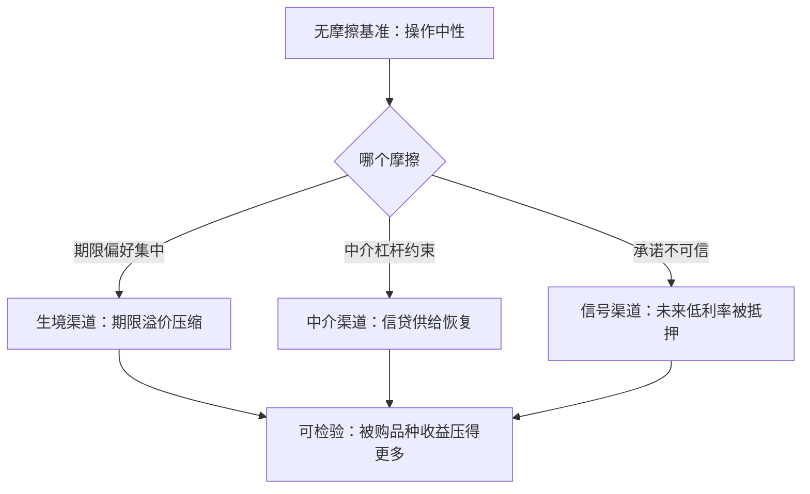

# QE 的理论

在无摩擦的市场里，公开市场操作只是资产互换；QE 的每一种效果，都必须指名道姓地找到那个被它松开的摩擦。

<footer>—— 据 Wallace 1981；Eggertsson–Woodford 2003 整理</footer>

[上一课](/econ/mt-expectations-transmission)把传导拆成利率路径、锚定与家庭结构三段，其中每一段都还需要一个正常工作的短端利率。利率触到下限时（[零下限与非常规政策](/econ/zlb-unconventional)），常规边际消失，工具转向央行资产负债表本身。[QE 与前瞻指引](/econ/qe-forward-guidance)与[央行资产负债表](/econ/central-bank-balance-sheet)已给出操作方式与事件研究证据；本课补它们背后的理论：QE 在什么模型里严格等于什么，以及它的无关性基准。

## 问题

理论起点是一个反直觉的定理。Wallace 1981 给公开市场操作写了一个 Modigliani–Miller 式的结论：若市场完全、无参与约束、税收一次性，央行用准备金换任何资产，公众都可以无成本地重新组合回原配置——一切公开市场操作都是中性的，无论买的是短债还是长债。这不是对 QE 的否定，而是纪律：**QE 的每一种效果，必须由一个具体摩擦来承担**。理论工作因此不是论证「QE 有效」，而是找到那个摩擦，并说明它何时重要、何时消失。

## 方法

三个摩擦，各自给出一个渠道，可以逐一检验。

**期限生境**：一部分投资者只愿意持有特定期限的资产（养老金匹配久期、监管约束），该期限的供给变化直接改价格。央行买走长期债，生境里的供给被抽走，期限溢价压缩。事件研究按渠道分解总效应时，这一渠道的可检验含义是：被购买的品种压得更多——抵押支持证券的收益率反应大于同期限国债。

**中介约束**：银行与非银中介受杠杆与融资约束，危机中约束收紧、信贷收缩（[Gertler–Kiyotaki](/econ/gertler-kiyotaki) 的脉络）。央行直接购买替代了收缩的中介资产负债表，等于把自身的无约束表借给市场使用；Gertler–Karadi 2011 把这一渠道写成可校准的模型。

**信号与承诺**：Eggertsson–Woodford 2003 指出，下限上真正稀缺的不是资产购买力，而是可信的未来低利率承诺；长期债购买把央行自己的表押进未来，提前退出的成本变高，承诺被部分抵押。QE 在这里的价值不是买什么，而是「买了」这个行为对承诺可信性的贡献。

## 机制

三个渠道的相对权重决定 QE 的边界，也解释了证据里的争议。生境渠道是价格效应，随购买停止而回吐；中介渠道是数量效应，取决于约束是否仍然紧；信号渠道与前瞻指引不可分离——它本就是指引的执行手段。归因困难由此而来：事件研究测得的是三渠道之和，而其中一段（信号）恰恰依赖市场对未来政策的预期，反事实无法直接观测。

Eggertsson–Woodford 2003 留下一个可作判别式的悖论：若市场本就相信承诺，购买只是资产互换，净效应趋近零；若承诺不可信，购买的价值恰在于让它可信。**QE 的效果与它自身的必要性成反比**——必要时的效果恰好最大，这也意味着用繁荣期数据外推危机期的 QE 效果会系统性偏低。

无关性定理不是摆设：它同时解释了为什么常规公开市场操作（买短债）在正常时期无须争论，以及为什么 QE 的辩护必须落在摩擦上。没有指名摩擦的「流动性注入」论证，在 Wallace 1981 面前是空话。

## 边界

财政是绕不开的另一侧。Sargent–Wallace 1981 的不愉快算术与[物价水平的财政理论](/econ/ftpl)划定边界：若财政赤字路径独立于货币当局，央行扩表最终要被财政回填，通胀的决定权移向财政（[财政-货币主导](/econ/fiscal-monetary-dominance)）。缩表也不是扩表的镜像——退出路径本身有再定价效应，[央行资产负债表](/econ/central-bank-balance-sheet)的递增上限设计即为此。下一课转向负债侧更激进的创新：央行不再买资产，而是直接对公众发行负债。

## 小结

- 无关性基准：完全市场下一切公开市场操作中性，QE 效果必须落到具体摩擦。
- 三渠道分工：期限生境改溢价，中介约束改信贷供给，信号渠道抵押承诺。
- QE 的效果与自身必要性成反比，事件研究归因因此系统性困难。
- 财政主导划定 QE 的最终边界：扩表要被财政回填时，通胀决定权移向财政。
- 出处：Wallace 1981；Eggertsson–Woodford 2003；Gertler–Karadi 2011；Krishnamurthy–Vissing-Jorgensen 2011；Sargent–Wallace 1981。
