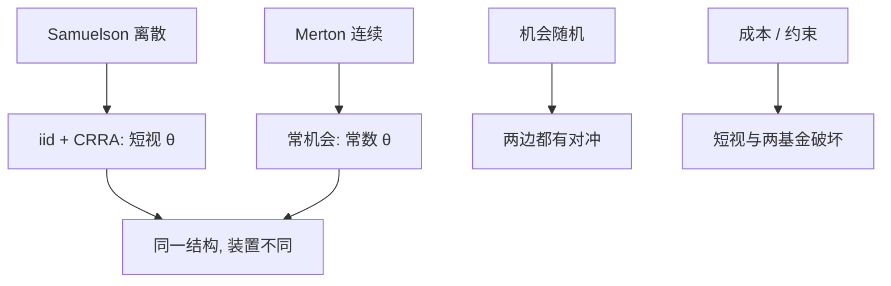

# 多期消费组合

离散多期里，消费与组合仍由欧拉与两基金（机会确定时）给出；连续时间 Merton 是这一结构的扩散极限，不是另一套偏好。

<footer>—— Samuelson, Lifetime Portfolio Selection by Dynamic Stochastic Programming, Review of Economics and Statistics, 1969；对照 Merton 1969/1971</footer>

[上一课](/econ/transaction-cost-portfolio-theory)在连续时间里因成本把点政策改成区间。本课缺口是把消费–组合收回到**离散多期**，与 Samuelson（1969）对齐，并作为本单元、本课程的收束：后课若进入动态宏观，默认已经有欧拉、两基金、对冲、以及摩擦何时破坏它们。不重解 HJB，不重写需求系统。

## 问题

Samuelson：有限生命、离散期、独立同分布回报（机会确定），CRRA 或对数下每期组合权重与剩余寿命无关（短视），消费率随剩余寿命变。这与 Merton 常机会的常数 $\theta$、变 $c/W$ 同构，只是时间装置不同。机会若 Markov，离散贝尔曼同样出现对冲项——ICAPM 不必非连续不可。缺口是钉：本单元不是「只有连续时间才有组合理论」；连续时间的贡献是瞬时 MV 许可证与随机积分复制，离散已经有欧拉与动态规划。

与 [跨期欧拉](/econ/consumption-euler)：资产菜单一旦超过债券，欧拉对每个可交易回报成立，$m$ 仍是 $\beta u'(c_{t+1})/u'(c_t)$。组合一阶是欧拉的资产形式。本课把菜单写回来。

Samuelson, *REStat* 51(3), 1969。与 Merton 同年连续时间互为对照。Hakansson 等在离散里写过类似短视结果。CRRA 加 iid 是短视的标准许可证。

## 方法

贝尔曼 $V_t(W)=\max_{c,\theta} u(c)+\beta\mathrm{E}[V_{t+1}(W')]$，$W'=(W-c)R_p(\theta)$。一阶：$u'(c)=\beta\mathrm{E}[V_{t+1}'(W')R_p]$，以及 $\theta$ 使 $\mathrm{E}[V_{t+1}'(W')(R_i-R_f)]=0$。CRRA 加 iid：$V$ 幂形式，$\theta$ 与 $t$ 无关。Markov 状态 $z$：$V_t(W,z)$，对冲出现。交易成本：离散也能写 $sS$；连续极限把 $sS$ 变成 Constantinides 带。不完全：欧拉只对可交易 $R_i$ 成立，不可交易收入进预算但不进菜单。

本课程从 Grossman–Stiglitz 走到这里：信息决定价格作为信号；FTAP 给出 $m$；摩擦改谁的 $m$；连续与离散给出组合如何持有。下一课程若是动态宏观，求解装置（贝尔曼、欧拉）从这里交接，不再从零讲组合。

## 机制

机制是动态规划的包络。无论离散还是连续，财富的影子价格连接消费与投资。短视来自「未来值函数对组合的依赖只通过财富标度」——CRRA 加 iid 保证标度。破坏标度的东西（习惯、劳动收入、约束、成本、随机机会）都引入额外状态，从而引入对冲或惰性。信息：若 $z$ 含私人信号，个人域流不同，加总不再是共同切点——回到本课程第一课序，而不是再写一遍 REE。

与 [到限价簿](/econ/to-limit-order-book)：多期组合给出想持有的 $\theta$；簿给出如何把 $\theta$ 变成成交。本课仍不停在协议上。理论课程在组合政策处可以停，执行换栏。

无限生命离散 CRRA iid 与 Merton 无限生命同样平稳。有限生命只改消费路径的倾斜，不改短视权重——这是教学上常被忽略的 Samuelson 要点。

## 边界

本课不是家庭金融实证（参与之谜已在上一课程）。不估计寿险需求。作为「信息、流动性与资产定价理论续」的最后一课：不把附录论文插入其后。若继续，动态宏观补层从贝尔曼求解起，或回到量化栏看执行与因子。

后课默认（本课程结束）：离散与连续的消费–组合同构；短视需要 CRRA+iid；对冲、成本、约束、私人信息都会破坏两基金加总。$m$ 仍是欧拉；FTAP 仍是无套利；价格作为信号仍是 REE。限价簿仍是协议。

## 小结

- Samuelson 离散与 Merton 连续：常机会下短视组合、消费摊平财富。
- 额外状态（机会、习惯、收入、成本、约束）引入对冲或惰性。
- 本课程在此收束：信息核、无套利核、摩擦核、组合核已经对齐；$p$ 的协议不在本栏。
- 出处：Samuelson, *REStat* 1969；Merton, *REStat* 1969、*JET* 1971。
