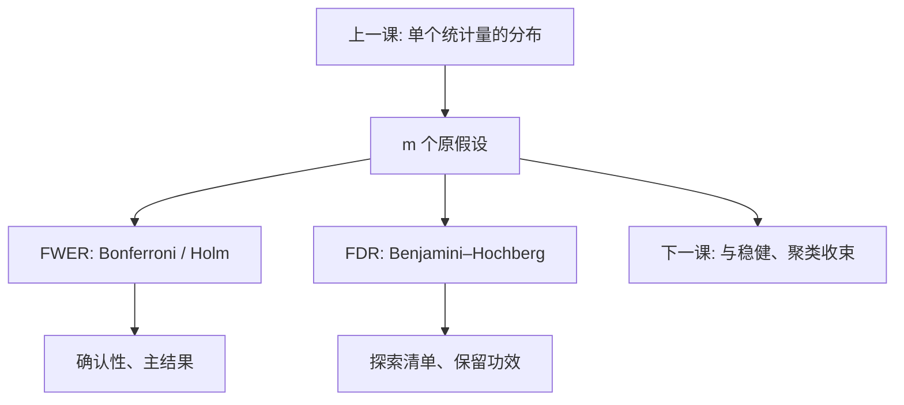

# 多重检验

二十个系数各用名义 5%，至少一个假阳性的概率远高于 5%。Holm 管族错误率；Benjamini–Hochberg 管假发现比例——改的是拒绝规则，不是单个 $p$ 的定义。

<footer>—— Holm, Scandinavian Journal of Statistics 1979；Benjamini and Hochberg, JRSS-B 1995；对照 Romano and Wolf 逐步法；Angrist and Pischke</footer>

[上一课](/econ/bootstrap-econ)给单个统计量一套可行的抽样分布：三明治或重抽样。本课缺口是：一张表里十个滞后、五个子样本、二十个行业，或扫描一篮子政策变量——即使每一个 $t$ 都算对了，**同时**看它们仍会把假阳性堆出来。后课[稳健、聚类与多重检验](/econ/inference-robust-cluster)把推断工具收束成检查清单；本课只加「许多原假设一起测」这一块。

## 问题

$m$ 个原假设，各用水平 $\alpha$。若独立且全真，至少一次错拒的概率 $1-(1-\alpha)^m$， $m=20$、$\alpha=0.05$ 时已超过六成。族错误率 FWER 是这句话的概率；FDR 是「拒绝里假发现所占比例」的期望。缺口不是再估一次 SE，而是：研究者实际做了多少次选择——包括没写进正文、只把「最显著」留下来的那些。规格搜索、子样本循环、先看图再决定分组，都是隐式 $m$。

预注册一个主结果，是设计上把 $m$ 压回 1；校正公式是事后补救。两件事不互相替代。

### 只报显著的那个就是多重检验

正文里只出现一个 $p<0.05$ 的系数，附录里躺着十九个不显著的孪生规格，读者按 $m=1$ 来读，名义水平已经坏了。这不是诚实问题的修辞，是样本空间没写全。机器学习里的 snooping 同源：特征在同一张表上挑完再检验，要用样本外或正交化，不能靠「最后只报一个」。

Angrist–Pischke 的实用划分：一个 primary outcome，其余当 robustness 并标明探索。FDR 适合探索清单；确认性研究更常保 FWER 或干脆只测一个。

## 方法

Bonferroni：每个检验用 $\alpha/m$，简单、常过严。Holm：将 $p$ 排序 $p_{(1)}\le\cdots\le p_{(m)}$，找最小 $k$ 使 $p_{(k)}>\alpha/(m-k+1)$，拒绝更小的那些——逐步、仍控 FWER，功效通常高于 Bonferroni。Benjamini–Hochberg：找最大 $k$ 使 $p_{(k)}\le k\alpha/m$，拒绝 $1,\ldots,k$，在独立或正依赖下控 FDR。检验相关时，BH 仍常用；FWER 方法可能更保守。Westfall–Young 一类 bootstrap 可同时吃进相关与小样本，装置接上一课，细节不在此展开。

主结果与探索结果分开写：前者按 $m=1$（或预注册的小数目）报；后者报校正后的 $q$ 值或明确说未校正。不要用校正当许可，去扫遍所有交互。

## 机制

单个 $p$ 仍是「这个假设下更极端的概率」。多重检验改的是阈值：你愿意在一整族里冒多大的错拒风险。FWER 把「至少一个错」当事件，适合监管或单一政策结论；FDR 允许错几个，换更多真发现，适合描述性扫描。隐式多重检验之所以毒，是因为阈值还按 $m=1$ 算，而选择已经发生。

与聚类、bootstrap 正交：先把每一个检验的 $p$ 算对（依赖结构、有限样本），再对这组 $p$ 做 Holm/BH。顺序不能倒成「先 BH 再随便 cluster」。

Romano–Wolf 逐步法在功效与 FWER 之间折中，常用于多结果的实验。本课以 Holm 与 BH 为默认语言，后课收束时可以点名它们。

## 边界

本课不把 BH 读成「可以随便挖」。也不处理序贯分析、可选停止的全部贝叶斯决策。相关检验的精确 FWER 控制可以更紧，那是专门文献。量化栏因子动物园是多重检验的经典现场，本课不重做那些表，以免吞并资产定价。下一课把 White、聚类、本课校正放回同一张检查单，并接到机器学习因果估计。

后课默认：报告估计量时写清测了多少个假设；主结论不靠扫描。聚类与 bootstrap 解决的是单个 $p$ 的分母，多重检验解决的是多少个 $p$ 被一起读。

## 小结

- 多假设同时读，名义 $\alpha$ 不再是一族的错误率。
- Holm 控 FWER；Benjamini–Hochberg 控 FDR。
- 只展示显著规格，等于隐瞒 $m$。
- 预注册主结果优于事后校正，校正是补救。
- 与稳健 SE、聚类、bootstrap 叠加，不互相替代。
- 出处：Holm 1979；Benjamini and Hochberg 1995；Romano and Wolf；Angrist and Pischke。
