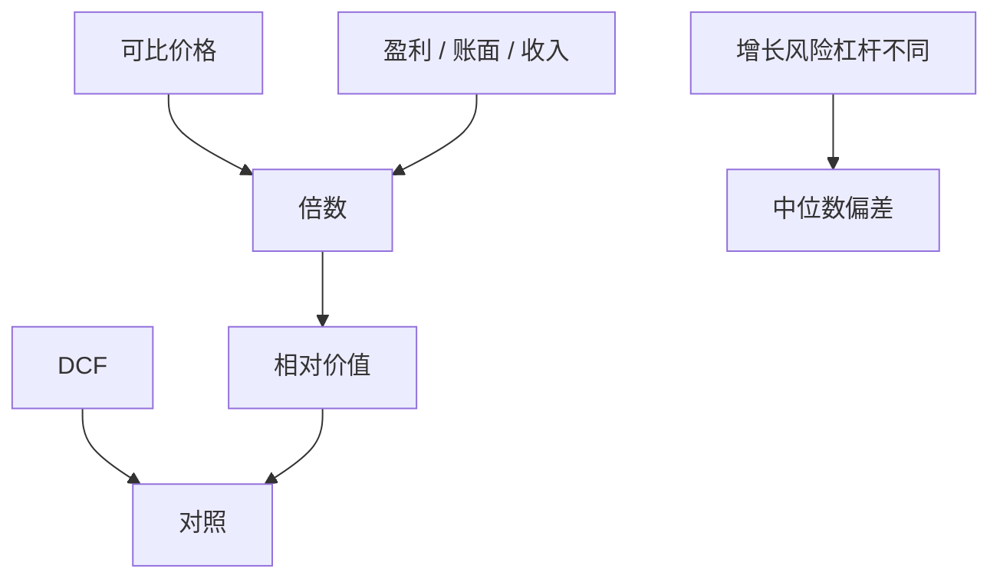

# 可比与乘数

    
乘数是把市场对一组相似资产的定价，压缩成价格对盈利、账面或收入的比率；它不是独立于折现的第二种经济学，而是同一价值的简写，误差来自「相似」失败。

    <footer>—— 据 Kaplan and Ruback, The Valuation of Cash Flow Forecasts: An Empirical Analysis, Journal of Finance 1995；Brealey, Myers and Allen 整理</footer>

[上一课](/econ/dcf-terminal-value)把 DCF 终值写成 $g$ 与 ROIC 的假设，并点名退出倍数是终值的另一写法。本课缺口是把倍数当成完整估值方法：何时 EV/EBIT、P/E、收入倍数可替代显式 DCF，何时只是对照。不重推 Gordon 公式，不把限价簿上的相对价值交易当成公司估值。

## 问题

DCF 的分子与 $r$ 都要预测；市场已经对上市可比给了价格。若可比与目标在增长、ROIC、风险、杠杆上接近，价格/基本面的中位数是目标价值的估计。Kaplan 与 Ruback（1995）对高杠杆交易的现金流预测做折现，发现 DCF 与交易倍数都能接近事后市值，不是「倍数更科学」或「DCF 更科学」。缺口是：倍数把终值假设压缩进一个比率，省掉 $g$ 与 $r$ 的争吵，同时把不可比藏进同一个中位数。

接受规则仍是 NPV：倍数给出的是相对定价，不自动等于项目对股东的增量价值——尤其当项目改变公司风险或当控制权溢价存在时。

企业价值倍数（EV/EBIT、EV/EBITDA）对应全资本，与 WACC/APV 对齐。股权倍数（P/E）掺进杠杆与税，跨公司比较先要杠杆相近，否则是把融资切片写进经营比较。

## 方法

先选可比：同行、纯业务、相近增长与周期。再选口径：前瞻对历史、剔除一次性、EBITDA 是否加回真实的现金成本。用中位数或回归（把倍数对增长、利润率回归）比用最高的一个「对标」。目标杠杆与可比不同，用 EV 倍数再减净债，不要直接套一个高杠杆公司的 P/E。

收入倍数出现在亏损或早期：它假设未来利润率收敛到可比。这是终值假设的另一种藏法，往往比 DCF 更乐观，因为利润率尚未被显式期约束。

控制权：交易倍数含控制溢价，交易价格对少数股权市值倍数会偏高。并购课再写协同与支付；本课只标：资本预算用交易倍数去估一个少数股权项目，口径错了。

## 机制

机制是一价定律的粗糙版本：相似资产应有相似的价格/基本面。MM 说切片不改变总 EV（无摩擦时），所以经营相似的企业 EV/NOPAT 应接近，P/E 可以因杠杆不同而不同。倍数失败，是因为「相似」在增长期权、会计、周期位置上失败——同一行业的会计折旧与租赁资本化可以让 EBITDA 不可比。

与 DCF 的对偶：Gordon 下 $P_0=\mathrm{FCFF}_1/(r-g)$，所以 EV/FCFF $=1/(r-g)$。倍数高，要么 $r$ 低，要么 $g$ 高，要么市场错了。资本预算若只用行业高倍数来给内部项目定价，等于导入了市场对同行增长的假设，却不检查本项目是否有同样的再投资与壁垒。

### 不要用倍数绕过增量

项目 NPV 是增量。公司交易倍数给出的是整家企业。把「行业 10 倍 EBITDA」乘在项目 EBITDA 上，忽略项目衰减、协同为负、以及期末资本支出。倍数是对照与终值输入，不能单独替代上一课的增量 FCFF。

会计：EBITDA 加回折旧，但折旧对应的维护性 capex 仍要发生。高 capex 行业的 EV/EBITDA 偏贵看起来便宜。Penman：倍数要与剩余收益、净经营资产放在同一套干净盈余里读。

## 边界

不要把本课写成投行 pitch 的倍数清单。对象是与 DCF 的信息等价与失败条件。也不要把量化栏的相对价值统计套利搬进来：那是交易协议与因子，不是项目接受。后课 EVA 给出会计上与 DCF 等价的第三条路，仍不是倍数。

后课默认：倍数是相对定价简写，EV 口径优先；与 DCF 对照，不替代增量 NPV。相似失败时中位数没有经济学。下一课：剩余收益把账面与剩余价值连回同一 $V$。

## 小结

- 倍数压缩了 $r$ 与 $g$；可比失败则中位数无意义。
- EV 倍数对齐全资本；P/E 掺进杠杆。交易倍数含控制权。
- Kaplan–Ruback：DCF 与倍数可同样接近市值；资本预算仍以增量 NPV 为准。
- 出处：Kaplan and Ruback, *JF* 1995；Brealey, Myers and Allen。
