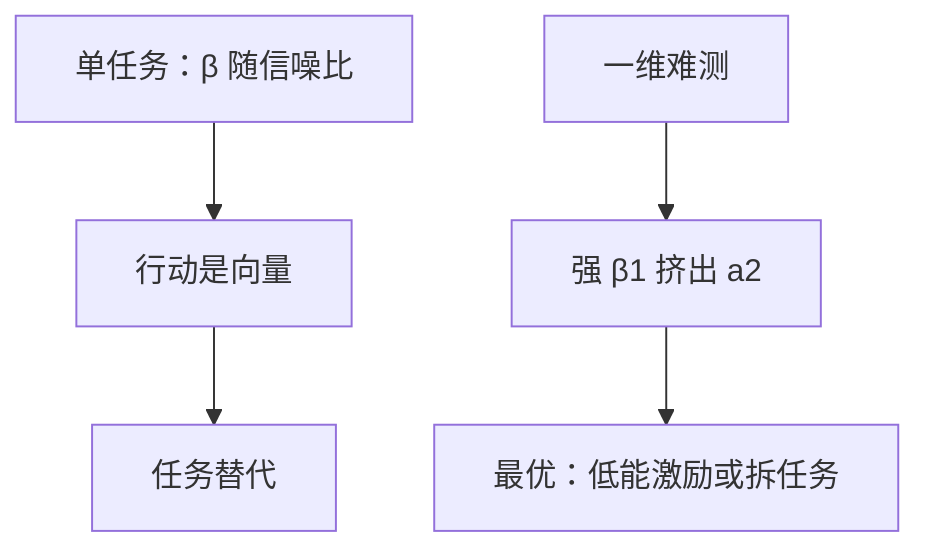

# 多任务代理

对易测任务付强激励，会把努力从难测任务上抽走；任务挤出是激励相容的向量性质，不是偏好变懒。

<footer>—— Holmström and Milgrom, Multitask Principal–Agent Analyses, Journal of Law, Economics, & Organization, 1991</footer>

[上一课](/econ/principal-agent)把单任务写成 IC–IR 规划，似然比进入工资。缺口是行动是向量：教学与科研、产量与质量、当期利润与维护。只对其中一维付 $\beta$，其余维若更难测，努力会搬家。本课钉挤出与低能激励，不把显示原理写成下一课，也不重写单任务的 $1/u'=\lambda+\mu(1-f_L/f_H)$。

## 问题

代理人选 $a=(a_1,\dots,a_k)$，成本 $c(a)$ 在任务间凸（努力预算或注意力）。可验证信号 $x_i=a_i+\varepsilon_i$，噪声可以极不对称：$a_1$ 几乎可测，$a_2$ 几乎不可测。线性教具（指数效用、正态噪声的 Holmström–Milgrom 极限）里，合同 $w=\alpha+\sum\beta_i x_i$。单任务时 $\beta$ 随信噪比升；多任务时，对任务 1 的高 $\beta_1$ 会通过 $c_{12}$ 降低 $a_2$。若 $a_2$ 对委托人很重要（质量、合规、资产保养），最优可能把 $\beta_1$ 也压低——故意用低能激励，以免产量挤掉质量。

极端：某维完全不可测，$\beta_2=0$。若任务完全替代，最优常是 $\beta_1=0$，固定工资，靠投入监管或索取权改写（把难测任务变成代理人的资产）。这与「激励越强越好」相反。

### 挤出不是道德说教

$c_{12}\gt 0$ 时，提高 $a_1$ 的边际成本含 $a_2$。IC 是一阶条件向量，不是一个不等式。单任务规划把其他维的努力当常数，会高估 $\beta_1$ 的好处。

原文同时谈资产所有权与工作设计：把互补任务捆给同一人、把替代且可测性差异大的任务拆开。本课只钉激励挤出；所有权是同一套 IC 的另一件工具。

可测性差异越大，越要用低 $\beta$ 或拆任务。
互补任务（$c_{12}\lt 0$）则强激励可以带动另一维，捆绑有好处。
主观评价能补难测维，但引入讨好与再谈判，本课不写。

## 方法

对象：两任务、线性合同、凸成本。先写代理人 FOC：$\beta=c'(a)$ 的向量式。再代入委托人目标，看 $\sigma_2^2\to\infty$ 时 $\beta_1$ 是否被压向零。对照：若能把任务 2 独立交给另一代理人，挤出消失，但协作成本另计。

## 机制

每一块 $\beta_i$ 买的是 $a_i$，但成本函数把各 $a_j$ 连在一起。委托人无法只对 $a_1$ 付报酬而不改 $a_2$ 的影子价格。单任务里噪声大则少买激励；多任务里，即使任务 1 噪声很小，只要它替代任务 2，仍可能少买。测量技术改进若只覆盖产量、不覆盖质量，福利可以下降——这是 1991 年论文相对 1979 年充足统计的转折：多一个信号不再无条件更好，因为它改变了任务间的相对价格。

充足统计仍说：共同冲击该滤。多任务说：滤完之后，$\beta$ 的水平还要看挤出。两句话叠用，不是互相取消。有限责任会让某些维的惩罚更难，挤出更狠；本课不把下界再推一遍。工作设计是第三条路：把替代且可测性差的任务拆给不同的人，或把难测任务变成代理人拥有的资产，使 $a_2$ 的回报不再经过工资 $\beta$。激励强度、测量与所有权是同一套 IC 的三件工具。

可测性差异越大，越要用低 $\beta$ 或拆任务；互补任务则强激励可以带动另一维。
只改进产量测量、不覆盖质量，福利可以下降——多一个信号不再无条件更好。

## 边界

超过线性–正态，最优合同不必线性，挤出仍在：任何对易测维更敏感的 $w$ 都会搬家努力。多代理人、团队、主观绩效，是后继文献。不要把多任务写成宏观多部门或限价簿多品种；那是别的摩擦。

后课默认：多任务下，对易测任务的强激励会挤出难测任务；最优常常是低能激励或任务捆绑/拆分。显示原理下一步把「任意间接规则」收成直接机制，不改变这组 IC 向量。

### 测量只改进一维可以有害

单任务的信息量原则：有信息就该写进合同。多任务：只改进 $x_1$ 的精度，等于只给任务 1 降价，挤出加剧。政策含义是同时测量或索性都不按绩效付。学校考试、医院吞吐量、警察开罚单，是同一几何。

Holmström–Milgrom 的线性极限来自连续时间指数–正态；课堂上用它读 $\beta$，不把线性当成一般道德风险的最优形式。

## 小结

- 行动是向量时，IC 是向量；一维强激励会抽走其他维。
- 可测性不对称 ⇒ 低能激励或拆任务，而不是把 $\beta_1$ 开到最大。
- 多一个只覆盖一维的信号，不必更好。
- 单任务规划不能直接套到工作设计。
- 出处：Holmström and Milgrom, *JLEO* 1991。
