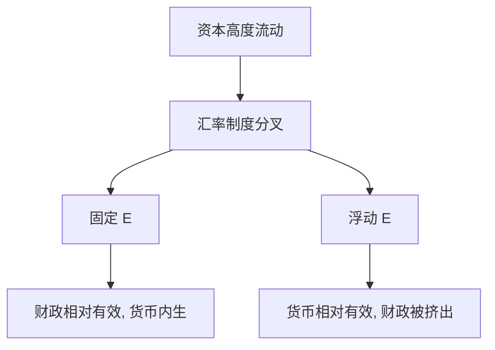

# Mundell 1963 资本流动

    
资本高度流动时，固定汇率下货币政策让给汇率锚，财政政策对产出更有效；浮动则相反。

    <footer>—— Mundell, Capital Mobility and Stabilization Policy under Fixed and Flexible Exchange Rates, Canadian Journal of Economics and Political Science 1963</footer>

附录对照，不插入主干。[上一课](/econ/lucas-1976-paper)对照的是政策评价不能用简化式。本篇对照 **Mundell 1963 原文的问题设定**：稳定化工具在开放经济里如何随资本流动与汇率制度换位。主干[蒙代尔–弗莱明](/econ/mundell-fleming)已取 IS–LM 加 $NX$ 与完全流动极限；这里对照 *CJEPS* 短文如何把资本流动写成改变指派的关键参数，以及 Fleming（1962）为何是并列的 IMF 文本而不是本章定理。

## 问题

封闭 IS–LM 里，财政与货币都对 $Y$ 有杠杆，分工靠斜率。开放后，资本随利率差流动，汇率制度决定 $M$ 是否还能当工具。Mundell 问的缺口是：在价格粘住的短局里，**完全资本流动**如何把有效工具换成制度的函数——钉住则货币内生，浮动则财政被升值挤出。这不是长期 PPP，也不是外汇微观结构。

稍早的指派文还允许不完全流动，内部与外部平衡可以各派一种工具。1963 年把流动推到极限，钉住下货币完全失去稳定产出的独立性，浮动下财政的产出效应被汇率吃掉。极限是为了把分叉画死，不是声称 1963 年的资本已经完美流动。

原文用流量 IS、静态预期、$i=i^*$ 的极限。未抛补利率平价带预期贬值、粘性价格下的超调，是后文；1963 年先把制度分叉画清楚。指派问题（内部与外部平衡各用哪一种工具）在 Mundell 稍早的文章里已经出现；本篇把资本流动推到极限，分叉变得最锋利。

Mundell, *Canadian Journal of Economics and Political Science* 29(4), 1963, 475–485。期刊后来拆成 *CJE*。Fleming, *IMF Staff Papers* 1962 是并列装置，不要把两人写成互为引理，也不要发明 arXiv。

## 方法

IS 加净出口，LM 或利率，BP 由资本流动与经常账户。完全流动、静态预期、固定 $E$：任何想把 $i$ 打下 $i^*$ 的货币扩张被储备流失冲掉，$M$ 缩回；财政抬 $Y$ 与货币需求，为维持 $E$，央行被动扩 $M$。浮动：$M$ 可独立，货币扩张贬值并抬 $Y$；财政推高 $i$、$E$ 升值，$NX$ 挤出。

主干课已写长期 PPP 拉回与中性；附录不重做比较静态图，只对照 1963 年的靶子是稳定化指派，不是估算贸易弹性。

## 机制

机制是储备或汇率承担调整。钉住加流动：利率被国外钉住，货币供给变成内生余量，财政「有效」其实是货币被迫配合。浮动：汇率承担支出转换，货币经贬值强化，财政经升值削弱。$CA=S-I$ 事后仍是恒等；BP 是事前外部相容，不是对恒等的否定。

静态预期下 $i=i^*$ 是无抛补的退化：预期贬值为零。一旦钉住不可信，资本流出可以在储备耗尽前就把 $i$ 打离 $i^*$——原文不写危机，极限命题假定锚被相信。主干课已点 Dornbusch 超调作动态补丁；附录不把 1963 年改写成超调模型。

### 对照主干 MF 课，不插入批判与三角之间

主干[蒙代尔–弗莱明](/econ/mundell-fleming)已从 PPP 短局接到制度分叉，下一课才是不可能三角。本附录对照 1963 年把资本流动推到极限的那一刀，以及静态预期、$i=i^*$ 的教学版。把 *CJEPS* 接在 Lucas 原文之后只因为附录链如此排，**不插入**宏观主干，也不把外汇订单簿写进来。读完回主干 MF 课。

完美流动极限：浮动时财政可被升值完全挤出。不完全流动介于两极端。CIP 的掉期会计在量化栏利率平价，本课的 $i=i^*$ 不是报价。

## 边界

不要把 1963 写成已经包含风险溢价、大国 $i^*$ 内生、或新凯恩斯开放经济的欧拉。Dornbusch 超调是理性预期加粘性 $P$ 的动态补丁。资本管制拿掉完全流动，分叉改变——正是主干三角课。也不要把 MF 写成对限价簿外汇订单的描述。

福利排序不在这篇：浮动的实际汇率波动与钉住的输入通胀要另评。原文是稳定化有效性，不是最优货币区的完整清单（最优货币区是 Mundell 另一篇）。

宏观与货币的论文对照链到此结束。不要把三篇增长–批判–开放原文当成插入主干的连续单元。

静态预期下钉住若不可信，$i$ 可以暂时离开 $i^*$，储备仍有限。原文取可信钉住与完全流动，为的是极限命题干净。

不可能三角把「资本流动、固定汇率、独立货币」收成三选二，是主干后课对这篇极限的收口。1963 年先把其中两角钉死，看第三角如何让渡。

## 小结

- 附录对照 Mundell 1963：资本流动使稳定化工具随汇率制度换位。
- 钉住则货币让给锚，浮动则财政被汇率挤出。
- Fleming 1962 并列；UIP/CIP 市场内容与外汇微观结构不在此重写。
- 出处：Mundell, *CJEPS* 1963。
