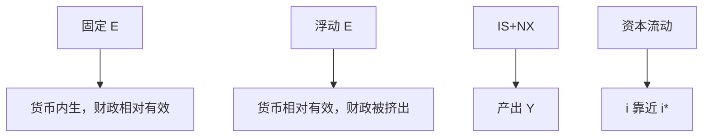

# 蒙代尔–弗莱明

资本高度流动时，固定汇率下货币政策让给汇率锚，财政政策对产出更有效；浮动则相反——这是 IS–LM 加上外部平衡，不是新的恒等。

<footer>—— Mundell, Capital Mobility and Stabilization Policy under Fixed and Flexible Exchange Rates, Canadian Journal of Economics 1963；Fleming 1962</footer>

[上一课](/econ/j-curve)（J 曲线）。给出长期相对 PPP。短期价格粘住，$E$ 与 $i$ 由资产与商品市场出清。本课把[Hicks 的 IS–LM](/econ/is-lm)加上净出口与资本流动：Mundell（1963）与 Fleming（1962）的装置。$CA=S-I$ 仍是恒等；BP 曲线是事前的外部均衡轨迹。不可能三角是下一课把三种制度目标收成三选二。

## 问题

封闭 IS–LM 没有 $E$。开放后，净出口依赖实际汇率与外国收入，资本流动依赖利率差。完全资本流动时，本国 $i$ 必须等于外国 $i^*$（风险贴水先忽略）——否则资本无限流动。缺口是：在 $P$ 粘性的短局里，财政与货币各能移动 $Y$ 多少，取决于 $E$ 是被钉住还是被市场决定。

Mundell 的命题用的是流量 IS 与静态预期，不是欧拉 + UIP 的完整 NK 开放。本课用原装置看清制度分叉；Woodford 式的开放 NK 是同一逻辑的前瞻版，不在这里重估系数。

未抛补利率平价 $i=i^*+\mathbb{E}\Delta e$ 把静态的 $i=i^*$ 变成带预期贬值的版本。PPP 慢、UIP 快，是短期 $q$ 波动的来源。CIP 在量化栏，有抛补、有远期。

## 方法

IS：$Y=C(Y-T)+I(i)+G+NX(q,Y,Y^*)$，$q$ 依 $E$（$P,P^*$ 粘住）。LM：仍可写 $M/P=L(Y,i)$，或直接用利率规则。BP：资本流动与 $CA$ 使外汇市场出清。完全流动、静态预期、固定汇率：央行必须内生 $M$ 以维持 $E$，LM 失去独立；$G$ 移 IS，$Y$ 可升，储备流动。浮动：$M$（或 $i$）可独立，$G$ 升推高 $i$、$E$ 升值，$NX$ 挤出，$Y$ 效果弱；货币扩张贬值并抬 $Y$。

长期 $P$ 动，PPP 拉回 $q$，货币中性恢复：固定汇率下本国通胀被锚到外国；浮动下本国选 $\pi$， $E$ 去对齐。这与 Friedman 的浮动主张相容：要独立的 $\pi$ 路径，就不要把 $E$ 钉死。

### 仍是会计加均衡

$CA$ 事后等于 $S-I$。MF 的「外部平衡」是计划的 $CA$ 与资本流动相容。储备变化使固定汇率下金融账户去补。不要把 BP 画成对恒等的否定。

## 机制

固定汇率加资本流动：任何想把 $i$ 打下 $i^*$ 的货币扩张，会被资本流出冲掉储备，$M$ 缩回。财政扩张提高 $Y$ 与货币需求，为维持 $E$ 与 $i=i^*$，央行被动扩 $M$，于是财政显得「更有效」——其实是货币被迫配合。浮动则汇率承担调整：货币扩张贬值，支出转换强化乘数；财政升值，支出转换削弱乘数。

下限与非常规在开放下变成汇率与资本流：若 $i$ 卡在零，浮动仍可能靠 $E$ 贬值提供刺激，但竞争性贬值与外国下限是外溢，本课只点明渠道。

## 边界

静态 MF 没有微观基础的 NX，没有风险溢价，对大国 $i^*$ 内生。资本管制把完全流动拿掉，制度分叉改变——正是下一课三角。也不要把 MF 写成对量化栏限价簿的外汇订单。长期增长与 $A$ 仍由索洛–内生增长决定，MF 是对 $y^*$ 的短期偏离。

预期贬值时 $i=i^*+\Delta e^e$，钉住若不可信，$i$ 可以暂时离开 $i^*$，储备仍有限。Dornbusch 超调把理性预期与粘性 $P$ 写成 $E$ 先过调，是动态补丁，主干不重导。CIP 的短端会计在[利率平价](/quant/irp)；本课的 $i=i^*$ 是宏观教学版，不是掉期报价。

完美流动极限：浮动时财政完全被升值挤出，货币经贬值有效。钉住时货币被储备冲销，财政有效。不完全流动介于两极端。

## 边界

后课默认：资本流动 + 汇率制度决定货币与财政的短有效性。下一课收成不可能三角。福利排序不在 MF 里：浮动的 $q$ 波动与钉住的输入通胀要另评。

## 小结

- 粘性价格短局里，把 IS–LM 加上 $NX$ 与资本流动。
- 完全流动时固定汇率让渡货币政策；浮动则财政被汇率挤出。
- 长期 PPP 与中性恢复；制度选的是名义锚。
- $CA=S-I$ 仍是恒等；BP 是事前外部均衡。
- UIP/CIP 的市场内容不在此重导。
- 出处：Mundell 1963；Fleming 1962。
