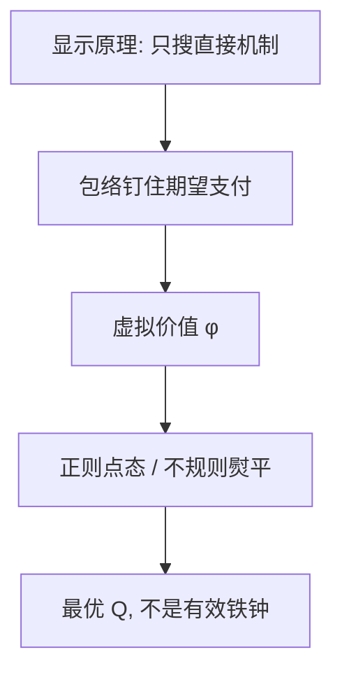

# Myerson 最优拍卖

    
卖家的期望收入等于期望虚拟剩余；正则时把物品给最高正虚拟价值者，不规则时先熨平再配置。

    <footer>—— Myerson, Optimal Auction Design, Mathematics of Operations Research 1981</footer>

附录对照，不插入主干。[上一课](/econ/vickrey-1961-paper)对照的是占优真话与反投机。本篇对照 **Myerson 1981 原文的问题设定**：卖方不追求社会剩余，而在贝叶斯激励相容与事中个人理性下最大化期望收入。主干[迈尔森虚拟价值](/econ/myerson-virtual-value)已取 $\varphi$ 与熨平；这里对照原文如何把显示原理、包络与最优拍卖写成同一篇 *Math. Oper. Res.* 短文。

## 问题

Vickrey 给出有效且占优的规则，但有效不是卖方的目标。若卖方可以选任意（直接）机制，只受 IC 与 IR 约束，最优是什么？Myerson 的缺口是把机制设计收成对配置规则 $Q$ 的选择：一旦 $Q$ 定了，期望支付由包络钉死，剩下的是点态比较虚拟价值。原文同时要对付非对称分布与 $\varphi$ 非单调——后者逼出熨平，而不是假设正则了事。

文章写在运筹与数学规划传统里：最优机制是一个规划，不是四种经典拍卖的赛马。标准拍卖只在对称、正则、最优保留价下实施那条 $Q$。

显示原理在原文里是工具：只搜真话直接机制即可。占优策略实施更强，最优收入一般只要求贝叶斯 IC。Vickrey 的占优真话因此通常不是收入最优。

## 方法

原文把卖方写成贝叶斯机制的委托人：先抽类型的联合分布，再选 $(Q,M)$。显示原理允许只搜真话直接机制，于是规划的变量是配置概率与支付。IPV，风险中性，拟线性。卖方期望收入写成

$$
\mathbb{E}\Bigl[\sum_i \varphi_i(v_i)Q_i(v)\Bigr]-\text{边界租金},\qquad \varphi_i(v)=v-\frac{1-F_i(v)}{f_i(v)}.
$$

正则：$\varphi$ 非降，点态把物品给最高正 $\varphi$；全负则保留。不规则：对收益曲线取凸包得到 $\bar\varphi$，再按 $\bar\varphi$ 配置，捆住下降区间以保住 $Q$ 单调。支付由包络反推。非对称时每人一条 $\varphi_i$，最优可以让估值较低但虚值较高的人赢。

主干课已用包络课的积分；附录不重推包络，只对照原文把规划写在拍卖上，而不是一般公共物品。

## 机制

机制是信息租金的边际会计。多卖给类型 $v$ 一单位概率，立刻多收大约 $v$，但 IC 强迫给所有更高类型多留积分租金，净值是 $\varphi(v)$。$\varphi<0$ 时不该卖：租金负担超过支付意愿。保留价是 $\varphi=0$ 的切点，不是卖方的边际成本。VCG 实施 $v$ 的铁钟；Myerson 实施 $\varphi$ 的铁钟。1961 年的二价在正则对称加最优 $r$ 时可以进入最优类，但那是推论，不是原文从二价出发。

非对称分布下，「给最高 $v$」可以不是最优：弱买家的 $\varphi$ 可能更高，最优故意优待他以压低强买家的信息租金。这与 Vickrey 的有效性决裂，正是 1981 相对 1961 多出来的那一刀。规则对称时，最优保留价由 $\varphi(r)=0$ 决定，甚至可以与人数无关——人数改善的是顺序统计量，不是切点公式。

### 对照主干虚值课，不插入机制课序

主干[迈尔森虚拟价值](/econ/myerson-virtual-value)已取正则、熨平与「VCG 有效、Myerson 抽租」。本附录对照 *Mathematics of Operations Research* 6(1), 1981, 58–73：显示原理作为搜索简化、非对称 $\varphi_i$、规划语言。没有关联价值的联动机制，没有多物品组合拍卖。把 1981 插进[VCG](/econ/vcg-pivot)之前，会让读者以为必须先做收入最大才能理解枢轴。

Myerson, *Math. Oper. Res.* 6(1), 1981。不要发明 arXiv。熨平是可实施性（单调）的影子，原文用收益曲线的凸包，不是「喜欢随机配」。

## 边界

关联价值、风险厌恶、预算约束、事后 IR 与预算平衡，都会让 $\varphi$ 不再充分。共同价值加赢家诅咒时，先回到信息结构。原文的独立私人价值不是装饰。

也不要把 1981 写成频谱拍卖操作手册。多单位、包装、活动规则是 1990 年代市场设计；Myerson 给的是单物品 IPV 的最优基准。

收入等价保证：同一 $Q$ 下付款路径不改期望。原文用它删掉对一价/二价的纠缠，把注意力留在 $Q$ 是不是虚值铁钟。

读完回主干虚值课。附录拍卖链下一篇转到匹配原文，不再加拍卖。

## 小结

- 附录对照 Myerson 1981：最优拍卖是最大化期望虚拟剩余的规划。
- 显示原理缩小搜索；正则给最高正 $\varphi$，不规则须熨平。
- Vickrey 有效占优，一般不是收入最优。
- 出处：Myerson, *Math. Oper. Res.* 1981。
