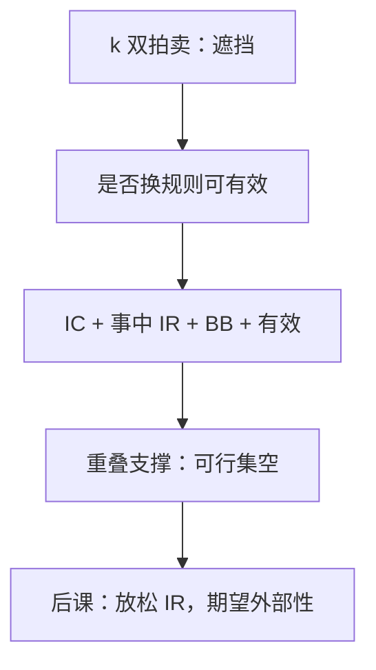

# Myerson–Satterthwaite

买卖双方估值的支撑若重叠，不存在既激励相容、又事中个人理性、又预算平衡、又事后有效的交易机制。

<footer>—— Myerson and Satterthwaite, Efficient Mechanisms for Bilateral Trading, Journal of Economic Theory, 1983</footer>

[上一课](/econ/double-auction)在 $k$ 双拍卖里看到遮挡与不成交。缺口是：换一套更弯的规则——抽签、补贴、多轮便宜话——能否把成交集扩回 $\{v\ge c\}$，同时不强迫人参与、不额外贴钱？Myerson–Satterthwaite 说不能。本课钉这条不可能，不把期望外部性机制提前写成解法。

## 问题

一人买家、一人卖家，类型独立，密度在 $[\underline v,\bar v]\times[\underline c,\bar c]$ 上严格为正且支撑重叠：存在正概率 $v>c$ 与正概率 $v<c$。准线性，风险中性。机制：报告类型（显示原理），以概率 $q(\hat v,\hat c)$ 成交、转移 $t$。要求：

- 事后有效：$q=1$ 当且仅当 $v\ge c$（平局可任意）；
- 贝叶斯激励相容；
- 事中个人理性：每一类型的期望支付不低于不参与（买家 $0$，卖家保留 $c$ 的期望）；
- 预算平衡：买家付出等于卖家收到（或弱平衡：设计者不亏钱）。

四条不能同时成立。双拍卖的无效率不是线性猜错，是可行集为空。

### 重叠支撑是关键

若几乎肯定 $v>c$（例如买家支撑整体高于卖家），有效交易「总能成交」，租金问题轻，可能存在有效机制。重叠意味着必须靠报告来分辨该不该成交，IC 要留给边际类型租金，IR 不让设计者从两端抽干，预算又不允许外面贴钱——三头不够。

证明走包络：有效 $q$ 钉死期望租金，事中 IR 要求最低买家与最高卖家租金不少于零，于是期望转移出现缺口：买家付不出卖家必须拿到的那笔。显示原理保证：间接机制若能做到，直接机制也能；故间接也救不了。

## 方法

对象：独立连续密度、重叠支撑、准线性。用[显示原理](/econ/revelation-principle)收成直接机制。有效配置代入包络，算期望社会剩余与必须留给代理人的信息租金之差，证明设计者的期望利润为负。对照：VCG / 枢轴能有效且占优策略 IC，但预算赤字；补贴来自机制外。

不可能是可行集空，不是「还没找到聪明规则」。设计者只能选放松哪一条：扭曲 $q$、贴钱、强迫参与，或假定类型公开。

弱化任一条即可逃离：放弃事后有效（双拍卖、最优机制扭曲 $q$）；放弃事中 IR（强迫参与或抽事前保证金）；放弃 BB（计划者贴钱）；放弃 IC（假定类型公开）。事前收一笔入场费再退还，有时能把事中 IR 改写成事前 IR，等价于走 AGV 那一支——下一课。

## 机制

有效交易的社会剩余是 $\mathbb{E}[(v-c)_+]$。IC 把每个类型的租金写成赢率（成交概率）的积分。事中 IR 卡住两端：最低买家、最高卖家必须至少不亏。这两端恰好是「最没有交易可敲」的人，他们的零租金要求，经过包络传导，变成对中间类型的转移下限。预算平衡要求转移内部抵消，于是出现亏空——与 VCG 公共品赤字是表亲。

因此「互利一定能谈成」在私型下不成立。科斯定理若读成「只要能谈判、无交易成本就有效」，缺的正是这组 IC+IR+BB。完全信息讨价还价可以有效；不完全信息加上自愿参与，不能。

### 与双边垄断不是同一句话

完全信息双边垄断的无效率来自定价（哪一边设价）。MS 即使允许任意随机机制，只要类型隐藏，事后有效仍不可及。无效率的来源是信息，不是「只有两个人所以市场厚不起来」单独一句——虽然两人使 IR 更紧。

Myerson 最优拍卖是一边的机制设计：卖方不要求对每一类型都 IR 到「留下物品的机会成本」那种双边对称。MS 是真正的双边，两边都要请进来。

## 边界

共同先验、独立、准线性都是条件。关联、多买家多卖家（市场变厚）、类型离散且不重叠，结论可松。实验与中介若能改变 IR（入场费事前收），等于走了放松事中 IR 的那一支。

后课默认：双边交易在重叠支撑下，不能四者兼得。下一课 AGV 用期望外部性保住有效、IC 与预算平衡，代价是事中 IR。

## 小结

- 双拍卖的不成交不能靠更弯的规则消掉。
- 重叠支撑下，IC、事中 IR、预算平衡、事后有效不可兼得。
- VCG 有效但不平衡；贴钱或强迫参与才能逃出。
- 不完全信息下的科斯「总能谈成」不成立。
- 出处：Myerson and Satterthwaite, *JET*, 1983。
