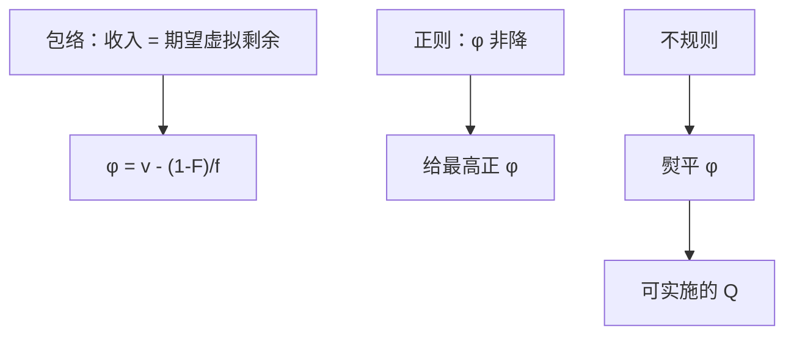

# 迈尔森虚拟价值

卖家最大化期望收入，等于把物品按虚拟价值配置：正则时给最高正虚拟价值者；不规则时先熨平再配置。

<footer>—— Myerson, Optimal Auction Design, Mathematics of Operations Research, 1981</footer>

[上一课](/econ/vcg-pivot)给出有效配置的占优策略实施：VCG / 枢轴，二价是特例。缺口是卖家不关心社会剩余，关心期望收入。包络已经把支付钉在 $Q$ 上，于是最优拍卖 = 选对的 $Q$。本课钉虚拟价值与熨平，不把无转移的投票写成下一课，也不重推收入等价的积分。

## 问题

IPV，风险中性，拟线性。包络给出卖家期望收入等于期望虚拟剩余：

$$
\mathbb{E}\Bigl[\sum_i \varphi_i(v_i)Q_i(v)\Bigr]-\text{边界租金},
$$

其中虚拟价值 $\varphi(v)=v-(1-F(v))/f(v)$（对称独立时）。直觉：$v$ 既是赢家的支付意愿，又通过信息租金的积分拖累所有更高类型；$(1-F)/f$ 是多留给更高类型的边际租金。最优：在可行、单调的 $Q$ 上点态最大化虚拟剩余。

正则：$\varphi$ 非降。则单调自动满足，最优是：只把物品给 $\varphi$ 最高且为正的人；若所有 $\varphi\lt 0$，保留。对称时即「最高估值者赢，保留价 $r$ 满足 $\varphi(r)=0$」。不规则：$\varphi$ 非单调，点态最大化会破坏 $Q$ 非降，须把 $\varphi$ 熨平（对收益曲线取凸包）得到 $\bar\varphi$，再按 $\bar\varphi$ 配置。熨平区间里不同类型捆在一起，随机或同概率，损失配置精度以换回可实施。

### 虚拟价值不是真价值

$\varphi(v)\lt v$，差额是信息租金的边际。低密度、厚上尾时 $\varphi$ 更小，更该保留。有效拍卖把物品给最高 $v$；最优拍卖给最高 $\varphi$，两者只在正则且 $r$ 恰使 $\varphi(r)=0$、且 $\varphi$ 与 $v$ 同序时才接近。

非对称分布下每人一条 $\varphi_i$，最优可以排斥高估值但虚值低的人（弱买家被优待），效率让位于租金抽取。VCG 仍有效，但不是最优收入。

标准拍卖在正则、对称、最优保留价下实施这条 $Q$，故它们在「标准类」里最优——收入等价把其余付款方式删掉。
没有正则，一价/二价不是最优，因为它们总把物品给最高 $v$ 而不是熨平后的虚值。
边界 $U(\underline v)$ 抽干：最低类型 IR 绑紧。

## 方法

对象：独立私人价值、直接机制、事中 IR。用[包络](/econ/implementability-envelope)把目标换成 $\mathbb{E}[\varphi Q]$，在 $Q_i$ 非降、$\sum Q\le 1$ 上优化。正则：点态比较 $\varphi$。不规则：熨平。支付由包络反推，不必先猜一价还是二价。

## 机制

卖家每多卖给类型 $v$ 一单位概率，立刻多收大约 $v$，但包络强迫他给所有 $v'\gt v$ 多留积分租金。净值是 $\varphi(v)$。$\varphi\lt 0$ 的类型不该赢：他们带来的租金负担超过支付意愿。保留价是把这些类型从 $Q$ 里切掉，与柠檬切断方向相反——这里切的是低虚值，不是质量上尾。

VCG 实施的是 $v$ 的铁钟，Myerson 实施的是 $\varphi$ 的铁钟。正则时两者只差一道保留价；不规则时连「给最高者」都要放弃。收入等价保证：一旦 $Q$ 选定，用一价还是二价去实施只影响路径，不影响期望——但 $Q$ 必须是虚值铁钟，不是有效铁钟。

## 边界

关联价值下虚值公式改，最优机制要用联动，可能公开信息。风险厌恶、预算约束、多物品（除了单位需求的简单推广）使 $\varphi$ 不再充分。事后 IR、预算平衡会再加约束，最优不必是虚值点态。共同价值加赢家诅咒时，先回到信息结构，不能直接套 IPV 的 $\varphi$。

后课默认：IPV 下最优拍卖 = 虚拟价值（熨平后）铁钟 + 包络支付。没有货币、定义域不受限时，连这么瘦的实施都不存在。

### 保留价是虚值的零点，不是成本

卖家成本为零时仍可能 $r\gt 0$，因为 $\varphi(r)=0$ 可以在 $r\gt 0$。这是租金抽取，不是边际成本定价。人数增加使顺序统计量改善，最优 $r$ 仍由 $\varphi$ 决定，不随 $n$ 消失（对称独立下 $r$ 甚至与 $n$ 无关）。

熨平：在 $\varphi$ 下降的区间，把类型捆成一档，使平均虚值相等且 $Q$ 不再随 $v$ 降。这是可实施性约束的影子，不是「喜欢随机」。

## 小结

- 包络把最优拍卖收成最大化期望虚拟剩余。
- 正则：物品给最高正 $\varphi$；保留价在 $\varphi=0$。
- 不规则必须熨平，才能保住 $Q$ 单调。
- VCG 有效，Myerson 抽租；下一课去掉货币。
- 出处：Myerson, *Math. Oper. Res.* 1981。
