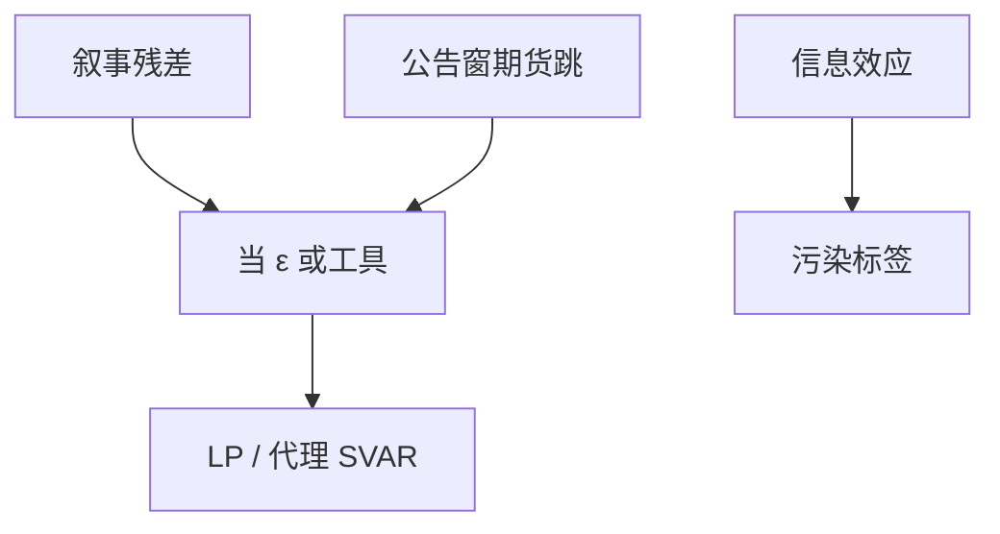

# 叙事与高频识别

冲击的标签若不能从同期零限制放心得到，就从历史记录或政策公告窗里的价格跳变去借。

<footer>—— Romer and Romer, A New Measure of Monetary Policy Shocks, AER 2004；Gertler and Karadi, Monetary Policy Surprises, QE and the Stock Market, AEJ:Macro 2015；Ramey 财政叙事</footer>

[上一课](/econ/local-projections)把 IRF 估计从 VAR 套牢里拆出，并声明冲击仍须外来。本课缺口是**冲击从哪来**：叙事（读档案、读绿皮书）与高频（公告窗内期货跳变）。本单元在此收束识别；下一单元进入异质性。不重写 LP 公式。

## 问题

Cholesky 对货币、财政都脆。Romer–Romer：用绿皮书预测把「对经济状况的内生反应」从意向利率里减掉，残差当叙事货币冲击。Ramey：军费新闻日期。Mertens–Ravn：叙事减税。Gertler–Karadi、Gürkaynak–Sack–Swanson：FOMC 公告窗内联邦基金或欧洲美元期货的跳变，当意外。缺口是给 SVAR/LP 一条外部 $\varepsilon$ 或工具，而不是再排一次变量顺序。

Romer and Romer, *AER* 94(4), 2004。Gertler and Karadi, *AEJ:Macro* 7(1), 2015。Nakamura and Steinsson, *QJE* 2018 用高频看信息效应。Kuttner 的联邦基金期货是前身。

## 方法

叙事：编码规则必须事前，防止用 IRF 形状反过来挑日期。把叙事序列当冲击直接 LP，或当代理进 SVAR（Mertens–Ravn）。高频：窗要短到宏观数据进不来、长到价格能反应；多目标（路径、前瞻指引）用若干期货期限抽因子。信息效应：若公告同时揭示央行的经济判断，利率升可能伴随股票升，工具就不是纯政策供给——要显式建模或选正交化。

财政与货币共用这一逻辑，冲击账户不同。本课不把区域乘数的 Bartik 写进来，以免换数据维度。

## 机制

机制是用制度时间线或市场时钟制造外生变异。叙事靠人读条件信息；高频靠市场比宏观更早把意外资本化。两者都可能弱（工具与真 $\varepsilon$ 相关低）或污染（混进新闻）。弱工具使 LP-IV 的远地平线不可信。DSGE 估计可以把这些序列当额外观测，把结构冲击与代理对齐——回到贝叶斯课的接口，不重估 SW。

本课程动态方法单元在此停：能解、能估、能识别加总脉冲。加总脉冲对「谁的 MPC」沉默——下一单元从代表性个体走开。

Ramey, *Handbook of Macroeconomics* 第 2 卷，财政与货币识别综述。Jarociński and Karadi 把信息效应与纯政策在符号上拆开。

## 边界

本课不重建绿皮书数据库，不交易期货。不把高频识别写成微观结构（不是 Kyle）。量化宽松的期限溢价通道可点名，不把整本央行资产负债表提前写完（金融摩擦单元后部）。太阳黑子与新闻冲击（Beaudry–Portier）是预期单元的题目。

后课默认：外部冲击序列来自叙事或高频（或两者作代理）；LP/SVAR 只是第二步。下一课：加总欧拉背后，不完全市场的资产分布。

## 小结

- 叙事从档案构造条件残差；高频从公告窗价格跳变借意外。
- 可当冲击或 IV；信息效应会污染标签。
- 识别单元结束；加总 IRF 不回答异质 MPC。
- 出处：Romer and Romer, *AER* 2004；Gertler and Karadi, *AEJ:Macro* 2015；Ramey 手册。
