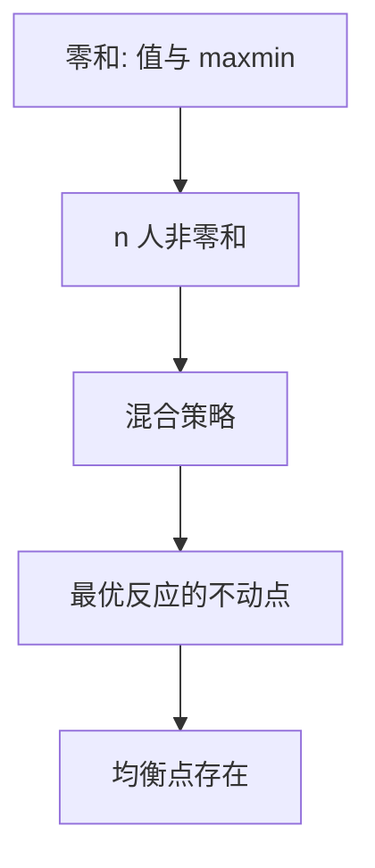

# Nash 均衡原文

    
有限策略式博弈存在均衡点：允许混合时，每人的混合是对其余人混合的最优反应。

    <footer>—— Nash, Equilibrium Points in n-Person Games, PNAS 1950；Non-cooperative Games, Annals of Mathematics 1951</footer>

附录对照，不插入主干。[上一课](/econ/rothschild-stiglitz)对照的是竞争保险里均衡可以空。本篇转到 **Nash 1950/1951 原文的问题设定**：非合作博弈有没有解，解是什么。主干[策略式与纳什](/econ/nash-equilibrium)已用最优反应当默认解概念；这里对照短讯与 Annals 全文如何把 von Neumann 的零和值推广到 $n$ 人非零和，以及存在性靠的是不动点而不是最大最小值。

## 问题

von Neumann（1928）给二人零和博弈一个值：混合策略下 $\max\min=\min\max$。$n$ 人、支付不必相反时，没有「值」，两人的得不必相加为零。Nash 要的缺口是一个**均衡点**：一组（混合）策略，使得没有人能靠单方面改自己的混合来提高期望支付。1950 年 *PNAS* 短讯用布劳威尔给出存在；1951 年 *Annals* 把定义、与零和的关系、以及「非合作」相对联盟的分界写全。学位论文同是 1950 年。

短讯几乎没有例子；Annals 才把猜硬币、与零和值的包含、以及「非合作意味着不能签订有约束力的联盟合同」写清楚。原文不讨论筛选合同，也不讨论瓦尔拉斯拍卖人。它问的是：把别人的策略当环境时，相互最优反应是否总存在。

有限纯策略是存在性的关键假设。无限策略或支付不连续时，均衡点可以空——那不是 1950 年未写完的脚注，是后文的反例传统。本附录只钉有限情形下「定义 + 存在」。

1950 年 *PNAS* 36(1) 只有两页，存在性一笔带过。完整论证与例子在 *Annals of Mathematics* 54(2), 1951, 286–295。不要写成「1950 年 Annals」，也不要发明 arXiv。

## 方法

对象：有限参与人、每人有限纯策略。混合策略是纯策略上的概率向量，支付对混合双线性。均衡点 $s^*$ 满足 $s_i^*\in r_i(s_{-i}^*)$ 对所有 $i$。证明把最优反应对应做成乘积对应，角谷（短讯用布劳威尔加逼近）给出不动点。零和二人是特例：均衡支付就是值。

没有「共同知识」「学习动态」。到达问题被刻意放下。合作博弈（核、von Neumann–Morgenstern 解）要求可转移支付与可执行的联盟合同；Nash 把可执行性拿掉，只挡单人偏离。

主干课已经用纯策略定义消化古诺；附录对照的是原文把存在性放在混合上，以及纯策略可以空（猜硬币）并不摧毁定义。

## 机制

机制是把均衡从「市场出清」换成「没有有利的单方面改招」，并用不动点保证这句话有解。价格在此不是参数；别人的混合才是参数。第一福利定理不再附送：囚徒困境的均衡点可以是双输——原文没有把有效性写进定义，这正是后来市场失灵课能接上纳什的原因。

混合在原文里是纯策略上的概率向量，支付取其双线性期望。它不是「玩家真的在扔骰子」的心理学，也不是进化频率——那些是后起解释。短讯用布劳威尔，是因为先把对应逼近成连续函数；Annals 更靠近角谷。与主干[存在性](/econ/ge-existence)同一类对象，定义域换成策略单纯形。

### 对照主干纳什课，不插入策略课中间

主干[策略式与纳什](/econ/nash-equilibrium)已取定义、占优与「不必有效」。本附录对照 *PNAS* 1950 / *Annals* 1951：存在性、混合、与零和值的包含关系。没有子博弈完美、没有贝叶斯、没有演化稳定。那些是后起精炼。把 1950 插进[次优](/econ/theory-of-second-best)与古诺之间当作「第 0.5 课」，会打断从计划者到无计划者的课序。

Nash 另有 1950 年 *Econometrica* 讨价还价文，是合作公理，不是本篇的均衡点。两篇不要并成一句「Nash 1950」。

## 边界

原文没有解决如何到达均衡、多个均衡如何挑选。Schelling 的焦点、Harsanyi–Selten 的选择，是后几十年。也不要把混合读成「真的在扔骰子」：原文是数学对象，可观测混合是后课的技术条件。

这与 Rothschild–Stiglitz 的「均衡可以空」不是同一句话：RS 空的是特定竞争合同均衡；Nash 对有限策略式保证均衡点非空。有限是关键——无限策略、不连续支付可以空。

不要把 1950 写成限价簿上的排队博弈。策略在原文是抽象的有限行动。

读完回主干纳什课即可。微观信息附录链在此进入博弈原文，不插入一般均衡课序。

有限博弈的纯策略均衡可以空，混合把存在性救回来。无限策略要另加连续与拟凹，那是主干后课，不是短讯里的定理。

## 小结

- 附录对照 Nash 1950/1951：非合作均衡点是相互最优反应，有限博弈在混合下存在。
- 方法是最优反应对应的不动点，不是零和的最大最小。
- 定义不附送有效；讨价还价公理是另一篇。
- 出处：Nash, *PNAS* 1950；*Annals of Mathematics* 1951。
