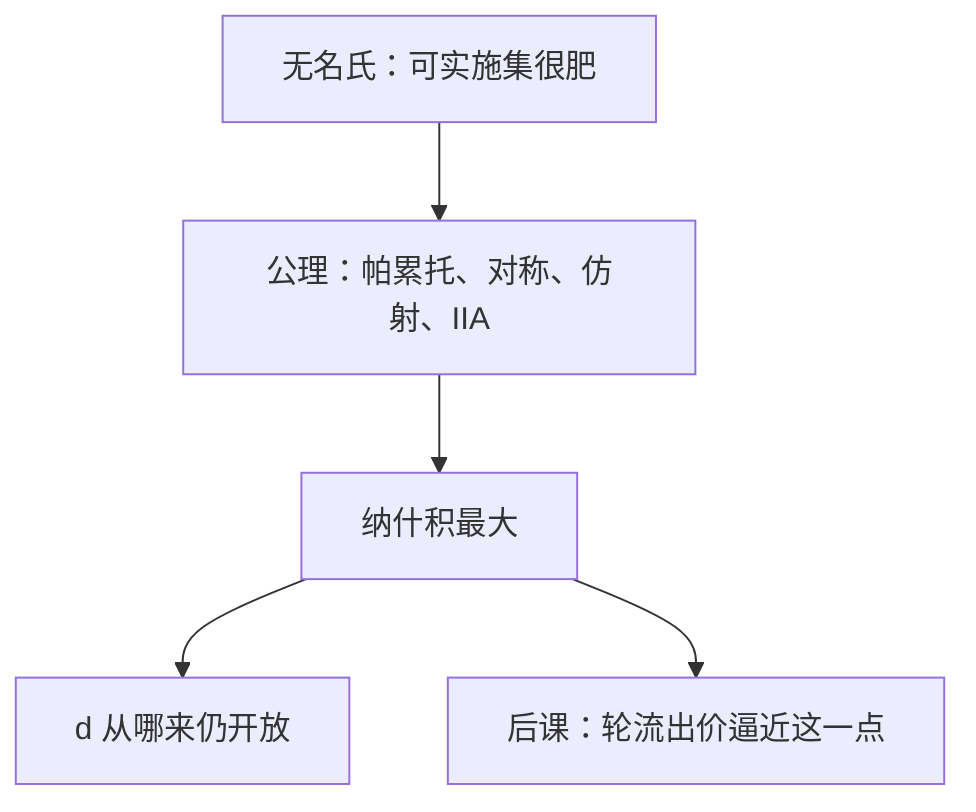

# 纳什讨价还价

满足帕累托、对称、线性变换不变与无关方案独立性的二人讨价还价解，是使纳什积 $(u-d_u)(v-d_v)$ 最大的那一点。

<footer>—— Nash, The Bargaining Problem, Econometrica, 1950</footer>

[上一课](/econ/folk-theorem)把重复博弈的 SPE 支付集撑到几乎整个可行且个人理性的集合，但不挑哪一点。缺口是选择：两人分一块剩余时，有没有公理化的那一个点？Nash 1950 的讨价还价解走合作公理路线，不是再写触发策略，也不是非合作纳什均衡的重讲。

## 问题

对象：紧凸的可行支付集 $S\subset\mathbb{R}^2$，分歧点 $d\in S$（谈不成时的支付）。解 $f(S,d)\in S$。四条公理：

- 弱帕累托：不存在 $s\in S$ 对双方都严格更好；
- 对称：若 $S$ 与 $d$ 对称，则两人所得相同；
- 仿射变换不变：对 $u,v$ 分别做正仿射变换，解跟着变，相对位置不变；
- 无关方案独立性（IIA）：若 $f(S,d)\in T\subset S$ 且 $d\in T$，则 $f(T,d)=f(S,d)$。

唯一满足四条的 $f$ 是

$$
f(S,d)=\arg\max_{(u,v)\in S,\,u\ge d_u,\,v\ge d_v}(u-d_u)(v-d_v).
$$

对称、线性生产可能集、 $d=0$ 时，均分剩余。这与无名氏里「许多分割都能被 SPE 撑住」不冲突：公理在挑，重复博弈在撑。

### IIA 与阿罗的 IIA 同名不同事

这里的 IIA 说：丢掉一些本就不会被选中的可行点，解不变。Arrow 的 IIA 说社会对 $x,y$ 的排序不看 $z$。不要把[不可能定理](/econ/arrow-impossibility)搬进来当本课的障碍——讨价还价的定义域是支付集加分歧点，已经是基数 vNM 支付，不是序数剖面。

分歧点 $d$ 是谈不成的支付，不是「现状消费」。它从哪来，公理不回答：可以是非合作威胁点、外面选择、或法庭判决。$d$ 一移，解沿可行边界滑。Kalai–Smorodinsky 用单调性替换 IIA，指向边界上比例于理想点的那一点。

## 方法

对象：二人、可转移或至少凸的 $S$、vNM 效用。先用仿射把 $d$ 移到原点、把解正规化，再由对称加帕累托钉住 $45^\circ$ 线与边界的交，最后用 IIA 把一般 $S$ 收回到这个正规化问题——乘积最大是这条几何的代数。

本课不把「某一条触发路径的分赃」叫做纳什解。无名氏只保证许多点可实施；实施哪一点要另加选择理论，或另加出价程序（下一课）。

## 机制

乘积最大的边际含义：沿可行边界，$du/(u-d_u)+dv/(v-d_v)=0$，即两人「相对分歧点的百分比损失」在边界上对齐。对称保证没有把名字写进解；仿射不变保证 vNM 效用的原点与单位不实质。IIA 则禁止「因为旁边还有一个更好看的点」而改选——解只盯住被选中的那个点和 $d$。

与非合作纳什的差别：那里每人选策略，挡单人偏离；这里没有策略空间，只有可行支付与公理。Nash 同年两篇论文，对象不同。把讨价还价解读成「谈判的纳什均衡」，漏掉了公理。

### 对称是支付空间里的对称

两人贴现不同、先手不同，支付集本身就不对称，解不必均分。公理的对称只在 $(S,d)$ 关于 $45^\circ$ 对称时启动。后课轮流出价会把「谁更有耐心」写成不对称的 $S$ 或不等的贴现，广义纳什积 $ (u-d_u)^\alpha(v-d_v)^{1-\alpha}$ 对应那一权。

可转移效用下，边界是斜率为 $-1$ 的直线，纳什解均分 $d$ 以上的剩余。不可转移时，边界弯曲，均分的是效用单位，不是货币。不要把解写成「各拿一半钱」。

## 边界

$n$ 人讨价还价有更多解概念（Shapley 值是另一条公理）。风险厌恶程度进入 vNM 曲率，从而进入分割——更厌恶风险的人在某些写法里少得。重新谈判、外部选择随时间变，公理要重写。

后课默认：完全信息二人分剩余，公理解是纳什积最大；它不替代无名氏，只在肥集合上挑点。分歧点与出价程序由非合作模型提供。

## 小结

- 无名氏撑住许多点；纳什讨价还价用公理挑一个。
- 四条公理 $\Rightarrow$ 纳什积最大。
- 这是合作解，不是策略式纳什。
- 分歧点外生；不对称耐心写成广义积或下一课的 $\delta$。
- 出处：Nash, *Econometrica*, 1950。
