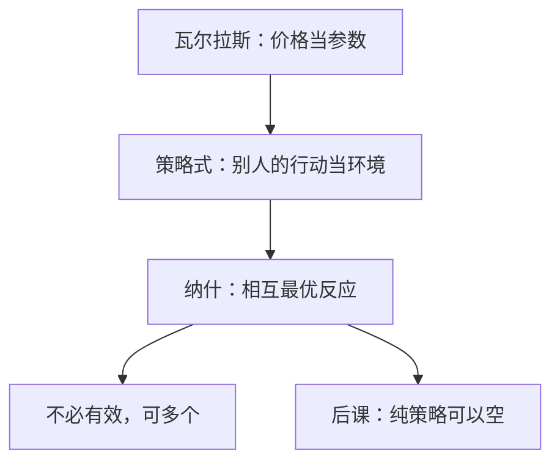

# 策略式与纳什

均衡点是这样一组策略：每人的策略是对其余人策略组合的最优反应。

<footer>—— Nash, Non-cooperative Games, Annals of Mathematics, 1951；Nash, PNAS, 1950</footer>

[上一课](/econ/rationalizability)（可理性化）。仍假定有一个计划者，在锁死的约束下改其余边际。缺口是：许多互动里没有这个计划者。厂商、谈判双方、公共品的自愿贡献者，每人选自己的行动，把别人当环境，但环境又由别人的选择构成。[古诺](/econ/cournot-oligopoly)已经用过「给定对方产量、选自己的产量」，本课把它写成一般的策略式与纳什均衡，不重写次优的拉格朗日。

## 问题

瓦尔拉斯均衡里，个人把价格当参数，没有人对 $p$ 有策略影响。市场失灵之后，价格或数量重新变成别人的选择。需要一个解概念：在没有拍卖人、也没有计划者改楔子时，什么样的策略组合可以站住。

策略式博弈是 $(N,(S_i),(u_i))$。纯策略纳什是 $s^*$ 使得对每一 $i$，

$$
u_i(s_i^*,s_{-i}^*)\ge u_i(s_i,s_{-i}^*)\quad\forall s_i\in S_i.
$$

没有人能单方面改进。它不要求联合最优，也不要求帕累托有效——囚徒困境的纳什是双输，这与第一定理的「分散化即有效」已经分家。

### 纳什不是「大家都猜中别人」的心理故事

定义只要求：在别人真的停在 $s_{-i}^*$ 时，自己不想偏离。如何到达、是否学习、是否共同知识，是另一些假设。本课用定义本身；存在性要混合策略，是下一课。

最优反应对应 $r_i(s_{-i})=\arg\max_{s_i}u_i(s_i,s_{-i})$。纳什是 $s_i^*\in r_i(s_{-i}^*)$ 对所有 $i$，即乘积对应 $r(s)=\prod_i r_i(s_{-i})$ 的不动点。这与[超额需求的不动点](/econ/ge-existence)是同一类对象，定义域换成策略空间。

## 方法

对象先限有限参与人、有限或紧凸的纯策略集、连续拟凹的 $u_i$。纯策略纳什在「每人最优反应单值且连续」时可由布劳威尔得到；一般要到混合。本课先用定义消化古诺、伯川德、公共品贡献：它们都是某个策略式的纳什，不是新的解。

占优策略均衡更强：无论别人怎样，自己这一手都最好。有占优策略时纳什与它重合；囚徒困境的招供是占优，也是纳什。协调博弈有多个纳什，占优帮不上，选择要靠风险占优或制度，本课不展开。

与核的对比：核允许联盟联合偏离；纳什只挡单人偏离。合作与非合作的分界在偏离的可行集，不在「人好不好」。

## 机制

纳什把均衡从「市场出清」换成「没有有利的单方面改招」。古诺产量对在反应曲线交点上，正是这句话。公共品自愿贡献的不足，也是纳什，不是新的失灵类型——失灵是偏好与技术，解概念是纳什。

有效性不再免费附送。要恢复有效，必须改支付（合同、税、重复互动），不能指望定义本身。次优计划者若存在，他面对的仍是这些纳什约束：政策改变 $u_i$，新均衡是新的不动点，不是计划者直接点名配置。

### 占优、重复删除与多个纳什

严格劣策略可以反复删除，纳什一定活过删除；反过来，删除后剩下的组合不必都是纳什。协调博弈（选同一家店、同一技术标准）有多个纯纳什，支付占优与风险占优可以指向不同点，定义本身不挑。囚徒困境则是占优策略均衡，因而也是唯一纳什，且帕累托劣于合作——这是「解概念不附送有效」的标准教具。

连续策略、拟凹支付时，纯策略纳什可以靠角谷直接存在（古诺常满足）。有限博弈的纯策略存在没有保证，猜硬币是缺口，下一课用混合填上。

与核的对照再写一句：核挡的是联盟用自己禀赋走开；纳什挡的是单人改招。公共品贡献不足是纳什，不是核空。两套解不要并成一句「市场失灵」。

## 边界

纯策略可以不存在（猜硬币）。不可观测混合、连续行动的技术条件，下一课补。纳什不管空威胁：扩展式里「若你进入我就疯价」可以是纳什，却不是后课的子博弈完美。不完全信息要贝叶斯化。

也不要把纳什写成限价簿的排队博弈。策略在本栏是抽象行动；簿上的时间优先是量化栏的规则。

后课默认：谈到无计划者的互动，解概念先是纳什；有效要另证。

## 小结

- 次优还有计划者；策略式没有，只剩相互最优反应。
- 纳什挡单人偏离，不挡联盟，不保证有效。
- 古诺、自愿贡献都是纳什的例子。
- 纯策略可以空，存在性要混合。
- 出处：Nash, *PNAS* 1950；*Annals of Mathematics*, 1951。
