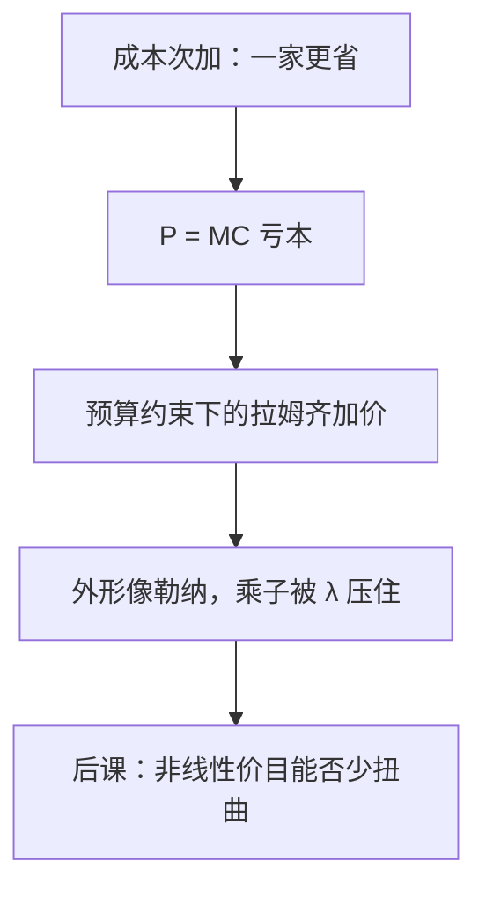

# 自然垄断与拉姆齐定价

次可加成本下按边际成本定价会亏本；拉姆齐价格在预算平衡约束上按弹性反比加价，是次优，不是勒纳垄断。

<footer>—— 据 Ramsey, A Contribution to the Theory of Taxation, Economic Journal, 1927；Boiteux, Econometrica, 1956 整理</footer>

定位：[上一课](/econ/monopoly-lerner)。垄断课在进入被挡住时写出 $\mathrm{MR}=\mathrm{MC}$ 与勒纳 $L=1/|\varepsilon|$，并点到 IRS 可以解释为什么只活得下一家。本课不重讲单一价格的无谓损失三角形。缺口是成本侧：[次加性](/econ/returns-vs-economies)意味着一家生产全行业产量更省，但 $P=\mathrm{MC}$ 收不回总成本。规制不能同时要有效产量与零补贴。

## 问题

自然垄断的定义是成本次加，不是「看见一家厂商」。相关产量区间上 $c(Q)\lt c(Q_1)+c(Q_2)$（$Q_1+Q_2=Q$）。此时让两家拆开是浪费；让一家按 $P=\mathrm{MC}$ 定价，若 MC 低于 AC，每单位亏 AC$-$MC，预算破裂。缺口不是再写一次勒纳，而是：**次可加成本下，边际成本定价与企业盈亏哪一头让步。**

不受规制的垄断者走 $\mathrm{MR}=\mathrm{MC}$，加价按弹性，产量太低。平均成本定价 $P=\mathrm{AC}$ 可盈亏平衡，但 $P\gt \mathrm{MC}$ 仍留三角形。拉姆齐–布瓦特（Ramsey–Boiteux）在「利润不低于零」（或固定的补贴上限）下最小化无谓损失，得到次优加价。

### 拉姆齐不是三级歧视的利润最大化

Ramsey 原文是商品税：在征到既定额度时，税率与弹性反比。Boiteux 把同一乘子写进受预算约束的公共垄断。公式外形像勒纳，目标函数相反：垄断最大化利润，拉姆齐在盈亏约束上最小化扭曲。不要把 $L_i\propto 1/|\varepsilon_i|$ 直接叫成「规制者也在盘剥」。

单产品时拉姆齐常退化成 AC 定价（只有一个自由度）。多产品才显出「弹性低的产品多承担固定成本」。与[三级歧视](/econ/price-discrimination)的分箱加价对照：那里没有盈亏约束，目标是利润。

## 方法

设公共垄断的产品 $i=1,\ldots,m$，反需求 $P_i$，共同成本 $c(q)$，约束 $\sum P_i q_i-c\ge 0$。拉格朗日乘子 $\lambda\ge 0$ 度量预算的影子价格。一阶条件整理成

$$
\frac{P_i-\mathrm{MC}_i}{P_i}=\frac{\lambda}{1+\lambda}\frac{1}{|\varepsilon_i|}.
$$

$\lambda=0$ 时回到 $P=\mathrm{MC}$（补贴足够）；$\lambda\to\infty$ 时加价逼近不受约束的勒纳。中间地带是次优。独立需求是教具；有交叉弹性时用超弹性（superelasticity）修正，本课不展开矩阵。

可竞争性（Baumol–Panzar–Willig）问：若沉没为零，潜在进入能否把在位者钉在可持续的 AC 上。本课把沉没当正，规制有对象；沉没为零时自然垄断不一定需要价格管制。不要把可持续价格写成限价簿上的保护限价。

## 机制

亏本的机制是固定或沉没的管网：MC 只反映多送一单位的可变支出，AC 还在摊 $z_f$。次加性保证「拆成两家」不能省掉这笔摊销。拉姆齐加价的机制是：既要收回固定成本，又希望少扭曲产量，于是把负担派给减少需求较少的那些产品——与 Ramsey 商品税同一直觉。

与上一课勒纳的关系：不受约束的垄断相当于预算乘子无穷（或没有预算约束、目标是利润）。规制把 $\lambda$ 压下来，加价同比缩小，产量向 $P=\mathrm{MC}$ 靠。补贴若政治上可行，$\lambda=0$ 恢复第一优；次优是补贴不可得时的让步。

可持续价格（sustainable prices）是可竞争性那一侧：在位者的价目使任何进入者拆走一部分产量都无利，同时在位者自身不亏。次加性是可持续的必要条件，不是充分条件。本课规制路径假定沉没挡住进入，才需要 Ramsey 公式；沉没为零时，潜在进入本身可能把价格压到可持续配置，管制的理由变弱。

Boiteux 1956 写的是受预算约束的公共企业，不是 1927 年 Ramsey 税的逐字翻译，但乘子结构同一。引用时不要把电力高峰负荷（后课）提前写进本课的静态多产品税。

## 边界

信息不对称下，规制者看不见 $c$，拉姆齐公式没有可实施的 $c$——那是机制设计。动态投资、搁浅成本、接入定价（essential facility）会改约束写法。两部收费可以在使用费贴近 MC 的同时用固定费收固定成本，后课再接；本课菜单仍是线性价格。

后课默认：自然垄断读成本次加；线性规制价格读拉姆齐乘子，不是把勒纳指数改个名字。

## 小结

- 次可加成本下 $P=\mathrm{MC}$ 亏本；AC 定价平衡预算但仍扭曲。
- 拉姆齐–布瓦特在盈亏约束上按弹性反比加价，是次优。
- 公式像勒纳，目标与约束都不是利润最大化。
- 后课放开按组别与按菜单的非线性要价。
- 出处：Ramsey, *EJ*, 1927；Boiteux, *Econometrica*, 1956；Baumol, *AER*, 1977。
