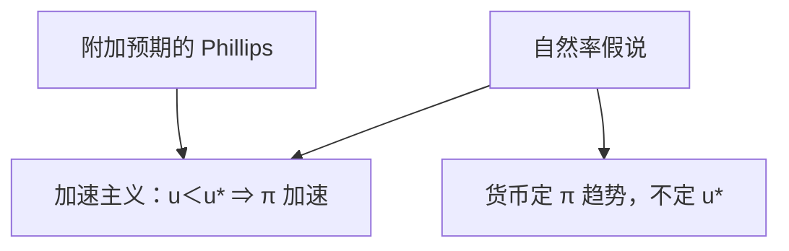

# 自然率假说

把失业钉在自然率之下，必须让通胀持续跑赢预期；于是通胀加速，而不是沿着一条稳定的替换菜单滑动。

<footer>—— Friedman, The Role of Monetary Policy, AER 1968；Phelps 同期的自然率与预期工资设定</footer>

[上一课](/econ/phillips-expectations)已经把 Phillips 的统计替换写成 $\pi=\pi^e+\kappa(u-u^*)+\varepsilon$，并指出长期垂直。本课的缺口不是再画那条短曲线的形状，而是把 Friedman–Phelps 的**假说**写成可证伪的加速主义：自然率 $u^*$ 是通胀既不加速也不减速的锚，货币不能买到永久的 $u\lt u^*$。失业课给过 $u^*$ 的定义；这里把它接到预期菲利普斯的政策含义。IS–LM 下一课才写需求侧会计。

## 问题

附加预期的菲利普斯一旦写下，政策菜单立刻消失——若公众的 $\pi^e$ 跟着政策走。自然率假说把这句话提升为对货币角色的限制：名义需求可以暂时推动 $\tilde{u}$，不能把 $u^*$ 本身当作货币政策的目标函数去钉死。缺口是加速主义机制，而不是把 [失业与自然率](/econ/natural-unemployment) 的摩擦分解再讲一遍，也不是把 $\kappa$ 的 Calvo 微观提前搬来。

Friedman（1968）：$u^*$ 由劳动市场实物与制度决定；试图用通胀换失业，只会加快 $\pi$。Phelps 从另一条工资设定走到同类结论。两者合称自然率假说，针对的是 1960 年代把 Phillips 当菜单的政策观。

加速主义：维持 $u\lt u^*$ 要求 $\pi\gt \pi^e$ 每一期都成立，于是 $\pi$ 本身上升。NAIRU 是操作近似；假说的理论对象是 $u^*$，不是某一个滤波值。

## 方法

把上一课的式子对时间差分（适应性预期下 $\Delta\pi^e$ 跟 $\pi$ 走）得到：$\Delta\pi$ 与 $(u-u^*)$ 同号。要把失业保持在自然率以下，必须接受**加速的**通胀，而不是一个更高但稳定的 $\pi$。理性预期下，被完全预见的扩张甚至买不到暂时的 $\tilde{u}$，只剩下立刻更高的 $\pi$——卢卡斯把假说推到「只有意外才有实量效应」。

假说不要求 $u^*$ 恒定。人口、失业保险、匹配技术会慢移 $u^*$。它要求的是：这些移动来自实物与制度，不是靠多印一张票子就能反向钉住。把 1970 年代滞胀读成「曲线坏了」，不如读成「菜单假说被加速主义拒绝」。

### 与自然率定义课的分工

定义课钉 $u^*$ 为正、货币长期中性、参与率对照。本课钉政策含义：不以 $u$ 为名义工具的长期目标，而以通胀（或名义锚）为长期目标，$u$ 回到当时的 $u^*$。Okun 仍只把 $\tilde{u}$ 接到 $\tilde{y}$，不提供可以永久压低的 $u^*$。

## 机制

意外扩张改变被感知的相对价格或实际工资，就业暂时上升。预期追上后，同一条短菲利普斯上移，$\pi$ 停在更高处才能维持原来的 $u$——若还想保持 $u\lt u^*$，就必须再加速。这就是假说的拒绝域：若存在稳定的、可用名义政策维持的 $u$–$\pi$ 替换，假说失败。1970 年代高 $\pi$ 与高 $u$ 并存，是对稳定负斜率菜单的拒绝，不是对短期替换的否认。

长期垂直于 $u^*$：预期正确时 $\pi$ 由名义锚决定。费雪方程把这个 $\pi$ 趋势送进 $i$。铸币税仍可在高通胀稳态抽取实际余额，但抽不到永久低失业——假说把两种「用通胀换东西」分开。

失业课与本课的分工再钉一次：前者给 $u^*$ 的劳动力定义与 $y^*$；后者给「不能用名义工具永久压低 $u^*$」的加速主义。菲利普斯课给了方程形状；假说给的是政策拒绝域。Okun 仍然只连接 $\tilde{y}$ 与 $\tilde{u}$，不提供可钉住的长期菜单。

若 $u^*$ 因制度上升，观察到的高失业可以与稳定通胀并存，并不推翻假说——那是锚在移动，不是菜单复活。把一切高失业写成「需求不足所以假说失败」，会把结构错配当成周期性 $\tilde{u}$。

自然率可以无效率（搜寻外部性、垄断）。假说不把它写成社会最优，只写成货币长期中性的锚。改善 $u^*$ 要改劳动与产品市场，不是改 $M$ 的水平。

## 边界

本课不估计 NAIRU，不把新凯恩斯 NKPC 的斜率当假说的检验。假说允许短期非中性，与粘性价格、不完全信息兼容。开放程度、锚定会改短期 $\kappa$，不能把某十年美国斜率抄成假说的「系数」。也不要把 $u^*$ 写成限价簿上的自然成交率。

参与率课已经说明 $u$ 会漏掉退出者：假说的对象是劳动力内部的 $u^*$，不是就业人口比。把参与趋势当成可以靠通胀压回去的缺口，同样违反假说。卢卡斯批判后课会警告：政策规则一变，连估计出来的 NAIRU 都会挪——那是简化式，不是假说本身要求 $u^*$ 可精确观测。

短期非中性与假说兼容：意外通胀可以暂时压低 $u$。假说拒绝的是把这条短替换当成可以钉住的长期菜单。新凯恩斯粘性给出短替换的微观，长期仍垂直于自然产出——与本课同一句，只是装置从工资误读换成交错调价。

后课默认：长期宏观把 $u\to u^*$、$\pi$ 由名义锚决定当成假说，而不是把 Phillips 当菜单。下一课用 IS–LM 把需求侧写成计划 $I$ 与计划 $S$ 的会计。

## 小结

- 自然率假说：货币不能永久把 $u$ 钉在 $u^*$ 之下。
- 加速主义：维持 $u\lt u^*$ 要求通胀持续超过预期。
- 假说不要求 $u^*$ 不变，只要求其变动来自实物与制度。
- 短期替换可以存在；稳定的通胀–失业菜单被拒绝。
- 改善 $u^*$ 要改劳动与产品市场，不是改 $M$ 的水平。
- 出处：Friedman, AER 1968；Phelps 的自然率与预期工资设定。
