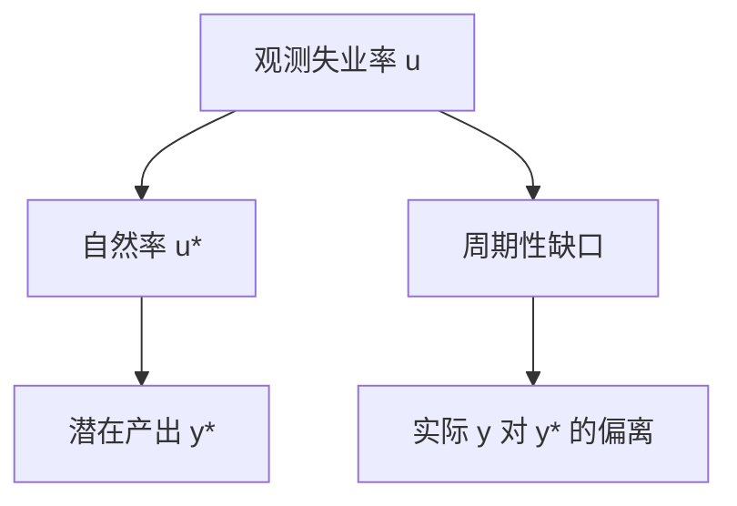

# 失业与自然率

自然失业率是通胀既不加速也不减速时的失业水平；它不是零，也不是一个可以用名义需求永久压下去的数。

<footer>—— Friedman, The Role of Monetary Policy, AER 1968；对照 Phelps 同期的预期工资设定</footer>

[上一课](/econ/price-index-real)把名义产出分成 $P$ 与实际 $y$。实际 $y$ 仍可能低于或高于「劳动力正常使用」时的水平。本课的缺口是：如何把未使用的劳动写成失业率，并与一个不靠持续通胀来维持的基准——自然率——对齐。增长理论要的是充分就业路径上的资本积累；本课先把这个基准钉住。

## 问题

劳动力调查给出失业人数与失业率 $u$。若把 $u=0$ 当成目标，会忽略摩擦性周转：匹配、寻职、季节与部门转移。若把观测到的 $u$ 全部叫周期性，又会把结构错配当成需求缺口去打。Friedman（1968）的缺口是：货币可以暂时压低 $u$，但不能把 $u$ 永久钉在自然率 $u^*$ 之下而不加速通胀。

自然率不是「上帝给定的常数」，而是当时劳动力市场结构、失业保险、人口与匹配效率下，预期正确时的 $u$。Phelps 从另一条工资设定路径走到同类结论。本课不把自然率写成后课菲利普斯曲线的整条动态，只钉：$u^*$ 是实际变量，不由名义货币水平决定。

NAIRU（使通胀不加速的失业率）是操作近似，估计依赖菲利普斯设定。自然率是理论对象。两者常被混用，后课预期菲利普斯会再分开。

## 方法

失业分解为摩擦、结构与周期。周期成分对应 $y$ 对潜在产出的缺口，经验上有 Okun 一类关系，本课只当对照，不把它升格为身份。劳动力参与率变化会使 $u$ 与就业率分叉：衰退中「泄气工人」退出，失业率可能看起来改善。账户上要同时看就业人口比。

$$
u = u^* + \tilde{u},
$$

$\tilde{u}$ 为周期性缺口。货币中性针对的是长期 $u\to u^*$，不是否认短期 $\tilde{u}$。潜在产出 $y^*$ 是 $u^*$ 与现有 $K$、$A$ 下的产出；索洛模型在 $u^*$ 上走，不在每次周期的 $u$ 上走。

测量 $u^*$ 要用通胀与工资行为，或用滤波把低频 $u$ 当近似。滤波不是理论。本课承认 $u^*$ 慢变，后课卢卡斯批判会警告：政策规则一变，连「自然」的简化式都会挪。

### 就业、工时与能力利用

失业只覆盖想工作而未工作的人。工时、临时解雇、产能利用率同样描写松弛。宏观主干仍用 $u$ 与 $y$ 缺口，因为后课 IS–LM 与泰勒规则的产出缺口以此为语言。

## 机制

自然率为正，因为匹配需要时间，劳动合同与住房使劳动力不能瞬时重新配置。名义需求扩张先改变 $P$ 的意外成分，误导实际工资或相对价格，就业可以暂时上升；一旦预期追上，$u$ 回到 $u^*$。这是 Friedman 对「货币可以买到永久低失业」的拒绝，细节的菲利普斯形状是后课。

$u^*$ 会因管制、工会、失业保险、人口老化与匹配技术而变。把 1970 年代 $u$ 上升全写成需求不足，是把 $u^*$ 当成常数。把一切写成结构，又会放过周期性 $\tilde{u}$。

## 边界

自然率不是社会最优失业。搜寻外部性和产品市场垄断可以使 $u^*$ 无效率，那是另一些模型。本栏主干仍用 $u^*$ 作为货币长期中性的锚。也不要在这里写限价簿上的劳动力「订单」；劳动市场微观结构不是量化栏的 LOB。

后课默认：增长与货币中性都以 $y^*$、$u^*$ 为背景。下一课在这条充分就业路径上引入资本积累。

## 小结

- 实际活动还要对照劳动力是否正常使用；$u=0$ 不是目标。
- 自然率是预期正确、通胀不加速时的 $u$，由实物与制度决定。
- 周期性缺口可被名义需求暂时推动；永久压低 $u^*$ 不是货币能买到的。
- 索洛在 $y^*$ 上增长；菲利普斯把 $u-u^*$ 与通胀预期接起来。
- 出处：Friedman, AER 1968；Phelps 的自然率与预期工资设定。
