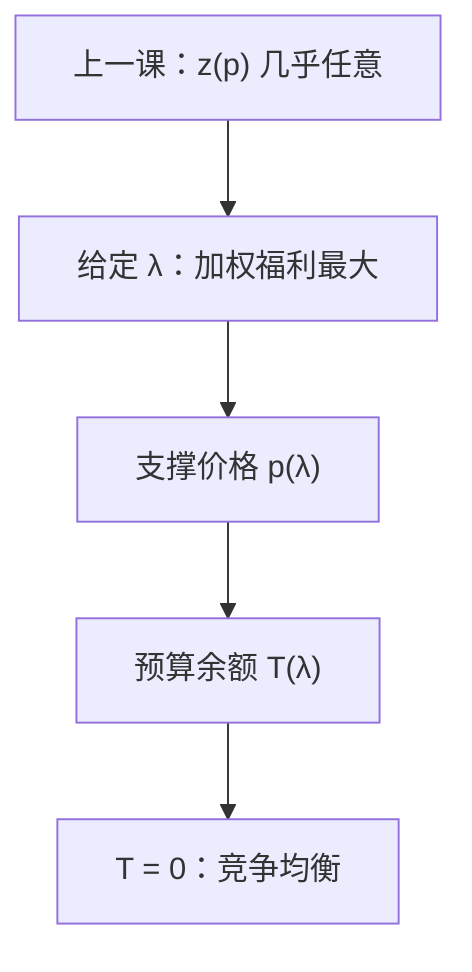

# Negishi 方法

给每人一个福利权重，在可行集上最大化加权效用之和，支撑价格就是候选均衡价格；再调权重直到每人预算闭合。

<footer>—— 据 Negishi, Welfare Economics and Existence of an Equilibrium for a Competitive Economy, Metroeconomica, 1960 整理</footer>

[上一课](/econ/smd-excess-demand)（Sonnenschein–Mantel–Debreu）。总体 $z(p)$ 在三条公理外几乎任意，对着超额需求找零点没有免费结构。本课不重写 Debreu 的构造。缺口是换未知数：第二定理说有效配置可被价格支撑；把福利权当参数，先在配置空间里解计划问题，再用预算余额把权调到瓦尔拉斯。均衡仍可能多，但映射定义在权重单纯形上，计算与存在都可以走这条路。

## 问题

SMD 让 $p\mapsto z(p)$ 不驯服。Negishi 问：能否把均衡写成「某个加权福利最优，且转移为零」？给定 $\lambda\in\Delta^{I-1}$，解

$$
\max_x \sum_i\lambda_i u^i(x^i)\quad\text{s.t. }\sum_i x^i\le\sum_i\omega^i
$$

（生产经济则加 $Y$）。内点下，资源约束的乘数 $p(\lambda)$ 支撑每人的 MRS。配置 $x(\lambda)$ 一般不是禀赋下的需求：隐含的转移是 $T^i=p\cdot(x^i-\omega^i)$。缺口是找 $\lambda^*$ 使所有 $T^i=0$。于是福利权扮演了价格的角色——更准确：权决定支撑价格与配置，预算闭合筛选哪一组权是竞争均衡。

### 权不是又一组市场价格

$\lambda_i$ 是计划者放在 $i$ 的效用上的数，不是 $p$。$p$ 从可行约束来。把 $\lambda$ 读成「谁更有钱」会混：权更大的人在最优里边际效用被压得更低、消费通常更多，但钱是 $p\cdot\omega^i$，由禀赋与 $p(\lambda)$ 决定。闭合条件正是让「计划分到的」与「市场买得起的」重合。

第二定理从有效配置出发找 $p$ 与转移。Negishi 把转移钉成零，反解 $\lambda$。存在性：$\lambda\mapsto T(\lambda)$ 在权重单纯形上有零点，可用角谷，商品空间维数不进未知数个数——未知数是 $I-1$ 个权。

## 方法

映射 $\Phi:\Delta^{I-1}\to\mathbb{R}^{I}$，$T^i(\lambda)=p(\lambda)\cdot(x^i(\lambda)-\omega^i)$。瓦尔拉斯定律使 $\sum T^i=0$，故可看作切空间上的向量场。零点即竞争均衡。凸连续假设下 $x(\lambda)$ 凸值上半连续，$T$ 有零点——与上一课存在性平行，不经过野的 $z(p)$。

计算一般均衡常用这条路：猜 $\lambda$，解一个最优规划（比解互补的 $z(p)=0$ 更稳），看预算，更新 $\lambda$。SCARF 一类单纯形算法也可以对 $\Phi$ 做。本课不把算法细节当主干。

有生产时，计划在 $Y$ 上选净产出，同一套 $p$ 让厂商利润最大——第一定理的逆方向在加权问题上自动满足。

## 机制

为什么「福利权当价格」：帕累托最优的一阶条件是 $\lambda_i\nabla u^i=\mu$，即 MRS 对齐到同一 $p=\mu$。这是有效的切条件。竞争还要求预算：$p\cdot x^i=p\cdot\omega^i$。只动 $p$ 时，$x$ 沿需求走，$z$ 可以乱；先强制切条件（有效），再只用 $I-1$ 个自由度去满足预算，未知数从 $L-1$ 个相对价格换成 $I-1$ 个权。人少商品多时，这条路更短。

SMD 仍在：$\Phi$ 的零点仍可有多个，比较静态仍不必唯一。Negishi 不驯服 $z$，只避免把野函数当求解对象。

$\lambda_i=0$ 的人在计划里可以落到生存边界，对应「无权」的角点均衡。内部禀赋假设挡住某些崩塌。权重单纯形的边界要单独检查，与存在性课切立方体是同一类权宜。

## 边界

非凸偏好或 IRS 时加权问题的解集不必凸，$\Phi$ 失去角谷所需的凸值，存在性一起垮——不是方法的错，是经济没有均衡。不完全市场没有单一帕累托集可加权，GEI 要用约束有效的 Negishi 变体，下一课序的 Radner 再谈计划。也不要把 $\lambda$ 写成宏观的社会偏好：这里的权是计算装置，不是 Arrow 加总出来的 $W$。

下一课[唯一性与试错](/econ/uniqueness-tatonnement)仍要对总体结构加条件；Negishi 只换了找零点的坐标系。

后课默认：竞争均衡是某组福利权下的可行最优，且隐含转移为零；权在单纯形上调整，价格是支撑乘数。

## 小结

- SMD 之后，不靠驯服 $z$，而靠加权规划加预算闭合。
- $\lambda$ 选配置与支撑 $p$；$T(\lambda)=0$ 筛选均衡。
- 未知数个数随人数，不随商品种类。
- 多重均衡仍然可能；方法是换坐标，不是唯一性定理。
- 出处：Negishi, *Metroeconomica*, 1960。
