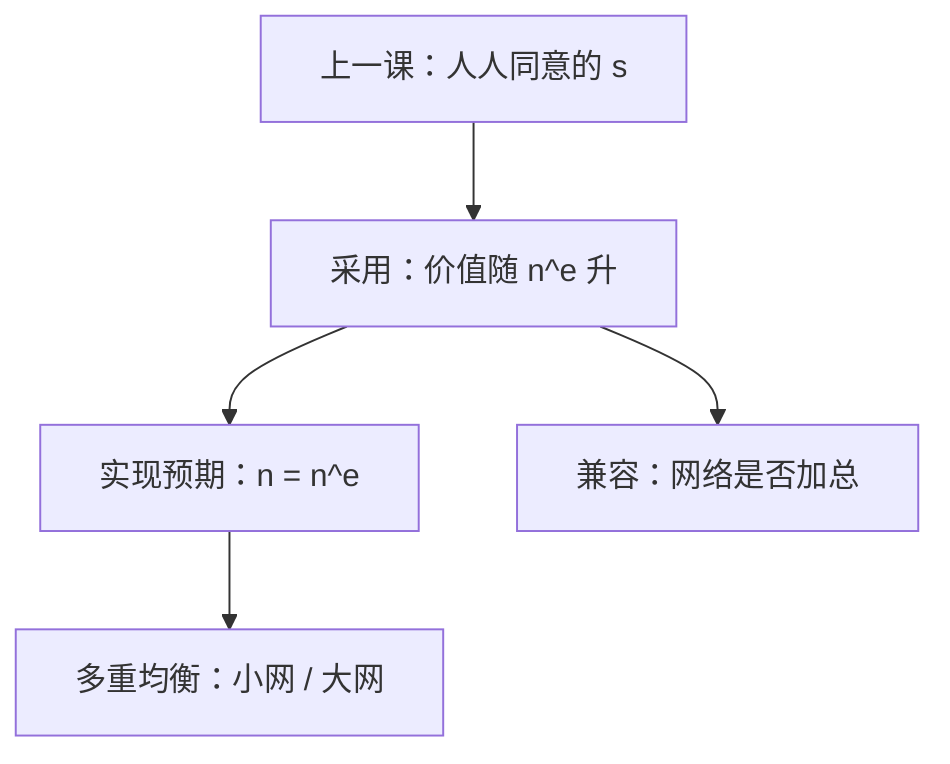

# 网络外部性

产品对买者的价值随预期用户规模上升；均衡是自我实现的预期，不是把质量 $s$ 再标高一档。

<footer>—— 据 Katz and Shapiro, Network Externalities, Competition, and Compatibility, American Economic Review, 1985 整理</footer>

[上一课](/econ/vertical-differentiation)（垂直差异）。质量排序一致，$\theta$ 切开谁买哪一档；固定成本型质量可以给出自然寡头。本课不重写 Mussa–Rosen 菜单，也不把 $s_H>s_L$ 再选一遍。缺口是采用外部性：别人买同一系统，我的净效用上升——这不是「人人同意质量更高」，规模本身进入支付意愿。Katz–Shapiro 把预期安装基础做成均衡对象。

## 问题

间接效用写成 $v(p,n^e)$，$n^e$ 是预期网络规模。实现的 $n$ 必须等于 $n^e$（实现预期）。同一 $p$ 可以对应多个 $n$：小网与大网都能自洽，因为大网把需求曲线抬高。缺口不是再写一次勒纳，而是：**采用规模是不是另一种 $s$，以及兼容、标准怎样改变均衡选择。**

纵差异里，高 $s$ 对所有 $\theta$ 都更好，只是加价忍受不同。网络：一个只有三人用的「高质量」系统，对需要互通的人可以差过一个十万人用的「低质量」系统。排序不再与 $s$ 一致，而与预期协调一致。

### 采用外部性不是质量阶梯

把 $n$ 写进 $s(n)$ 再套上一课，会漏掉协调失败：大家都等别人先买，市场停在零；或锁进一个劣标准。质量研发改变的是成本与 $s$；网络改变的是策略互补。兼容决策（是否让两家的 $n$ 加总）是厂商的另一维策略，不是选 $s$。

Katz–Shapiro 1985 用实现预期古诺：厂商选产量，消费者按预期 $n$ 买，均衡要求预期等于实际总销量。兼容使有效网络变成总和，改变进入与定价。

## 方法

实现预期均衡：给定 $n^e$，需求 $D(p,n^e)$；供给或寡头定价给出实际 $n$；不动点 $n=n^e$。可能有多个不动点。帕累托排序往往偏向大网，但无协调装置时市场不必选它。

两家系统：兼容则网络加总，价格竞争更像同质；不兼容则各养各的 $n$，先发或预告可以抢预期。消费者「赞助」某一标准，是为了避免事后被锁在小网。

启动：一期低于成本的定价可以是投资于 $n$，不一定是[掠夺](/econ/predatory-pricing)。要分开，仍用 Ordover–Willig 的反事实：没有网络时这笔低价还做不做。预期协调失败时，补贴、预告或保证回购是选均衡的工具，不是把质量 $s$ 买高。

## 机制

需求抬升的机制是互补：电话、软件、接口，别人接入使我的选择集变大。自我实现的机制是预期：我买是因为我以为别人会买。失败的机制对称：悲观预期让 $D$ 沉在零附近，即使大网帕累托更优。

与纵差异的分工：要解释「贵但公认更好」用 $s$；要解释「先发标准赢、后期质量更高的反而进不去」用网络。同一产品可以两种都在——本课禁止把安装基础直接叫成质量。

临界容量：需求 $v(p,n)$ 对 $n$ 上升够陡时，小扰动就能从零跳到大网，或反过来崩掉。厂商用预告、赠机、保证回购去选均衡，这些开支是协调装置，不是把 $s$ 买高。不兼容则两家各养各的临界点，先发优势来自预期，不来自成本函数上的 IRS。

Farrell–Saloner 的过量惯性 / 过量转换是同一协调问题的动态版。主干停在 Katz–Shapiro 的静态实现预期；动态路径依赖放边界。

## 边界

间接网络的软件目录看起来像质量：先把安装基础拿掉，再问 $s$ 还剩多少。

直接网络（通信）与间接网络（软硬件配套）机制同类、商品不同。间接网络里「另一边」尚未定价，看起来像硬件质量随软件目录升，仍是规模而不是 $s$。双边平台把「用户」拆成两边分别收费，下一课写。转换成本也可以制造锁定，但锁定的是已买者的沉淀，不必有规模进入效用——再下一课。也不要把网络效应写成宏观的总需求外部性。

后课默认：网络外部性是采用规模进入支付意愿；均衡靠实现预期，可以多重；它不是垂直质量 $s$。

本课不把安装基础写成另一种质量阶梯。

## 小结

- 支付意愿随预期用户规模变，不是 $\theta s-p$ 里把 $s$ 改成 $n$。
- 实现预期可以给出多个 $n$，协调决定选哪一个。
- 兼容改变有效网络，从而改变价格竞争。
- 下一课把用户拆成两边，价格结构本身成为策略。
- 出处：Katz and Shapiro, *AER*, 1985。
