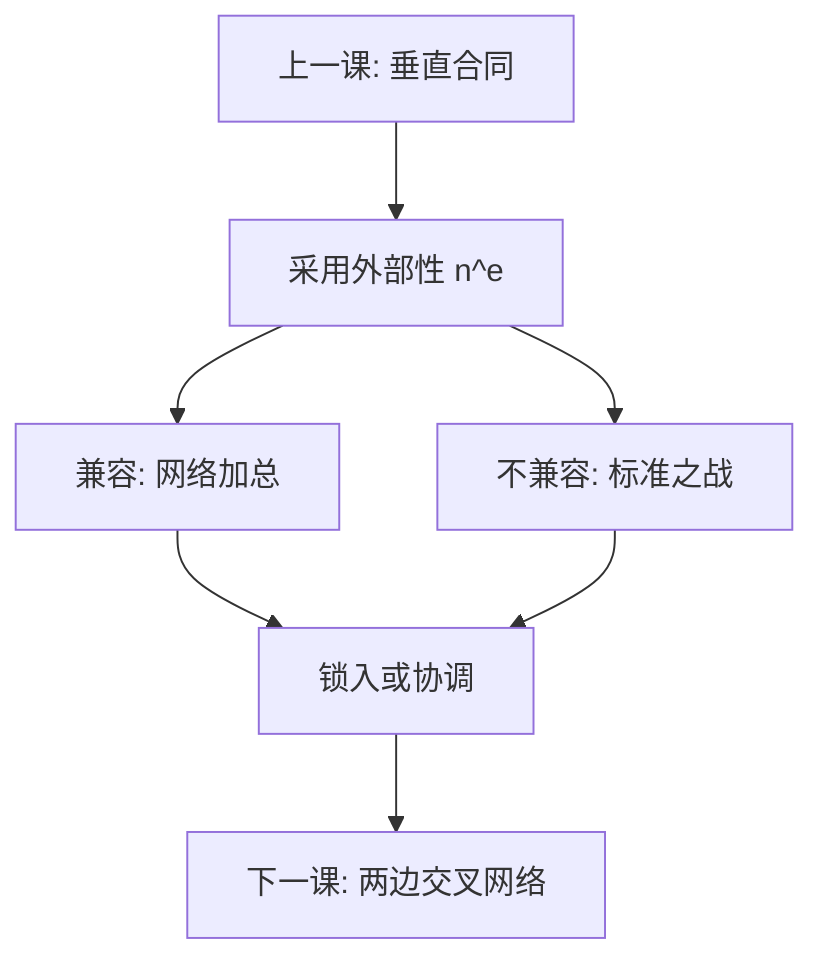

# 网络效应与标准

兼容把两家的安装基础加总成一张网；不兼容则把采用变成标准之战。胜出的不必是技术更优的，而是预期先协调到的。

<footer>—— Katz and Shapiro, AER 1985；Farrell and Saloner 标准化与安装基础；David 对 QWERTY 的路径依赖讨论；对照 Tirole 网络章</footer>

[上一课](/econ/vertical-restraints)用合同内部化垂直链上的外部性。本课缺口是横向的采用外部性：别人用同一系统，我的支付意愿上升。微观[网络外部性](/econ/network-externalities)已经写下实现预期与多均衡。产业组织续课要补的是**标准与兼容作为策略**：厂商何时开放接口、何时为不兼容而战，以及这如何改变进入的沉没与定价。后课把同一逻辑接到平台两边。

## 问题

实现预期下，同一价格可以撑住小网与大网两个不动点。兼容决策把有效网络从「自家用户」改成「可互通用户之和」，需求曲线外移，但独占加价的能力下降。缺口不是再定义 $n^e$，而是：**兼容是公共品还是封锁工具，标准战锁定的是协调还是质量。** Farrell–Saloner：在位的安装基础可以阻止更优的新技术（过度惯性），也可以因预期跳到新网而抛弃仍有价值的旧网（过度动量）。

标准可以由协会、主导厂商或政府指定。指定解决协调，也可能把错误技术锁死。本课对照机制，不写标准化学术委员会的程序法。

### 标准战不是最好技术胜出

把市场结果读成「revealed quality」，会把协调失败叫成效率。键盘布局、录像带格式是教学对照：即使经验争议仍在，理论要点不变——支付意愿含 $n^e$，早期份额通过预期放大。质量 $s$ 更高但 $n^e$ 更低的系统可以输。上一课纵向约束保护的是服务；本课保护或开放的是接口。

Katz–Shapiro 的兼容是内生策略：混合兼容使有效网络介于完全互通与完全分裂之间。厂商对弱者开放、对强者封闭，可以是均衡，不必诉诸阴谋叙事。

## 方法

三件套。(1) 需求：$v(p,n^e)$，不动点 $n=n^e$。(2) 兼容：两家的 $n$ 是否加总；开放可能收费（接口许可）。(3) 标准：事前协调到单一 $n$，或让市场裂成多标准。进入：不兼容迫使新厂商自建安装基础，沉没上升——接[进入与沉没](/econ/entry-exit-sunk)。定价：大网的勒纳用的是含网络的有效弹性，不是把 $n$ 再叫成质量档。

不要用单边勒纳直接读「免费增值」软件：价格结构可能在补贴采用，那是下一课对象。开放接口的许可费把兼容从「免费公共品」改成可定价的接入；费率过高等于事实不兼容。标准必要专利的诉讼是这条许可费的法律外观，本课不写专利法，只留：接入价格改变有效 $n$。

## 机制

策略互补：你采用提高我采用的收益，预期是状态变量。兼容把互补从「同一品牌」扩到「同一标准」，削弱品牌级网络势力、增强标准级势力。在位拒绝兼容，等于把沉没强加给进入者——纵向排他绑的是渠道，这里绑的是用户基础。路径依赖：早期随机或策略性的份额，通过 $n^e$ 变成后期的需求优势，边际质量改进不必翻转结果。

与差异化定价对照：那里交叉弹性来自偏好异质；这里交叉来自规模进入效用。两套矩阵可以同时存在（不同软件既差异化又联网）。合并模拟若忽略网络，会低估「把两张网合成一张」的涨价或效率。过度惯性与过度动量哪一种更常见，取决于转换成本与预期协调装置，不是取决于哪家的广告预算更大。

Farrell and Saloner 把转换写成带安装基础的动态博弈。本课要的是惯性与动量两种失败，不把全部微分对策写完。

## 边界

本课不重写 Katz–Shapiro 的古诺代数，主干已经有网络外部性课。不把标准写成专利法教程，不进限价簿上的撮合。政府强制标准的政治经济只点到「协调装置」，不展开。下一课：交叉网络——一边的 $n$ 进入另一边的需求，价格结构比总价更要紧。

后课默认：兼容与标准是策略变量，会改进入 $F$ 与有效弹性。看见锁入，先问预期协调，再问质量。

## 小结

- 兼容加总安装基础，不兼容把采用变成标准之战。
- 多均衡下，胜出不必是技术更优。
- 拒绝兼容可以提高对手的沉没，类似封锁。
- 网络加价不能用单边无 $n$ 的勒纳直接读。
- 出处：Katz and Shapiro, *AER* 1985；Farrell and Saloner；David；Tirole。
