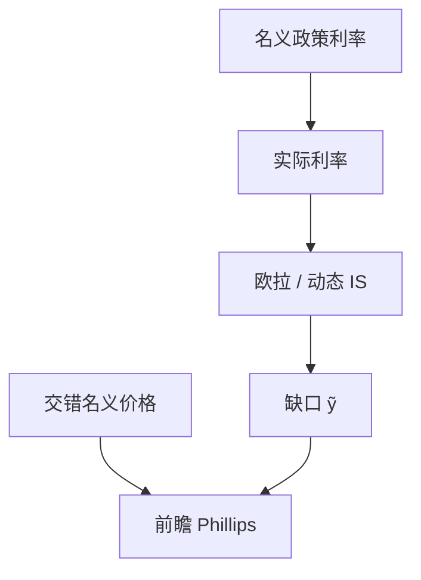

# 新凯恩斯粘性价格

名义利率能暂时支配实际利率，是因为价格不能立刻把所有商品的标价改完；前瞻的菲利普斯把通胀接到预期与缺口。

<footer>—— Woodford, Interest and Prices, 2003；对照 Calvo 交错定价</footer>

[上一课](/econ/hall-random-walk)（Hall 随机游走）。用欧拉替换了 $C(Y)$。若价格完全灵活，欧拉里的实际利率由实物出清决定，名义利率只是费雪意义上的加层——回到货币中性。本课的缺口是：在垄断竞争与交错调价下，名义政策利率能在一段时间内移动 $i-\mathbb{E}\pi$，从而沿欧拉移动需求。Woodford 把这套装置写成利息规则下的新凯恩斯综合；RBC 对照是下一课。

## 问题

Hicks 的 LM 靠外生 $M$ 与给定 $P$ 出 $i$。现代央行钉的是隔夜利率，准备金往往充足。缺口不是再画 LM，而是：为何 $i$ 不是马上被 $P$ 的跳跃中和。Calvo 型厂商每期只有一部分能改名义价格，未改价的相对价格被通胀稀释。加成与边际成本的缺口使通胀满足前瞻菲利普斯

$$
\pi_t=\beta\mathbb{E}_t\pi_{t+1}+\kappa\tilde{y}_t,
$$

$\tilde{y}$ 为产出对自然率产出的偏离（自然率产出是灵活价格下的产出，可随真实冲击动）。与 Friedman–Phelps 的差别是：$\pi^e$ 明确等于 $\mathbb{E}_t\pi_{t+1}$，并且来自优化的调价，不是外贴的适应性。

自然产出不是索洛稳态本身：它可以因技术、markup 冲击而波动。货币仍然长期中性：稳态通胀由名义锚决定，$\tilde{y}=0$。

## 方法

三块：欧拉（动态 IS）、新凯恩斯菲利普斯、政策利率规则（泰勒规则是后课，本课可先把 $i$ 当成外生路径）。Woodford（2003）强调均衡是利率路径与预期系统的解，不必先指定 $M$。数量方程在后台：一旦 $i$ 与 $P$ 定了，货币需求给出 $M$，操作上由央行按需供给。

需求冲击、成本推动、利率路径都进入这三方程。长期 $\pi=\pi^*$（目标），$\tilde{y}=0$。短期名义刚性让 $i$ 的变动改变实际利率，沿欧拉改变 $\tilde{y}$，再反馈到 $\pi$。

### 粘性不是「价格永远不动」

粘性是调价不同步。通胀仍可很高——恶性通胀与铸币税仍可发生——只是相对价格暂时错位。超中性仍可被通胀税破坏；新凯恩斯的线性近似常把这一点藏在稳态附近。

## 机制

未调价厂商面对的需求由相对价格决定。央行提高 $i$，若 $\mathbb{E}\pi$ 尚未一对一跟上，实际利率上升，欧拉要求当前需求下降，边际成本下降，能调价的厂商少涨价，$\pi$ 减速。反向亦然。预期是结构的一部分：若公众相信利率路径会把通胀拉回目标，$\mathbb{E}\pi_{t+1}$ 立刻进入当前 $\pi$。这与卢卡斯批判一致——规则一变，连 Phillips 的截距都变——但本课先把粘性优化写完。

灵活价格极限 $\kappa\to\infty$ 或调价频率无限时，缺口被压到零，货币回到中性。RBC 走的就是这条极限，再用真实冲击解释 $y$ 的波动。

三方程：动态 IS、NKPC、利率规则。自然实际利率 $r^n$ 来自灵活价格均衡，增长与偏好冲击会动它。货币政策对 $r^n$ 的偏离造成缺口。Calvo 的 $1-\theta$ 未调价厂商把未来边际成本贴现进今天的价格，于是 NKPC 前瞻。

NKPC 是 $\pi_t=\beta\mathbb{E}_t\pi_{t+1}+\lambda\tilde{y}_t$ 一类。混合 NKPC 加滞后项是经验修补。本课先前瞻基准。

## 边界

本课不校准 $\kappa$，不把金融摩擦、有效下限写进方程——ZLB 是后课。工资粘性、不完全信息可以并列，不是否定 Calvo。量化栏的限价是微观；这里的粘性是宏观名义刚性和垄断竞争加成。菜单成本是替代微观，不是把 Calvo 日历当真。

后课默认：短期宏观用欧拉 + 前瞻 Phillips + 利率工具。下一课把同一套波动对照真实经济周期：若价格灵活，还剩什么周期。

## 小结

- 欧拉要能被名义利率推动，必须有名义刚性。
- 新凯恩斯 Phillips 来自交错调价，通胀前瞻。
- 工具是利率路径； $M$ 由需求内生。
- 长期中性、自然产出可被真实冲击移动。
- 灵活价格极限回到 RBC 的骨架。
- 出处：Woodford, *Interest and Prices*；Calvo 交错定价传统。
