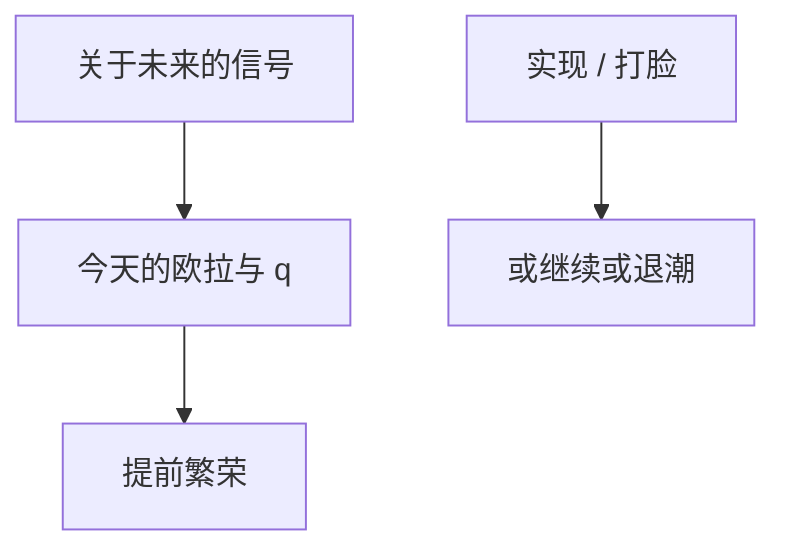

# 新闻冲击与信心

关于未来技术或政策的消息今天就进欧拉与 $q$，繁荣可以发生在果实落地之前；若消息是噪声，繁荣会退潮。

<footer>—— Beaudry and Portier, Stock Prices, News, and Economic Fluctuations, AER 2006；Jaimovich and Rebelo；Barsky and Sims</footer>

[上一课](/econ/diagnostic-expectations)把过冲写成偏差。本课缺口是 **RE 下的新闻**：信息集提前，不必扭曲概率。不重写代表性启发，不把「动物精神」当残差标签用完。

## 问题

标准 RBC：TFP 今天升，今天产出升。Beaudry–Portier：股市与 TFP 的识别显示，许多宏观波动像是对未来 TFP 的提前消息。新闻冲击下，消费想升、劳动想降（财富效应），需要补偏好、投资调整或互补才能让繁荣有就业——Jaimovich–Rebelo。缺口是：识别课的「冲击」可以是信息到达，而不是当前资源。信心：若消息不准，实现打脸，IRF 在中期反转。

Beaudry and Portier, *AER* 96(4), 2006。Barsky and Sims, *JME* 2011。Schmitt-Grohé and Uribe 把新闻写进估计 DSGE。Lorenzoni 的噪声需求冲击。

## 方法

状态含「已宣布未实现」的未来 $z$。欧拉与 $q$ 立即跳。SVAR：用长期 TFP 与当期宏观的零限制，或用股市当新闻的前向变量——识别脆弱，正是叙事/高频课警告过的。DSGE：给技术过程加 MA 或提前信号，贝叶斯估新闻份额。与诊断性对照：RE 新闻的反转来自噪声实现，不是系统性过加权。

财政与货币也可以有新闻（Ramey 军费公告）。本课装置通用，例子以技术新闻为钉子。

## 机制

机制是前瞻。完全信息 RE 下，可预测的未来已经进价格；「新闻」指相对昨天的信息集扩大。粘性信息下，新闻只进入更新者。HANK 下，新闻若先抬资产价格，债权人与房主的财富效应与约束家庭的工资预期分道。信心调查是后课数据，本课先给结构对象：信号精度。

与不确定性（下一课）：新闻改变条件均值；不确定性改变条件方差。可同时到达（Bloom 的坏消息常伴高波动）。

Pigou 周期是思想前身。本课用现代识别与 DSGE 新闻过程，不写思想史全文。

## 边界

本课不把每一轮牛市当成 TFP 新闻。不估计因子风险溢价。太阳黑子是没有关于基本面的新闻的信念波动，BK 不定时才进；本课默认有信号。沟通课会把政策新闻从技术新闻里拆出。

后课默认：冲击可以是信息到达；就业对新闻的符号依赖互补与偏好。下一课：方差冲击。

## 小结

- 新闻冲击：未来基本面的信号先动今天的量价。
- RE 下也可有反转，若信号有噪。
- 与诊断性过冲、与纯太阳黑子分列。
- 出处：Beaudry and Portier, *AER* 2006；Barsky and Sims, *JME* 2011。
