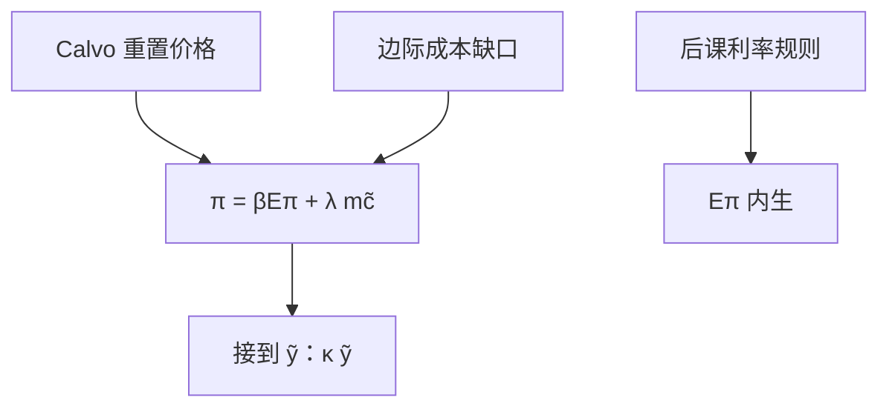

# 新凯恩斯菲利普斯曲线

交错调价一旦写成优化，通胀就不再是外贴的 $\pi^e$ 加缺口，而是对未来边际成本的贴现；NKPC 是那条一阶条件的对数线性。

<footer>—— Woodford, Interest and Prices, 2003；对照 Galí, Monetary Policy, Inflation, and the Business Cycle</footer>

[上一课](/econ/taylor-contracts)（Taylor 交错合同）。已经把粘性钉成 Calvo 抽签与 Rotemberg 二次调价成本，不再从菜单故事起笔。本课的缺口是：把重置价格的一阶条件收成一条可嵌进三方程的通胀方程。后课默认 NKPC 已经成立，只引用 $\kappa$、$\beta$，不重做交错。

## 问题

附加预期的菲利普斯是 $\pi=\pi^e+\kappa(u-u^*)$。[新凯恩斯粘性价格](/econ/new-keynesian)已经预告前瞻形式，但还没有从重置价格推到系数。Calvo 课给出：每期只有 $1-\theta$ 能改标价，重置者盯的是整段不能再改价的边际成本路径。缺口不是再解释「为什么价格粘」，而是：这条优化如何变成

$$
\pi_t=\beta\mathbb{E}_t\pi_{t+1}+\lambda\widetilde{mc}_t,
$$

再把 $\widetilde{mc}$ 接到产出缺口 $\tilde{y}$。没有这一步，利率规则没有供给侧；动态 IS 也没有东西可联立。

$\lambda$ 随调价频率下降而变小：越少厂商能改价，同样的成本缺口越少进入当期 $\pi$。这是粘性的斜率，不是又一次「价格为何不动」。

## 方法

重置价格是未来名义边际成本的加权贴现，权重含 $\beta$ 与存活概率 $\theta$。围绕零通胀稳态对数线性：当前通胀等于下期通胀预期加上当期真实边际成本缺口——未调价厂商的相对价格被 $\pi$ 稀释，调价厂商必须把整段预期写进今天的一跳。Galí 的课堂写法把 $\lambda=(1-\theta)(1-\beta\theta)/\theta$ 一类接到需求弹性与劳动供给；Woodford 允许不同稳态通胀与指数化，形状同族。

再把 $\widetilde{mc}$ 写成 $\tilde{y}$ 的单调函数（劳动市场出清、生产函数），得到标准 NKPC

$$
\pi_t=\beta\mathbb{E}_t\pi_{t+1}+\kappa\tilde{y}_t.
$$

$\kappa$ 随 $\theta$ 上升而下降。Rotemberg 二次成本对数线性后得到同形方程，$\kappa$ 的微观不同、宏观用法相同——上一课已经并列过两种粘性，本课只取「同形」。

### 与附加预期 Phillips 的差

Friedman–Phelps 的 $\pi^e$ 可以是适应性；NKPC 的 $\mathbb{E}_t\pi_{t+1}$ 是模型给出的条件期望。截距随规则而动，正是[卢卡斯批判](/econ/lucas-critique)要的结构：改 $g$，连 Phillips 一起重解。混合 NKPC 加 $\pi_{t-1}$ 是经验修补，不是本课的一阶条件。

## 机制

机制是前瞻贴现。今天的 $\pi$ 已经包含 $\mathbb{E}\pi_{t+1}$：若规则让公众相信缺口将被关掉，当前通胀立刻下降，不必先走过一整串失业。长期 $\tilde{y}=0$、$\pi$ 由名义锚决定，与自然率兼容。成本推动（markup 冲击）作为残差进入，使 $\pi$ 与 $\tilde{y}$ 可以同向——[神圣巧合](/econ/divine-coincidence)会问这是否破坏「稳通胀即稳缺口」。

灵活价格极限 $\theta\to 0$ 或 Rotemberg 成本趋于零，$\kappa\to\infty$，缺口被压掉，货币中性在周期频率上恢复，接到 [RBC 对照](/econ/rbc-contrast)。动态 IS 从下一课接过需求侧：没有 NKPC，利率规则只有欧拉，没有通胀。三方程必须先有这一条供给。索引化（过去通胀进入未调价合同）会加进滞后项，那是对 Calvo 一阶条件的修改，不是本课的基准。

工资粘性会再写一条工资菲利普斯。本课只做价格 NKPC。两套粘性并存时，$\kappa$ 的解释变，方程形状仍前瞻。

## 边界

本课不估计 $\kappa$，不把 1958 年 Phillips 的统计替换再讲一遍。量化栏的限价不是宏观 Calvo。指数化、正稳态通胀会改线性化细节，不取消前瞻结构。

后课默认：供给侧是 $\pi_t=\beta\mathbb{E}_t\pi_{t+1}+\kappa\tilde{y}_t$。下一课把欧拉对数线性成与它对偶的动态 IS。

## 小结

- NKPC 是重置价格一阶条件的对数线性，不是外贴 $\pi^e$。
- $\pi_t=\beta\mathbb{E}_t\pi_{t+1}+\kappa\tilde{y}_t$；$\kappa$ 随调价频率下降。
- 预期是结构的一部分，规则一变截距跟着变。
- Calvo 与 Rotemberg 宏观同形；本课不重写粘性故事。
- 灵活价格极限 $\kappa\to\infty$，缺口被压掉，接到 RBC。
- 出处：Woodford, *Interest and Prices*；Galí 的 NK 课本推导。
