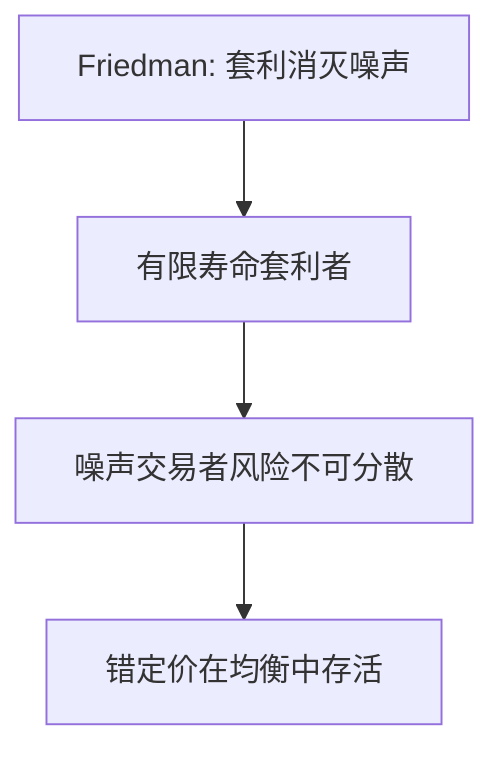

# 噪声交易者风险 DSSW

即使价格已经偏离基本面，套利者也不敢把仓位加满：噪声交易者明天可能更错，短期亏损会先要了资本的命。

<footer>—— De Long, Shleifer, Summers and Waldmann, Noise Trader Risk in Financial Markets, JPE 1990</footer>

[上一课](/econ/experimental-methods)把偏差留在实验室与田野。本课打开市场单元。缺口是：若有理性套利者，实验室零件为何还能进价格？DSSW 的回答不是「没有套利者」，而是套利者面对**不可分散的噪声交易者风险**。不重写 [EMH](/econ/emh) 的信息分层，不进入限价簿。

## 问题

Friedman 的经典反驳：非理性会被套利消灭。DSSW（1990）建两期重叠世代：安全资产与供给固定的不安全资产，后者基本面已知。噪声交易者对基本面的错误信念随机；理性交易者最大化下期财富，厌恶风险，生命有限。均衡价格含一项噪声溢价：错误可以持续并扩大，理性者不愿完全抵消。噪声交易者甚至可能赚得比理性者还多——因为他们多承担了自己制造的风险。

缺口是给「偏差如何存活」第一块均衡零件，而不是再列过度自信。

噪声交易者风险与基本面风险不同：即使股息确定，价格路径仍随机，因为别人的信念随机。有限寿命使套利者无法等到信念回归。

## 方法

两资产、均值方差偏好、噪声需求外生随机。求解理性者对不安全资产的需求，市场出清得价格。错定价的方差进入理性者的一阶条件，像额外风险。比较两者的期望收益：噪声交易者若平均看多，持有更多风险资产，可以有更高期望财富。本课不估计噪声方差。

主干在限价簿交接处已停。本课是补层理论：对象仍是均衡价格 $p$，不是队列。量化栏的做市商存货不要写进来。

## 机制

机制是风险。套利不是无风险的：你买低估资产时，噪声交易者可能明天更悲观，你必须在生命结束前卖出。风险厌恶使抵消仓位有限。因此价格可以偏离基本面而不被立刻修平。这与[股权溢价](/econ/equity-premium-puzzle)的 $m$ 语言相容：多出来的风险可以要求溢价，只是风险来自别人的错误，不是来自消费。

下一课 Shleifer–Vishny 把「有限寿命」换成「委托资本」：专业套利者会被短期亏损赎回。

DSSW 的不安全资产股息可以是常数，价格仍抖——抖来自噪声需求。这与消费 SDF 的风险不是同一来源：这里 $m$ 若仍是消费核，溢价来自噪声与消费的协方差，不必很大；但套利者自己的定价核含噪声方差。有限寿命关掉「等到 $T=\infty$ 信念回归」。主干停在簿的交接处；本课 $p$ 仍是出清价，没有队列。噪声交易者不是实验室被试的别名，是需求冲击的均衡载体。

## 边界

DSSW 的噪声是外生情绪，没有微观启发式。重叠世代是技术，不是人口学主张。完全无限寿命加无赎回的套利者会削弱机制。本课也不处理封闭式基金折价的全部经验——那是应用，DSSW 原文用它当动机。

后课默认：噪声交易者风险是错定价存活的需求侧风险；套利限制是资本与委托的供给侧。

股息可确定，价格仍抖，因为别人的信念随机；有限寿命使套利者无法等到回归。

主干交给量化栏的是协议；本课 $p$ 仍是出清价。噪声是需求冲击的均衡载体。

## 小结

- 噪声交易者让价格路径本身成为风险，有限套利者不敢完全抵消。
- 错误可以在均衡中存活，甚至给噪声交易者更高期望收益。
- 不重写 EMH 分层，不写簿；补层问的是均衡里的风险。
- 噪声交易者可以因多承担自己制造的风险而期望收益更高。
- 方向尚未给出，只解释存活。
- 出处：De Long, Shleifer, Summers and Waldmann, *JPE* 1990。
