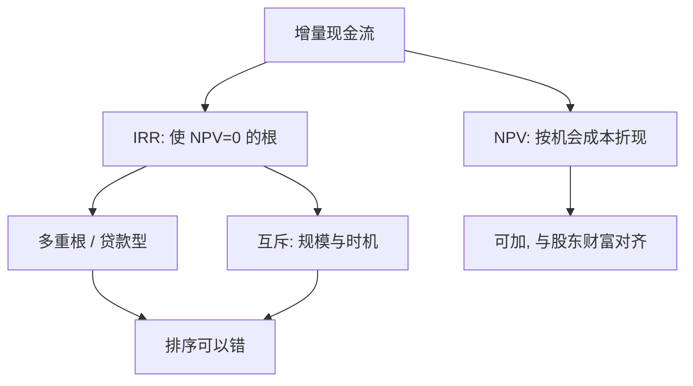

# NPV 与 IRR 的陷阱

    
正确的投资规则是把增量现金流折成今天的钱；内部收益率只是使该现值为零的利率，它既不必唯一，也不必给出与净现值相同的排序。

    <footer>—— 据 Fisher, The Theory of Interest, 1930；Hirshleifer, On the Theory of Optimal Investment Decision, Journal of Political Economy 1958；Brealey, Myers and Allen, Principles of Corporate Finance 整理</footer>

[上一课](/econ/dollar-dominance)把动态宏观收到美元计价与全球地板。「公司金融进阶」从本课起：把同一套「今天的钱」用到企业项目，并标明 IRR 何时与 NPV 打架。不重解 DSGE，不重写限价簿，不把 CAPM 横截面提前。

## 问题

家庭欧拉已经给出：晚到的消费要用边际替代率折回来。企业项目是一组增量现金流 $\{C_t\}$。Fisher 的「超过成本的收益率」与 Hirshleifer 的最优投资，都把可接受项目写成：在资本市场上按机会成本折现后，现值非负。净现值

$$
\mathrm{NPV}=\sum_t\frac{C_t}{(1+r)^t}
$$

正是这块价值增量。内部收益率（IRR）是使 NPV=0 的 $r$。实务爱 IRR，因为它看起来像「项目自己的回报率」，不必先选定 $r$。缺口是：在符号改变、互斥项目、规模与时间分布不同时，IRR 的根与排序都可以错，而 NPV 的可加性仍在。

Lorie and Savage（1955）已经把资本配额下的「收益率排序」写成会选错组合的规则。Brealey–Myers 把陷阱收成课堂标准：多重根、互斥、贷款型现金流、期限与规模冲突。

## 方法

NPV 可加：互不相关的项目，合起来的 NPV 等于各自 NPV 之和。接受所有 NPV>0 的项目（资金不受配额约束时）使股东财富最大——这是 MM 切片之前、资产收益流本身的价值。贴现率 $r$ 此刻仍是占位符：它是放弃资本市场上等价风险的回报；下一课才把它写成 WACC。

IRR 的代数：$\sum C_t(1+\mathrm{IRR})^{-t}=0$ 是多项式。Descartes 符号法则：现金流变号 $k$ 次，正实根可以有 $k$ 个。先流出后流入是投资型，通常单根；先流入后流出是贷款型，IRR 是融资成本，应当比 $r$ 低才划算，方向反了。中途大额维护、关停成本，制造多次变号，多个 IRR 无法告诉你「高于门槛就做」。

互斥项目：规模小、IRR 高的项目，NPV 可以低于规模大、IRR 略低的项目。时间分布靠前的项目 IRR 更高，但若 $r$ 低，后期现金更值钱，NPV 排序可以反过来。正确比较是增量现金流的 NPV，或等价地看增量 IRR 是否超过 $r$——不是比较两个绝对 IRR。

资本配额（Lorie–Savage）下，按 IRR 贪心挑选也不保证可行集上 NPV 最大；应解的是受预算约束的 NPV 规划。配额本身往往是组织摩擦，不是市场利率。本课只禁止用 IRR 表代替规划。

## 机制

机制是价值的可加性对比率的不可加性。NPV 把每笔现金乘上同一套状态价格（在确定世界里就是 $(1+r)^{-t}$），再求和；项目 A 加项目 B 的价值就是两笔求和。IRR 是非线性根：两个项目并起来，合成 IRR 不是各自 IRR 的加权，更不是挑选「IRR 较大者」的许可证。互斥时，被放弃的是增量现金流，必须单独折现。

与家庭欧拉的衔接：家庭在市场上按 $r$ 借贷，把消费挪到今天；企业按同一 $r$ 决定是否把资源锁进项目。IRR 高于 $r$ 只在「单根、投资型、独立项目」时与 NPV>0 同向。宏观课序里的随机折现因子 $m$ 把 $r$ 换成状态依存；本课先在确定或风险已折进 $r$ 的课堂上把陷阱钉死，以免后课 WACC 还在用错的接受规则。

### 不要用 IRR 比较互斥的再投资假设

教科书常说「NPV 假设按 $r$ 再投资，IRR 假设按 IRR 再投资」。更干净的说法是：中间现金流一旦实现，其机会成本就是市场上的 $r$，不是项目自己的 IRR。把未实现的高 IRR 当成再投资利率，等于假装企业能不断复制一个尚未发生的高回报项目。Brealey–Myers 的处方是：比较用 NPV；若坚持比率，用增量 IRR 对 $r$。

修正 IRR（MIRR）把中间现金流按 $r$ 再投资到期末，人为造一个单根。它是报告格式，不是新理论：信息仍在 NPV 里。

## 边界

不要把本课写成「永远禁止 IRR」。融资合同、债券内部收益率、杠杆收购的持股期回报，都会用内部收益率说话；只要对象是贷款型或已锁定的现金流，且根唯一，它是成本或实现回报的简写。陷阱发生在**项目选择**：接受或互斥。也不要把资本配额当成市场不完全的证明——总部的预算上限常常是代理，不是 Fisher 的资本市场关闭。

本课不估计 beta，不把 WACC 的权重写出来。$r$ 仍是机会成本的占位符。[实物期权](/econ/real-options-theory)已经说过 NPV>0 不必现在执行；那是时机，不是 IRR 代数。后课估值要先保证：接受规则是 NPV，贴现率与现金流口径匹配。

后课默认：独立项目看 NPV 符号；互斥看增量 NPV；IRR 可以多根、可与 NPV 排序冲突。宏观课序在前，家庭与总量的贴现装置不在本课重解。限价簿仍是协议，不在本栏重写。

资金不受配额时，NPV>0 全做。配额下按 IRR 排序不是最优规划。

贷款型现金流：IRR 是成本，低于 $r$ 才接受，方向与投资型相反。

## 小结

- 项目规则是增量现金流的 NPV；IRR 是使 NPV=0 的根，不必唯一，也不必同序。
- 互斥比较增量，不比较绝对 IRR；资本配额下 IRR 贪心会选错组合。
- 宏观课序在前；本课从家庭欧拉把「今天的钱」接到企业项目，不重写限价簿。
- 出处：Fisher 1930；Hirshleifer, *JPE* 1958；Lorie and Savage, *Journal of Business* 1955；Brealey, Myers and Allen。
