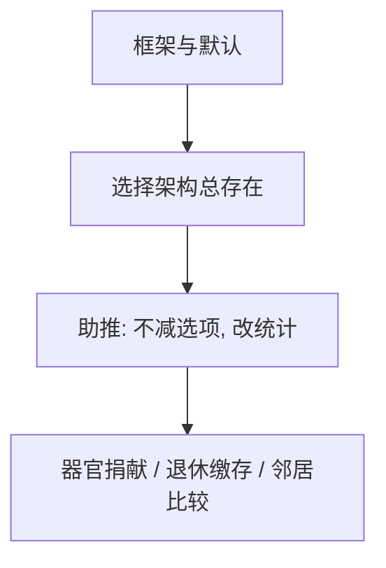

# 助推与选择架构

菜单的排列、默认和反馈改变选择，而不关掉任何选项——自由保留，统计不保留。

<footer>—— Thaler and Sunstein, Nudge, 2008；对照 Johnson and Goldstein, Science 2003；Madrian and Shea, QJE 2001</footer>

[上一课](/econ/social-preferences)把别人写进效用。本课缺口是设计：若偏好依赖框架、默认和满意停点，则架构是政策变量。不重写 401(k) 的数字，只把家庭金融那一课升成一般选择架构。

## 问题

标准公共经济学改预算（税、补贴）或改可行集（禁令）。助推改的是描述与默认，菜单在法律上仍全在。Johnson 与 Goldstein（2003）：器官捐献默认从退出改为进入，登记率跳跃。Madrian–Shea 已见退休账户。Thaler 与 Sunstein 称之为自由家长主义：不强迫，但预测行为被推往某方向。缺口是承认[框架](/econ/framing-effects)与[满意](/econ/bounded-rationality-satisficing)之后，中性菜单并不存在——总有一种默认。

中性架构是幻觉：选项总要有一个预先勾选、总要有一个先出现在屏幕上。问题不是「是否助推」，是朝哪推、谁来选方向。

## 方法

工具：默认、简化、社会比较反馈、承诺装置的可选版本、显著性标记。评价：在不减少选项的约束下，目标行为的统计变化。本课不做法哲学裁决。与税的比较：税改相对价格，助推改编码与搜索顺序。

## 机制

机制是把决策停在架构指定的点。满意者停在默认；损失厌恶者把默认当参考点，离开它被编码为损失；社会偏好者响应邻居比较。同一工具对不同零件生效，不必先估计 $\lambda$。家庭金融课已经用过默认；本课只声明它是一般技术。

不进入限价簿的默认价格档。交易所的 tick 与保护订单是协议设计，属量化栏。

Madrian–Shea 已在家庭金融出现；本课把它升成一般命题：只要满意与损失厌恶还在，默认就是实质菜单。器官捐献的进入/退出默认证明同一技术跨出退休账户。税改相对价格，人人面对新预算；助推改编码，法律菜单不变。中性架构不存在——总有一种先勾选。方向由谁选，是政治，不是本课的一阶条件。

## 边界

助推可被用来抽取而非帮助（暗模式）。长期习惯形成可能使效应衰减。信息性标签若实际上改变了信念，就不是纯框架。本课不把所有政策效果称为助推。显著性与注意力是下一课：有些「助推」其实是把被忽略的属性点亮。

后课默认：选择架构是行为公共财政的工具箱；注意力模型给它提供另一条微观基础。

中性架构是幻觉：总有一种默认、总有一个先出现的选项。问题是朝哪推。

税改相对价格；助推改编码。器官捐献与 401(k) 是同一技术的两个现场。

本课不做方向上的哲学裁决；只标明架构是政策变量。

## 小结

- 架构不可避免；助推在不减选项时移动统计。
- 默认、简化、社会比较，分别调用惰性、满意与社会偏好。
- 与税分工：一个改价格，一个改编码。
- 暗模式用同一零件抽取而非帮助。
- 显著性下一课解释有些标签其实是点亮属性。
- 出处：Johnson and Goldstein, *Science* 2003；Thaler and Sunstein, 2008。
