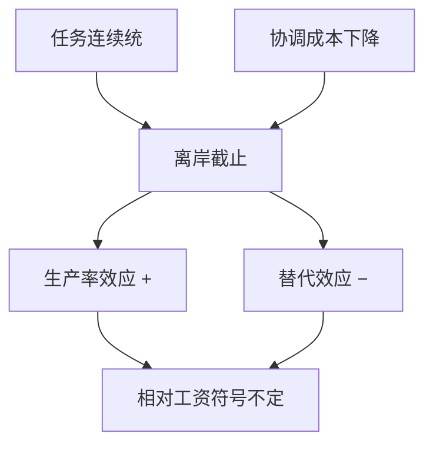

# 离岸外包与任务

可贸易的不是行业而是任务；离岸像劳动增进型技术进步，可以同时提高生产率与改变技能溢价——符号取决于哪些任务被切开。

<footer>—— Grossman and Rossi-Hansberg, Trading Tasks, AER 2008；Feenstra and Hanson 外包与工资</footer>

[上一课](/econ/china-shock)用行业暴露度量进口竞争。本课缺口是：同一行业内，一部分任务去了国外，一部分留下，工资效应不必等于「整个行业被进口替代」。贸易与增长下一课换长期；本课钉任务贸易。

## 问题

Feenstra–Hanson：把生产切片，把低技能密集的中间阶段离岸，相当于发达国家低技能劳动的有效供给增加，扩大工资差距。Grossman–Rossi-Hansberg（GRH）：任务连续统，离岸成本随任务下降，像对离岸任务的技术进步；对留下的同类劳动有生产率效应（正）与替代效应（负），相对工资符号不定。缺口不是再跑一条 CZ 回归，而是：暴露应从任务 / 职业可离岸性来，而不仅从行业进口渗透。

Blinder 的职业离岸清单、Autor 的例行任务，是劳动侧分类。贸易侧 GRH 给一般均衡价格。两边合在一起才不会把「电脑」与「中国」混成一个残差。

## 方法

把最终品生产写成任务积分，每个任务可用本国或外国劳动。冰山或固定协调成本决定截止任务。比较静态：协调成本下降，截止点外移，本国任务集中到更核心的。工资：生产率效应对所有执行留下任务的人；相对价格效应改技能溢价。计量：职业暴露（可离岸指数）对工资，控制行业；与 ADH 行业暴露对照，看是否独立。

与 GVC 会计：任务是理论对象，增加值是账户对象。离岸使总额贸易升得比 VA 更快（往返运输）。与 Melitz：企业选择离岸哪些任务，高 $\varphi$ 企业更可能组织复杂链。

## 机制

机制是成本下降使切片变细，而不是「一个行业消失」。留下的工人与外国任务互补（用进口中间品），其边际产出可升——这是 ADH 对照组里出口与下游企业受益的通道。替代效应是直接抢任务。政策把两者加总进一个「进口渗透」里，会把互补当冲击。

与 SS：SS 是商品价格 → 要素价格。任务贸易可以在商品相对价格变化不大时改变要素价格（有效技术变了）。这是 Feenstra 强调外包可以解释工资差距而最终品价格变动不够大的理由。

不要把离岸写成只有制造业。可编码的服务任务同样走 GRH。本课不写远程软件的企业名录。

## 边界

本课不仲裁「中国 vs 机器人」的方差分解。不把 GRH 符号写成永远正或永远负。贸易–增长课问的是动态创新，不是任务切片的一次性。不要用任务取消行业暴露：两者是不同投影，ADH 仍然有效，只是机制要加一层。

后课默认：贸易对象可以是任务；离岸有生产率与替代两效应，工资符号不是 SS 的简单复制。行业进口渗透会把下游互补算进冲击，解释时要拆。价值链会计与任务理论对接，但不互相替代。

## 小结

- 可离岸的是任务，不是整个行业标签。
- Feenstra–Hanson：离岸低技能阶段扩大技能溢价。
- GRH：生产率效应与替代效应对冲，符号不定。
- 度量应从职业 / 任务暴露补行业渗透。
- 出处：Grossman and Rossi-Hansberg, *AER* 2008；Feenstra and Hanson。
