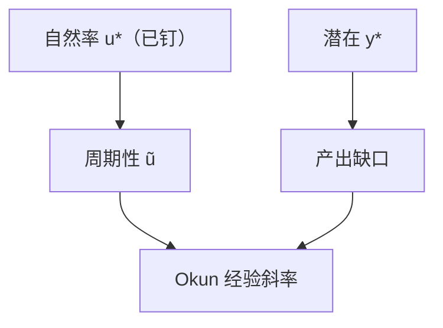

# 奥肯定律

产出缺口与失业率缺口一同起伏，是一条经验规律；它不是自然率的定义，也不是生产函数的恒等。

<footer>—— Okun, Potential GNP: Its Measurement and Significance, 1962</footer>

[上一课](/econ/natural-unemployment)已经把 $u=u^*+\tilde{u}$ 钉住，并声明周期成分对应 $y$ 对潜在产出的缺口，Okun 只当对照、不升格为身份。本课的缺口就是把这条对照写成可引用的经验关系：产出缺口与失业缺口如何共变，以及它**不是**再讲一遍 $u^*$ 由什么制度决定。参与率下一课会说明 $u$ 还会漏掉退出者；本课先承认 Okun 用的就是调查失业率。

## 问题

自然率给出锚 $u^*$、$y^*$，没有给出 $\tilde{y}$ 与 $\tilde{u}$ 的数量关系。若每一点失业只对应少一个人按人均产出工作，缺口比例应接近劳动份额的某种倒数；经验上产出的周期性波动更大，因为工时、努力与生产率也顺周期。Okun（1962）的缺口是：用一条稳定的经验斜率，把潜在产出与失业连起来，便于从 $u$ 读 $y$ 的松弛。本课不把这条斜率写成深结构，更不把自然率重推一遍。

Okun 原意是给 potential GNP 一个可操作的测量，不是发现一条永远不变的物理定律。系数随参与、工时与劳动窖藏而变。

## 方法

常见写法是缺口形式

$$
\frac{y-y^*}{y^*} \approx -\beta(u-u^*),
$$

或差分形式 $\Delta u \approx -\frac{1}{\beta}\frac{\Delta y}{y}$ 一类（符号与百分比约定随教材）。$\beta$ 常被说成「失业变动 1 个百分点对应产出缺口若干百分点」，数量级随样本变，本课不写死某一个数当真理。

潜在产出可以用生产函数、滤波或「使通胀不加速」的路径来代理；每一种代理都会改变拟合的 $\beta$。本课把 Okun 当核算对照：给定选定的 $y^*$ 与 $u^*$，缺口是否大致共线。滤波不是理论，与上一课对 $u^*$ 的警告相同。

### 不是身份、不是政策菜单

把 $\beta$ 当成可以用需求政策精确换算的菜单，等于把工时、参与和劳动生产率的周期成分当成常数。衰退里厂商先砍工时与招聘、后裁员，$u$ 的反应滞后于 $y$；复苏里「无就业复苏」则让 Okun 暂时变陡或变平。那是机制，不是否定经验相关。

## 机制

产出缺口可以来自：失业人数、平均工时、劳动参与，以及周期中的劳动生产率（劳动窖藏使 $Y/L$ 在衰退掉得比就业更深）。Okun 的 $\beta>1$（按常见百分比写法）正是因为后几项也顺周期。因此它不能从生产函数 $Y=F(K,AL)$ 在 $L=(1-u)N$ 上直接读出，除非假定工时与 $A$ 没有周期。

自然率课已经说过：货币不能永久钉住 $u<u^*$。Okun 只说，当 $\tilde{u}$ 暂时非零时，$\tilde{y}$ 通常也非零。它不提供 $u^*$ 的水平，也不解释通胀是否加速——那是菲利普斯。把 Okun 与菲利普斯叠成「牺牲比」，已经加入更多结构，本课不预先做。

差分形式与缺口形式也不总是同一条：若 $u^*$、$y^*$ 慢变，差分近似缺口；若自然率漂移，差分会把结构变动当成周期。Okun 原论文用的是 potential GNP 与失业的水平关系，教材里的 $\Delta u$ 对 $\Delta y$ 是方便写法，系数解释要跟着变。潜在产出若用 HP 滤波，周期两端的缺口会被扭曲，$\beta$ 跟着漂——又一次：滤波不是理论。

泄气工人退出劳动力，$u$ 的下降可以伴着就业停滞，Okun 用 $u$ 就会低估松弛。下一课把参与率写成与 $u$ 并列的账户，而不是把 $\beta$ 再估一遍。

## 边界

Okun 不是 SNA 恒等，也不是索洛。资本利用率、存货与净出口都会让 $y$ 与国内劳动投入分叉。开放经济里国内 $y$ 可以靠贸易而劳动市场不动。不要在这里写限价簿；劳动市场微观匹配不是量化栏的订单。系数不稳定时，正确做法是分解工时与参与，而不是宣布「定律失败所以自然率无用」。

潜在产出 $y^*$ 来自自然率课的充分就业路径，不是从 Okun 反推出来再去定义 $u^*$——那会循环。本课只在 $y^*$、$u^*$ 已经选定之后谈共变。增长课的索洛在 $y^*$ 上走，周期缺口用本课对照，两者不要抢同一条运动方程。

后课默认：谈到产出缺口与失业缺口，默认它们经验上同向、比例不是身份。下一课问：失业率漏掉了哪些未工作的人。

## 小结

- 自然率给出 $u^*$、$y^*$；Okun 给缺口之间的经验斜率。
- 斜率大于「一人一分产出」，因为工时、参与与窖藏也顺周期。
- 它不是恒等，也不是可以精确兑换的政策菜单。
- 缺口形式与差分形式在 $u^*$ 漂移时不是同一条。
- 参与率变化会使 $u$ 与就业分叉，是下一课缺口。
- 出处：Okun, 1962, potential GNP 的测量。
