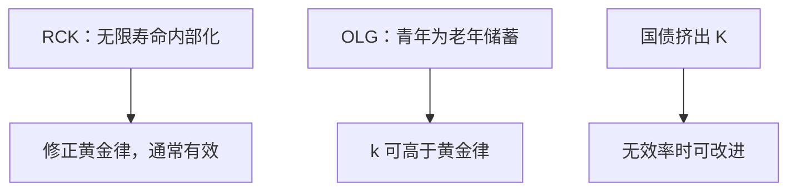

# OLG 与动态无效率再访

世代交叠里，当代人不必把未出生者的效用写进目标；资本回报可以低于增长率，过度积累可以是竞争均衡。

<footer>—— Diamond, National Debt in a Neoclassical Growth Model, AER 1965</footer>

[上一课](/econ/ramsey-cass-koopmans)把无限寿命（或完备利他）钉在修正黄金律：通常 $k^*\lt k_{\mathrm{gold}}$。黄金律课已经预告叠代可以越过那条线。本课的缺口是再访这条无效率：为何**有限寿命**使 $r\lt n$ 一类配置可以成为均衡，以及国债在 Diamond 里如何挤出过度的 $K$。内生 $g$ 仍留到下一课；本课生产技术仍是索洛型递减报酬。

## 问题

RCK 的欧拉来自同一个主体比较今天与明天。OLG 里青年储蓄供老年消费，市场利率使青年的欧拉成立，但没有一个主体为「所有未来世代的稳态 $c$」负责。于是分散均衡的 $k$ 由人口结构、养老金与工资路径决定，可以落在 $k_{\mathrm{gold}}$ 之上。缺口不是再推修正黄金律，而是：Diamond（1965）的两期叠代如何让动态无效率成为均衡现象。

动态无效率：存在帕累托改进，使每一世代稳态消费都不下降。判据仍是黄金律那条：$f'(k)-\delta\lt n+g$ 时，少留资本、多吃，稳态全面更好。

## 方法

两期生存：青年工作、储蓄 $s$，老年消费 $(1+r)s$。资本 $K_{t+1}$ 等于青年储蓄。工资与 $r$ 来自竞争企业的 $F(K,L)$。稳态储蓄函数与资本需求的交点给出 $k^*$。与 RCK 不同，没有 $\rho$ 把 $k^*$ 锁在修正黄金律；时间偏好只进入青年的欧拉，不代表未出生者。

判断无效率的可观察代理仍常是 $r$ 是否低于增长。经验有争议（安全利率、资本回报、土地），本课只给模型内判据。Diamond 同时指出：若经济动态无效率，适当的国债可以减少资本、提高稳态福利——国债在此不是必然的负担。动态有效时，国债挤出有成本。

### 不要把 OLG 写成「RCK 加人口」

人口增长 $n$ 在两套模型里都摊薄 $k$。分叉来自偏好加总：RCK 有无限视野的单一贴现；OLG 的帕累托比较必须让每一世代都不损失，计划者问题要用另一套权重。利他遗产若足够强，OLG 被推回 RCK，无效率窗口关掉。

## 机制

青年面对的 $r$ 是其储蓄的私人回报。稳态时若资本已经很多，$r$ 很低，但青年仍可能因没有其他储值手段而持有 $K$。未出生者无法在当期市场出价要求少积累。于是竞争均衡可以帕累托次优——这与福利定理在有限商品、有限人经济里的前提不同：这里有无限世代，市场不完全。

动态有效时，每代人的资本刚好被后来的增长「值回票价」。国债与资本在储值上竞争，挤出 $K$ 会降低稳态 $c$。无效率时，挤出反而把经济推回黄金律一侧。政策含义依赖判据，不能从「债务=坏」或「债务=免费午餐」单边出发。

两期是教学装置。三期或连续时间 OLG 不改变核心：缺少无限视野的单一主体，黄金律另一侧就可以是均衡。土地、货币若提供替代储值，过度积累的窗口会缩小——因为青年不必把全部储蓄都做成 $K$。本课生产侧仍用递减报酬的 $F(K,L)$，不把叠代写成内生增长；$g$ 外生时，无效率是水平问题，不是增长率问题。

封闭经济里 $S=I$ 仍是恒等。OLG 改的是谁储蓄、均衡 $k$ 停在哪，不是把恒等读成「储蓄决定投资」的因果。黄金律课的外生 $s$ 可以偶然落在无效率区；本课说的是竞争均衡自己可以停在那里。

社会保障现收现付也是世代间转移，功能上像国债。它是否改进，同样取决于经济是否过度积累，而不是口号。

## 边界

本课不估计 $r$ 与 $n$ 的计量争论，不把长寿、年金市场与习惯写成主干。货币、土地可以提供替代储值，减弱无效率——那是更后的课。也不要把 Diamond 的国债写成公司金融的杠杆；这里的债是代际资产，不是 MM。量化栏的利率期限不是 $r\lt n$ 的检验。

内生增长下一课会让 $g$ 被研发移动；动态无效率的切线条件要重写，本课不预先做。封闭核算的 $S=I$ 在叠代里仍然是恒等：无效率改的是均衡 $k$ 的位置，不是把会计读成因果。开放经济的外债可以替代国内 $K$ 当储值，判据更绕，留给经常账户课。

计划者若用各世代效用的贴现和，仍可能选出黄金律附近的路径；分散市场缺的是那套权重。因此「OLG 无效率」不是技术 $F$ 的问题，是代际市场不完全。RCK 用无限寿命把同一主体贯穿所有日期，缺口被内部化。两套模型不要用同一个「代表性家庭」标签。现收现付与国债在账户上都是代际转移，福利符号仍跟 $r$ 对 $n+g$ 的位置走。

后课默认：RCK 通常有效；OLG 可以动态无效率，国债/养老金的福利符号随判据而变。下一课打开外生 $g$：知识若可生产，递减报酬还能否关掉增长引擎。内生 $g$ 会改切线条件，本课不提前重写。

黄金律的 $r\lt n+g$ 判据在此仍然够用；经验上安全利率与资本回报会对出不同答案，本课不选边。

## 小结

- RCK 内部化未来的自己；OLG 的市场不内部化未出生者。
- 分散均衡可以 $k\gt k_{\mathrm{gold}}$，动态无效率是均衡而非只是外生 $s$ 的事故。
- 无效率时，国债挤出资本可以改进；有效时挤出有成本。
- 利他遗产把模型推回 Ramsey。
- 替代储值（土地、货币）会缩小过度积累窗口。
- 出处：Diamond, AER 1965；对照 Phelps 黄金律与 RCK。
