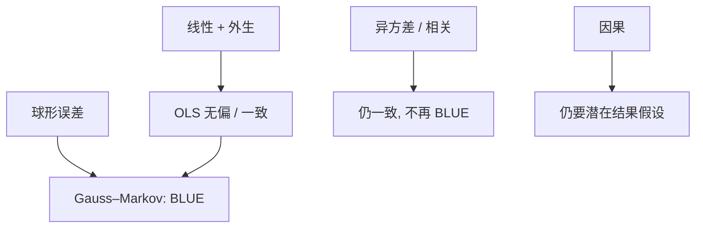

# OLS 与 Gauss–Markov

在线性、外生、球形误差下，OLS 是线性无偏类里方差最小的；这句话管的是精度，不是把 $\beta$ 变成 ATE。

<footer>—— 据 Gauss 最小二乘传统；Aitken 推广到 GLS；对照 Wooldridge, Econometric Analysis of Cross Section and Panel Data</footer>

[上一课](/econ/potential-outcomes)把效应写成潜在结果的平均。本课缺口是最常用的估计装置：线性回归与 Gauss–Markov。后课先补[异方差与 HAC](/econ/hac-heteroskedasticity)的推断，遗漏变量更后再拆外生；本课先钉：OLS 何时是 BLUE，以及 BLUE 不等于因果。

## 问题

潜在结果给出参数，没有给出算法。线性模型 $Y=X\beta+u$、$\mathbb{E}[u\mid X]=0$ 时，$\beta$ 是总体最佳线性预测的系数，也是条件期望若恰好线性时的斜率。缺口是分开三件事：预测、条件期望、因果。Gauss–Markov 只在第三层之外的精度层发言：线性无偏估计量中 OLS 方差最小，前提是外生与 $\mathrm{Var}(u\mid X)=\sigma^2 I$。

随机化下，$D$ 的系数可以等于 ATE（或不加控制时的简单差）。加上控制、非线性真实 CEF、异质 $\tau_i$，OLS 变成加权平均，权重由 Angrist 的「回归加权」给出——那是后课异质，本课先承认：同质性加线性时，$\beta$ 才直接等于 ATE。

BLUE：Best Linear Unbiased Estimator。线性指估计量是 $Y$ 的线性函数。无偏需要外生。球形误差失败时 OLS 仍可一致，只是不再方差最小，要用 GLS 或稳健标准误。

## 方法

正规方程 $X'X\hat\beta=X'Y$。投影解释：$\hat Y$ 是 $Y$ 在 $X$ 列空间上的正交投影，残差与 $X$ 正交。Frisch–Waugh–Lovell：多元回归中 $x_1$ 的系数，等于把 $Y$ 与 $x_1$ 都对其余回归元残差化后再做一元回归。后课遗漏变量、固定效应、都从这条残差化来读。

大样本：外生加有限矩，OLS 一致、渐近正态。正态误差给出精确 $t$；经济学默认用渐近，把精确正态当特例。

## 机制

机制是正交投影。$\mathbb{E}[u\mid X]=0$ 使 $X$ 与误差不相关，斜率对准条件期望（线性时）。因果要的是 $X$ 与**潜在结果的噪声**不相关，比「与观测残差不相关」更强。预测可以不管因果：房价对面积的回归仍有用。政策要把面积当成可干预的 $D$，必须回到上一课的赋值。

Gauss–Markov 不管一致性之外的稳健：一条杠杆点可以毁掉有限样本。它也不给聚类依赖下的正确精度——那是[稳健、聚类](/econ/inference-robust-cluster)的缺口。量化栏的金融回归有另一套 HAC 与因子，本课不搬过去，以免吞并。

下一课 HAC 先修标准误。遗漏变量仍在更后：漏掉的 $w$ 进入残差，若 $\mathrm{Cov}(X,w)\neq 0$，外生失败，BLUE 无从谈起。

## 边界

本课不把 $R^2$ 当因果证据。不引入工具。非线性 CEF 上 OLS 仍是最佳线性近似（在 $X$ 的测度下），Angrist–Pischke 强调这一点：线性化是特征，不是 bug；但近似权重必须声明。面板、时间序列的依赖结构会破坏球形，本课只标出来。

后课默认：写下 OLS 时，先问外生针对的是 CEF 还是潜在结果；Gauss–Markov 只在球形下给精度排名。下一课先写 White / Newey–West；外生失败的两种形状交给更后的遗漏变量课。

## 小结

- OLS 是正交投影；外生时对准线性 CEF。
- Gauss–Markov：线性无偏类中方差最小，不管因果。
- FWL 把多元系数收成残差化一元回归，后课反复用。
- 异质与非线性时，$\beta$ 是加权平均，不是自动 ATE。
- 出处：Gauss–Markov 传统；Wooldridge 截面与面板；Angrist and Pischke, *Mostly Harmless Econometrics*。
