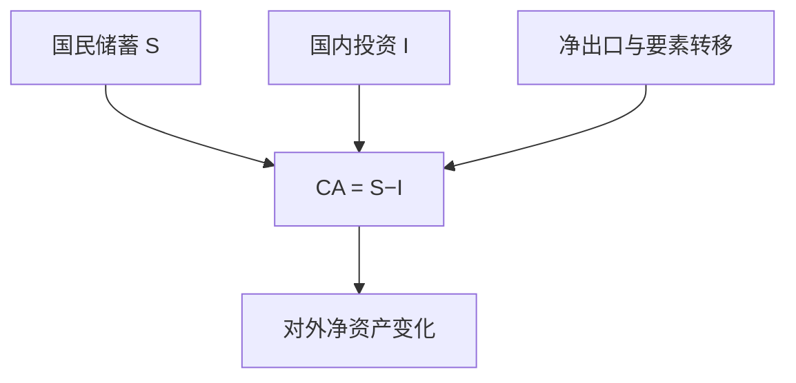

# 开放经济会计与经常账户

经常账户不是「竞争力评分」，而是国民储蓄减去国内投资：吸收与产出的差，对应对外净要求权的积累。

<footer>—— 据 SNA 国外账户；对照 Mundell 把外部平衡写成宏观约束之前的会计身份</footer>

[上一课](/econ/fiscal-multiplier)在封闭或未写国境的装置里谈乘数。支出恒等里一直有 $NX$，[储蓄–投资](/econ/saving-investment-id)用它当代理。本课的缺口是把对外账户写全：经常账户 $CA$、资本与金融账户、储备，以及 GDP 与 GNI 的差。购买力平价从下一课起给相对价格；本课先保证符号是账，不是蒙代尔图上的斜率。

## 问题

封闭时 $S=I$。开放时国民储蓄可以离开本国资本形成，变成对国外的净债权。缺口是

$$
CA \equiv S-I,
$$

在 SNA 口径下与货物服务净出口、要素净收入、经常转移一致（细节科目以手册为准）。$CA>0$ 是本国吸收 $C+I+G$ 小于国民收入，不是道德上的「盈余美德」。财政课的孪生赤字是这句恒等的部门展开：公共 $S^g$ 下降，若私人 $S^p-I$ 不变，则 $CA$ 下降。

GDP 课留下的国内与国民之差，在此落地：GNI $= $ GDP $+$ 跨境要素净收入。$CA$ 用国民口径更干净。本课不把 $CA$ 写成汇率的函数——那是 PPP 与蒙代尔。

金融账户记录谁向谁买了哪些资产。经常账户与金融账户（加储备与净误差）对平。恒等不告诉你资本流入是「推动」还是「拉动」。

## 方法

支出：$Y=C+I+G+NX_{\mathrm{goods,services}}$。国民收入再调要素与转移。跨期：一国的 $CA$ 是对未来净出口的要求权变化，欧拉在开放下变成对外净资产的平滑——Obstfeld 一类跨期方法，本课只借用：赤字可以是最优的投资高峰或平滑消费，不必是失衡的同义词。

储备与汇率制度：央行买外汇，金融账户与储备同时动，经常账户仍由 $S-I$ 决定。不可能三角会把「资本自由流动」写成这一金融账户的开放度；本课只记下账户存在。

### 乘数的开放漏出

$G$ 上升提高吸收，一部分变成进口，$CA$ 变差，封闭乘数缩小。李嘉图与欧拉仍适用：若减税被对外借贷平滑，对外净资产下降，未来要用净出口偿还。批判仍在：开放度与汇率规则都进简化式。

## 机制

每一笔未用于国内 $C+I+G$ 的国民产出，变成对国外的净要求权；反过来，吸收超过产出就消耗对外资产或增加对外负债。汇率、利率、相对价格决定的是**均衡中** $S$、$I$ 如何调整，不是恒等是否成立。货币中性的长期：名义汇率可以变，$CA$ 的实物路径由跨期偏好、投资机会与净国外资产决定。

财政扩张在浮动与固定下对 $CA$ 的短期效应不同，那是蒙代尔–弗莱明。会计先行：无论哪一种，$S-I$ 必须等于 $CA$。

## 边界

不要把双边贸易差额当成福利。不要把统计误差当理论。量化栏的外汇微观结构、CIP 偏差，不是 SNA 科目；本栏加总到宏观净额为止。公司如何在境外融资，留给资本结构课。

后课默认：写下开放宏观时，$CA=S-I$ 是恒等，事前均衡另说。下一课用一价定律与购买力平价给相对价格与汇率一个长期锚。

## 小结

- $CA=S-I$ 是国外账户恒等，不是竞争力排名。
- GDP 与 GNI 差在跨境要素；经常账户含净出口、要素、转移。
- 跨期上赤字可以是平滑或投资，不必等于「失衡」。
- 汇率制度改变的是调整渠道，不是恒等。
- 出处：SNA 国外账户；Mundell 外部平衡语言之前的会计身份。
