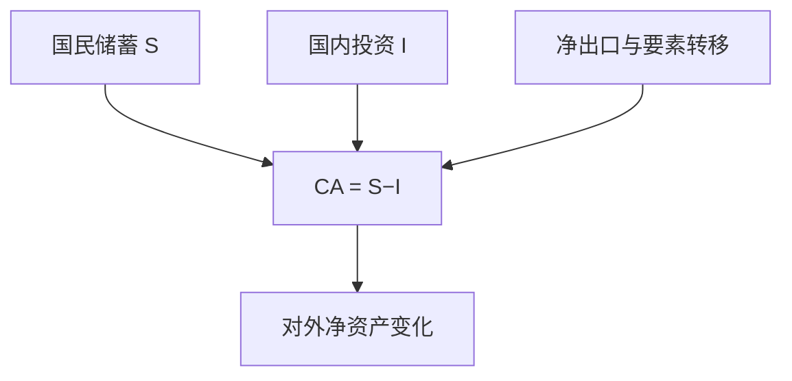
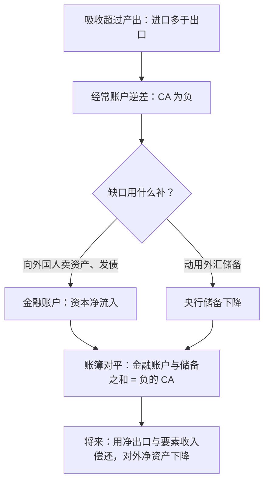

# 开放经济会计与经常账户

经常账户不是「竞争力评分」，而是国民储蓄减去国内投资：吸收与产出的差，对应对外净要求权的积累。

<footer>—— 据 SNA 国外账户；对照 Mundell 把外部平衡写成宏观约束之前的会计身份</footer>

[上一课](/econ/automatic-stabilizers)（自动稳定器）。在封闭或未写国境的装置里谈乘数。支出恒等里一直有 $NX$，[储蓄–投资](/econ/saving-investment-id)用它当代理。本课的缺口是把对外账户写全：经常账户 $CA$、资本与金融账户、储备，以及 GDP 与 GNI 的差。购买力平价从下一课起给相对价格；本课先保证符号是账，不是蒙代尔图上的斜率。

## 问题

封闭时 $S=I$。开放时国民储蓄可以离开本国资本形成，变成对国外的净债权。缺口是

$$
CA \equiv S-I,
$$

在 SNA 口径下与货物服务净出口、要素净收入、经常转移一致（细节科目以手册为准）。$CA\gt 0$ 是本国吸收 $C+I+G$ 小于国民收入，不是道德上的「盈余美德」。财政课的孪生赤字是这句恒等的部门展开：公共 $S^g$ 下降，若私人 $S^p-I$ 不变，则 $CA$ 下降。

直觉类比：把国家想成一个家庭，$S-I$ 就是「这个家攒下的钱减去花在自家房子上的装修」。攒得多、修得少，余钱借给了别人（对外净债权）；攒得少、修得多，就得向别人借钱。$CA$ 记录的正是这个差，不是「竞争力考卷」的分数。

GDP 课留下的国内与国民之差，在此落地：GNI $= $ GDP $+$ 跨境要素净收入。$CA$ 用国民口径更干净。本课不把 $CA$ 写成汇率的函数——那是 PPP 与蒙代尔。

金融账户记录谁向谁买了哪些资产。经常账户与金融账户（加储备与净误差）对平。恒等不告诉你资本流入是「推动」还是「拉动」。

## 方法

支出：$Y=C+I+G+NX_{\mathrm{goods,services}}$。国民收入再调要素与转移。跨期：一国的 $CA$ 是对未来净出口的要求权变化，欧拉在开放下变成对外净资产的平滑——Obstfeld 一类跨期方法，本课只借用：赤字可以是最优的投资高峰或平滑消费，不必是失衡的同义词。

```mermaid
flowchart TD
  S["国民储蓄 S"] --> CA["CA = S−I"]
  I["国内投资 I"] --> CA
  CA --> NFA["对外净资产变化"]
  NX["净出口与要素转移"] --> CA
```

储备与汇率制度：央行买外汇，金融账户与储备同时动，经常账户仍由 $S-I$ 决定。不可能三角会把「资本自由流动」写成这一金融账户的开放度；本课只记下账户存在。

### 乘数的开放漏出

$G$ 上升提高吸收，一部分变成进口，$CA$ 变差，封闭乘数缩小。李嘉图与欧拉仍适用：若减税被对外借贷平滑，对外净资产下降，未来要用净出口偿还。批判仍在：开放度与汇率规则都进简化式。

## 机制

每一笔未用于国内 $C+I+G$ 的国民产出，变成对国外的净要求权；反过来，吸收超过产出就消耗对外资产或增加对外负债。汇率、利率、相对价格决定的是**均衡中** $S$、$I$ 如何调整，不是恒等是否成立。货币中性的长期：名义汇率可以变，$CA$ 的实物路径由跨期偏好、投资机会与净国外资产决定。

```mermaid
flowchart TD
  A["吸收超过产出：进口多于出口"] --> D["经常账户逆差：CA 为负"]
  D --> Q{"缺口用什么补？"}
  Q -->|"向外国人卖资产、发债"| FA["金融账户：资本净流入"]
  Q -->|"动用外汇储备"| RES["央行储备下降"]
  FA --> BAL["账簿对平：金融账户与储备之和 = 负的 CA"]
  RES --> BAL
  BAL --> FUT["将来：用净出口与要素收入偿还，对外净资产下降"]
```

数字实例：GDP 为 100、吸收 $A=C+I+G=103$，则 $CA=-3$——本国多花掉的 3 块钱，对应对外净资产减少 3 块。若明年 GDP 涨到 105 而 $A$ 仍是 103，$CA$ 转正为 2，正好开始「还账」。

财政扩张在浮动与固定下对 $CA$ 的短期效应不同，那是蒙代尔–弗莱明。会计先行：无论哪一种，$S-I$ 必须等于 $CA$。

吸收法：$CA=Y-A$，$A=C+I+G$。贬值要改善 $CA$，必须 $Y$ 升或 $A$ 降。这是会计加一句行为空位。GDP 与 GNI 的差在跨境要素落地。孪生赤字是恒等的部门展开，不是因果。

BPM 把直接投资、组合、其他、储备写在金融账户。本课用「资本流动」作口语，与科目名不完全同义。恒等不告诉你流入是推动还是拉动。

## 边界

不要把双边贸易差额当成福利。不要把统计误差当理论。量化栏的外汇微观结构、CIP 偏差，不是 SNA 科目；本栏加总到宏观净额为止。公司如何在境外融资，留给资本结构课。发展中经济的 $CA$ 逆差可以是 $I$ 高，不是 $S$ 不道德。

常见误区：听到「贸易逆差」就想到「输给了外国」。会计上逆差只说明吸收大于产出，可能正值国内投资高峰、借钱搞建设；顺差也可能是消费不足、钱被迫外借。恒等本身不含因果与好坏，判断要回到 $S$ 与 $I$ 各自为什么在动。

后课默认：写下开放宏观时，$CA=S-I$ 是恒等，事前均衡另说。下一课用一价定律与购买力平价给相对价格与汇率一个长期锚。

## 小结

- $CA=S-I$ 是国外账户恒等，不是竞争力排名。
- GDP 与 GNI 差在跨境要素；经常账户含净出口、要素、转移。
- 跨期上赤字可以是平滑或投资，不必等于「失衡」。
- 吸收法把 $CA$ 写成产出减吸收，行为仍空着。
- 汇率制度改变的是调整渠道，不是恒等。
- 出处：SNA 国外账户；IMF BPM。
