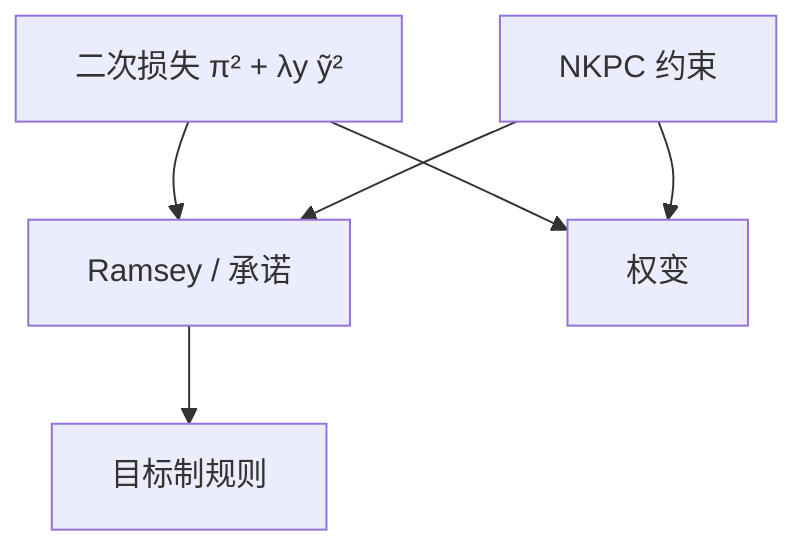

# 最优货币政策

二次损失把通胀与缺口的权衡写成一个目标；最优不是「两个工具」，而是一条把二者锁在一起的目标制规则。

<footer>—— Woodford, Interest and Prices, 2003；Clarida, Galí and Gertler, The Science of Monetary Policy, JEL 1999</footer>

[上一课](/econ/divine-coincidence)说明：仅价格粘性、无成本推动时，稳通胀即稳福利缺口；巧合破裂后必须权衡。本课的缺口是把权衡写成 Ramsey 问题：最小化 Woodford 二次损失，得到承诺下的目标制规则。通胀目标制下一课才把它收成可操作的制度；本课先给最优条件，不谈走廊操作。

## 问题

损失

$$
\mathbb{E}_0\sum_{t=0}^{\infty}\beta^t\bigl(\pi_t^2+\lambda_y\tilde{y}_t^2\bigr)
$$

在巧合下被 NKPC 锁死，最优是 $\pi=0$（或钉 $\pi^*$）。有 $u_t$ 或工资粘性时，两项真正分叉。缺口不是再解释巧合是否存在，而是：承诺与权变各给出怎样的一阶条件。Clarida–Galí–Gertler（CGG）把最优写成对通胀与缺口的线性反馈直觉；Woodford 强调承诺下的历史依赖——过去的缺口仍进入今天的目标。权变课已经对比过两条路径；本课把最优条件钉在 NK 约束上。

$\lambda_y$ 来自福利近似，随 $\kappa$ 与消费替代弹性变，不是「委员会更关心失业」的任意权重。把 $\lambda_y$ 当政治偏好，会取消 Woodford 的微观。

## 方法

约束是 NKPC（可加混合项、工资菲利普斯）与动态 IS。工具是 $i$，但最优常先写成**目标制**：$\pi$ 与 $\tilde{y}$ 的线性组合为零，再倒求出支撑它的 $i$。承诺：央行像 Ramsey 计划者，对未来约束自己，一阶条件含滞后乘数——通胀在冲击后超调回来。权变：每期重新优化，没有这笔历史账，稳定偏误与更差的权衡再现。

泰勒规则是实现目标制的一种工具规则，系数要对准最优条件，不是 1993 年拟合的再贴。泰勒原理（$\phi_\pi\gt 1$）仍是确定性的最低要求；最优通常更激进或含惯性。

### 巧合破裂才有真正的两项

无 $u_t$ 时目标制退化为「永远钉通胀」，$\tilde{y}$ 项是冗余的充分统计。有成本推动时，允许通胀暂时偏离以保缺口，权重由 $\lambda_y$ 与 NKPC 斜率给出。不要把泰勒规则里同时出现的 $\phi_\pi$、$\phi_y$ 当成两个独立目标已经最优。

## 机制

成本推动到来：承诺把部分冲击摊到未来一段偏低的 $\pi$，今天的双偏离更小。权变不肯承认未来要「还账」，今天就打得更死或更松，预期更差。神圣巧合成立时，这笔账是空的。下限上 $i$ 卡住，最优改成对未来路径的承诺——非常规课已经预告，本课在正利率区把一阶条件写完。

工资粘性使损失里还应有工资通胀项（EHL）。本课基准仍用价格 $\pi$ 与 $\tilde{y}$；对象一变，目标制的组合系数变。金融加速器把净值加进状态，最优会含金融变量——不在本课展开。

工具规则与目标规则不要焊死：许多 $i$ 路径可以暂时支撑同一组 $(\pi,\tilde{y})$，确定性要求对名义变量反应足够。最优课给出的是目标空间里的一阶条件；下一课的 IT 把它说成公开的 $\pi^*$。把 1993 年泰勒系数当成已经最优，会取消 $\lambda_y$ 与 NKPC 斜率的微观。

「灵活通胀目标」是下一课的制度语言：中期钉 $\pi^*$，短期允许权衡。本课的目标制规则是它的优化原型。

## 边界

本课不估计 $\lambda_y$，不把最优写成某一次加息的对错。量化栏没有宏观 Ramsey。操作上如何把 $i$ 钉在走廊里，是再后一课。开放汇率错位会加进损失，蒙代尔再打开。

二次近似在大冲击与有效下限上会坏：损失非二次，最优承诺的形状要重算。本课在稳态附近把一阶条件钉住，以便 IT 课有一个可沟通的原型。时间不一致课已经说明权变有稳定偏误；本课只把偏误对照成「缺少历史依赖的那条一阶条件」。

后课默认：NK 最优政策首先是目标制条件，工具规则是实现；承诺含历史依赖。下一课：通胀目标制如何把这条条件变成公开的制度。

## 小结

- 巧合课给出何时必须权衡；本课给出二次损失下的一阶条件。
- 承诺：目标制加历史依赖；权变没有这笔账。
- 工具是 $i$，最优先写成 $\pi$ 与 $\tilde{y}$ 的组合。
- $\lambda_y$ 来自福利近似，不是任意政治权重。
- 出处：Woodford, *Interest and Prices*；Clarida, Galí and Gertler, *JEL* 1999。
