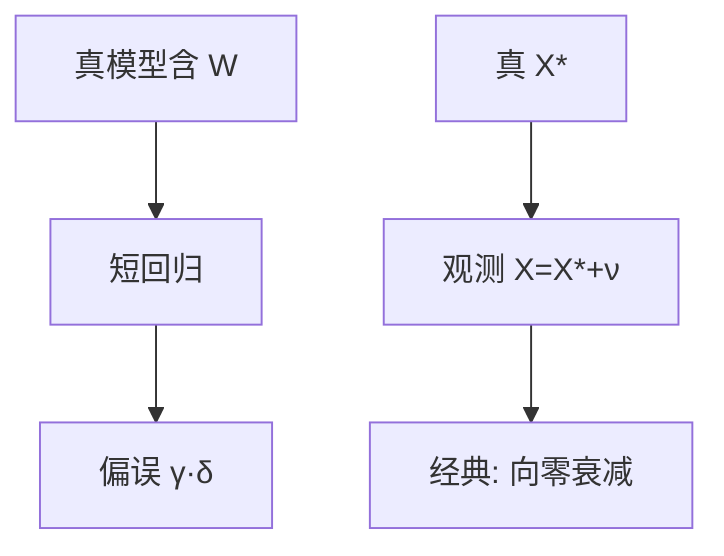

# 遗漏变量与测量误差

漏掉与 $X$ 相关的决定因素，OLS 把别人的效应算进 $\beta$；用误差污染的 $X$，经典测量误差把 $\beta$ 往零拉——两种偏误形状不同，都会毁掉上一课的外生。

<footer>—— 据 Griliches 论经济测量；Wooldridge 遗漏变量公式；对照 Bound, Brown and Mathiowetz 对调查误差</footer>

[上一课](/econ/clustered-se)把簇内相关下的标准误钉死。推断修完之后，本课缺口才是外生失败的两条经典通道：遗漏变量偏误（OVB）与测量误差。工具变量下一课才出场；本课先把偏误方向钉死，避免一上来就「找一个 IV」。

## 问题

真模型 $Y=\beta X+\gamma W+e$，$\mathbb{E}[e\mid X,W]=0$，却回归 $Y$ 对 $X$。FWL 给出

$$
\mathrm{plim}\,\hat\beta=\beta+\gamma\cdot\delta_{WX},
$$

其中 $\delta_{WX}$ 是 $W$ 对 $X$ 的总体回归系数。$\gamma$ 与 $\delta$ 同号则 OVB 与真效应同向放大。能力漏在工资–教育回归里是教科书原型：教育与能力正相关，能力抬工资，OLS 高估教育回报。

测量误差另一条。真 $X^*$，观测 $X=X^*+\nu$，经典假设 $\nu$ 与 $X^*$、$Y$ 的结构误差独立，则一元回归衰减：$\mathrm{plim}\,\hat\beta=\beta\cdot\frac{\mathrm{Var}(X^*)}{\mathrm{Var}(X^*)+\mathrm{Var}(\nu)}$。多元里「哪一个变量被测错」决定谁衰减、谁把脏吸收到自己身上。缺口是：看见 $|\hat\beta|$ 偏小，不要默认「不显著所以没有效应」——可能是衰减。

非经典测量误差（误差与真值相关，如顶编码、报喜不报忧）不必衰减，甚至可以反向。调查收入、自我报告处理，先问误差过程，再套经典公式。

## 方法

OVB：写出完整回归与短回归，用 FWL 读差。代理变量若与 $W$ 相关、与 $e$ 不相关，可减偏，但不能当无偏证明。固定效应把不随时间变的 $W$ 吸掉——那是后课，本课只标：FE 是对**时不变**遗漏的装置，不是对所有遗漏的装置。

测量误差：重复测量、工具（用第二次测量当 IV）、外部校准。经典衰减公式只用于自变量误差；因变量的经典误差加大残差方差、不偏斜率。两边同时测错要另写。

## 机制

OVB 的机制是相关遗漏进入残差，残差不再与 $X$ 正交。测量误差的机制是 $X$ 的变异掺了噪声，信号被稀释。两者可以叠加：教育年限既漏能力，又有误报。方向可能对冲，不能当「所以无偏」。

与[潜在结果](/econ/potential-outcomes)：OVB 是 $\mathbb{E}[Y(0)\mid D=1]\neq\mathbb{E}[Y(0)\mid D=0]$ 在线性里的一种参数化。测量误差是处理或结果被错标，连 $D$ 都不是真处理。随机化不自动消灭调查误差。

Griliches 反复强调：许多「生产函数残差」先是测量问题，再是技术。先问数据生成，再问内生。

## 边界

本课不引入 IV 的存在性证明。不把控制变量清单写成「加到不显著为止」：坏控制（碰撞、中介）可以制造新偏误，Angrist–Pischke 与 Cinelli–Hazlett 的讨论留给设计课。因变量的非经典误差（如审查）走 Tobit 一类，不是本课衰减公式。量化栏的微观结构噪声是价格测量，对象不同，不搬来当教育回报。

后课默认：短回归必须用 OVB 公式交代方向；经典测量误差默认衰减。下一课在相关遗漏无法观测时，用工具把 $X$ 的外生变异拆出来。

## 小结

- OVB：$+\gamma\delta$；符号由漏掉变量的效应与其和 $X$ 的相关决定。
- 经典自变量测量误差向零衰减；因变量经典误差不偏斜率。
- 非经典误差、坏控制，都不在本课公式里。
- FE 只吸时不变遗漏；不是万能。
- 出处：Wooldridge 教材 OVB；Griliches 测量传统；Bound, Brown and Mathiowetz 调查误差综述。
